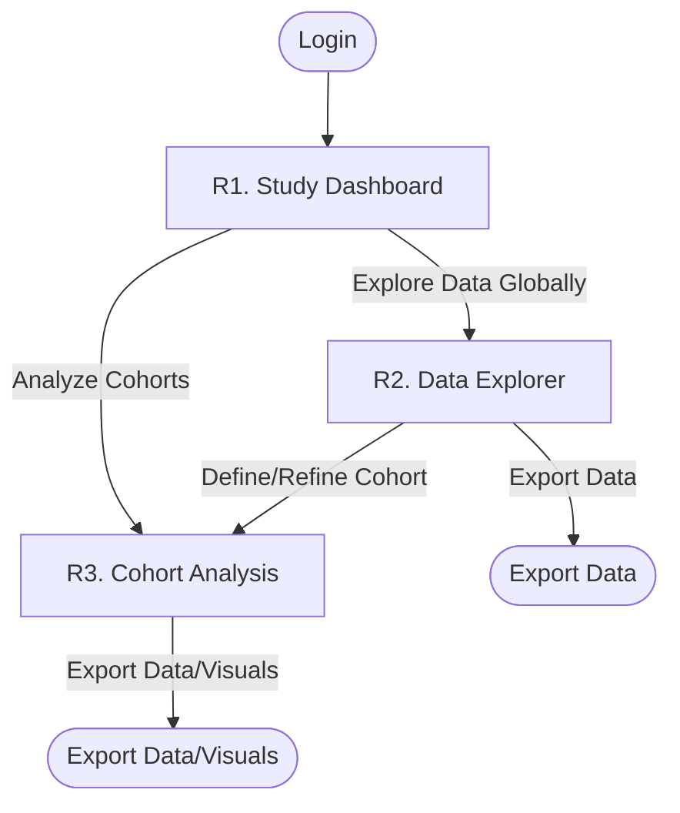

---
markmap:
  initialExpandLevel: 2
  maxWidth: 450
---

# Ghostly+ Dashboard: Functional Design and UI/UX Specifications

> ***Preliminary Notice***
>
> * This document outlines initial specifications based on my current understanding, following a review of the official TBM project proposal submitted to FWO on April 11th, 2024 ("*2024\_ghostly\_proposal.md*") and public clinical trial details ("*clinical\_trial\_info.md*", NCT05258500, [link](https://findclinicaltrials.eu/en/details/18096)). 
> * These specifications are subject to validation by the GHOSTLY+ research team and are intended as a foundation for further discussion.
> * LLM assistance: Drafting support was provided by Gemini for non-sensitive content only.


## 1. Introduction
This document details the User Interface (UI) and User Experience (UX) specifications for the Ghostly+ Dashboard. The dashboard is an integral web application supporting an EMG-driven serious game aimed at mitigating muscle strength loss in hospitalized elderly patients. It serves as a critical tool for clinicians and researchers to monitor patient progress, analyze electromyography (EMG) data, and manage the clinical trial and system operations.
> *Nota Bene* - For a broader understanding of the project's context, refer to the [Product Context document](mdc:memory-bank/productContext.md).

### 1.1. Clinical Context

The GHOSTLY+ project is a multicenter Randomized Controlled Trial (RCT) designed to evaluate the efficacy of an innovative intervention. This intervention combines Blood Flow Restriction (BFR) with an EMG-driven serious game to enhance functional ability in hospitalized older adults, contrasting its effects with standard care protocols.

#### Ghostly+ Dashboard: Role & Scope

Central to this research endeavor, the Ghostly+ Dashboard functions as the primary online platform for data collaboration and management. Its pivotal role and comprehensive scope encompass:

*   **Primary Objective:** To serve as a secure, integrated data hub for the GHOSTLY+ multicenter RCT. This includes robust support for patient management, precise intervention delivery, comprehensive data collection, and advanced analytical capabilities.
*   **Target User Groups:** The platform is tailored for three distinct user profiles:
    *   Therapists/Clinicians
    *   Researchers
    *   System Administrators
    Each group will have access to functionalities specific to their roles and responsibilities within the trial.
*   **Core Functional Pillars:**
    1.  **Patient and Trial Management:** Facilitating patient enrollment, ensuring pseudo-anonymization, managing cohort assignments (Intervention vs. Control groups), and systematically tracking patient progress throughout the trial (correlating with WP3, WP4 activities).
    2.  **Intervention Support (Therapist-Centric):** Empowering therapists to meticulously configure GHOSTLY+ game parameters (inclusive of Dynamic Difficulty Adjustment (DDA) settings from WP2.4), manage sEMG sensor selections (WP2.2), define BFR protocols, and guide Maximum Voluntary Contraction (MVC) calibrations. The system will also streamline the management of **Rehabilitation Sessions** and their constituent **Game Sessions**.
    3.  **Data Collection and Secure Storage:** Ensuring the secure aggregation and management of diverse patient data. This includes demographic details, comprehensive clinical assessments (e.g., MicroFET, ultrasound, functional tests), C3D files generated from game sessions (containing raw sEMG and game event data), sEMG-derived physiological metrics (WP2.3), gameplay statistics (WP2.3), and DDA parameters (WP2.4).
    4.  **Data Analysis and Visualization (Therapist & Researcher Utility):** Providing therapists with intuitive tools for monitoring individual patient progress, featuring visualizations of sEMG data and game performance indicators. Researchers will gain access to tools for exploring and visualizing pseudonymized data sets to evaluate therapeutic effectiveness and implementation outcomes (WP5).
    5.  **Security and Regulatory Compliance:** Implementing robust user authentication mechanisms, stringent role-based access controls, and ensuring strict adherence to GDPR and ethical guidelines pertinent to the handling of sensitive medical data (WP2.5, WP4).
    6.  **Implementation Science Enablement:** Capturing data crucial for understanding the implementation context (e.g., adherence rates, patient engagement levels, DDA usage patterns). This data will inform analyses based on Proctor's Framework and the Consolidated Framework for Implementation Research (CFIR) (WP4, WP5).

#### Development priority order
Development efforts will be prioritized as follows:
1.  Essential Therapist screens (T1-T4)
2.  Essential Administrator screens (A1, A2, A4)
3.  Essential Researcher screens (R1-R3)
4.  Non-essential screens across all user roles

#### Purpose of This Document

This UX/UI Specifications document aims to:
*   Clearly articulate the functional capabilities of each dashboard screen from the perspective of its end-users.
*   Establish User Experience (UX) goals, define consistent interaction patterns, and provide layout guidance.
*   Serve as an authoritative reference for UI design and subsequent front-end development.
*   Delineate between essential and non-essential features to effectively guide development prioritization.


### 1.2. Technical Foundation

The Ghostly+ Dashboard's user interface will be developed leveraging the following technologies:
- **Core Framework**: React, utilizing Vite for an optimized development and build process.
- **UI Component Suite**: Tailwind CSS, complemented by shadcn/ui components (React version: [https://ui.shadcn.com/](https://ui.shadcn.com/)) for a consistent and modern aesthetic.
- **State Management**: Robust and scalable React state management solutions will be implemented as appropriate for application complexity.
- **Authentication & Authorization**: User identity management and JWT-based authentication will be handled by Supabase Auth.
- **Data Persistence & Backend Interaction**: Supabase will serve as the primary PostgreSQL database for application data. C3D files originating from game sessions will be securely stored using Supabase Storage. All data operations will be orchestrated through a FastAPI (Python) backend API, which will encapsulate business logic and manage interactions with Supabase services.

## 2. Design System Guidelines

### 2.1 Graphical chart
- _To be defined - Branding (hospital ?), Typography, Color Palette, Component Patterns_
- Logos of scientific sponsors (FWO) ?

### 2.2 Accessibility Requirements
- Multilingual support (English, Dutch, French) -> *To be confirmed* ? 
- Target WCAG 2.1 Level AA compliance.

## 3. User Roles (Personas)

The dashboard serves three primary user roles. Permissions should be granular enough to accommodate various study personnel (e.g., Study Nurses, Project Coordinators) with specific data access or input needs.

### 3.1. Persona: Therapist/Clinician 
- Main interface
-   **Role Overview & Primary Goal**: The Therapist/Clinician is central to delivering the GHOSTLY+ intervention. This dashboard empowers them to efficiently manage patient participation, meticulously configure individualized treatment sessions (including game parameters and BFR), input vital clinical data, and closely monitor patient progress through integrated EMG and game metrics, all while adhering to the clinical trial's protocol and aiming to enhance patient rehabilitation outcomes.
-   **Context**: Works directly with patients in a clinical setting (e.g., UZB, UZA, UZL Pellenberg). Responsible for guiding patients through the GHOSTLY+ therapy, including game setup, BFR application, and clinical assessments. Relies on the dashboard for real-time information and to document patient interactions and outcomes accurately.
-   **Reference Contact**: e.g., Lead Therapist from UZB/UZA/UZL involved in the project ?
-   **Key Features**:
    1.  **Patient Management**:
        *   View a personalized dashboard (T1) with their assigned patient list, (potential) alerts, reminders, and upcoming **Rehabilitation Sessions**. 
        *   Access and manage (CRUD operations) detailed patient profiles (T2), including essential demographics, and key relevant medical data (e.g. conditions directly impacting therapy).
        *   Input and track comprehensive clinical assessment data at designated time points (T0, T1, T2), primarily for overall clinical trial outcome monitoring and patient characterization (Detaileds below)

    2.  **Treatment & Session Management**:
        *   Configure GHOSTLY+ game parameters for each **Rehabilitation Session** (T4), including guiding MVC calibration, selecting sEMG sensors (if applicable), setting game parameters, and reviewing DDA settings.

            - **Table 3.1.1: GHOSTLY+ Game Configuration Parameters**
                *(Sourced primarily from 2024_ghostly_proposal.md WP2.1, WP2.2, WP2.4)*
                | Parameter Category                  | Specific Settings                                                                                                   |
                | :---------------------------------- | :------------------------------------------------------------------------------------------------------------------ |
                | **MVC Calibration**                 | Guided process, results (e.g., peak EMG values per channel)                                                         |
                | **sEMG Sensor Selection**           | Choice of sEMG sensor/profile if multiple supported                                                                 |
                | **Game Levels & Difficulty**        | Selection of game, specific level(s)                                                                                |
                | **Dynamic Difficulty Adjustment (DDA)** | Review/adjustment of DDA settings (e.g., parameters for adaptive muscle contraction detection, level progression) |
                | **Exercise Structure (per Game Session)** | Number of repetitions, sets (e.g., long vs. short contractions), rest intervals                                     |
                | **Game Targets (derived from MVC)** | E.g., %MVC for contractions (e.g., 60-80% for short, lower for sustained)                                             |
                | **Exercise Types / Muscle Targeting** | Selection of specific exercises/games designed to target certain muscle groups                                      |
        *   Configure and document Blood Flow Restriction (BFR) parameters for relevant Game Sessions (T4).
               - **Table 3.1.2: Blood Flow Restriction (BFR) Parameters (Therapist Input - T4, Researcher View - R2.1)**
                    *(Sourced from clinical_trial_info.md, 2024_ghostly_proposal.md)*

                    | Parameter Category             | Specific Settings                                                                                                    |
                    | :----------------------------- | :------------------------------------------------------------------------------------------------------------------- |
                    | **BFR System**                 | Indication of system used (e.g., Delfi)                                                                              |
                    | **Arterial Occlusion Pressure (AOP)** | Measured AOP value (e.g., mmHg)                                                                                      |
                    | **Target Pressure**            | Target cuff pressure as % of AOP (e.g., 50% or 80%) or absolute value                                                 |
                    | **Actual Cuff Pressure**       | Actual pressure applied by the cuff (e.g., mmHg)                                                                     |
                    | **Duration**                   | Duration of BFR application for the Game Session                                                                     |
        *   Schedule and log **Rehabilitation Sessions** and their constituent **Game Sessions** (T1, T2).
    3.  **Progress Monitoring & Analysis**:
        *   Review detailed analysis of individual **Game Sessions** (T3), including EMG data visualizations and key sEMG-derived metrics and game performance statistics.

            - **Table 3.1.3: Key sEMG-Derived Metrics (Therapist Review - T1.3, T2.3, T3.4, T5.2; Researcher Analysis - R1.4, R2.1, R2.2, R3.2)**
                *(Sourced primarily from WP2.3 - Refer to Section 9 for visualization context)*

                | Metric Category             | Example Specific Metrics                                                                                               |
                | :-------------------------- | :--------------------------------------------------------------------------------------------------------------------- |
                | **Muscle Activation Levels**| Root Mean Square (RMS), Mean Absolute Value (MAV), Mean Absolute Deviation (MAD), Variance (VAR)                         |
                | **Muscle Fatigue Indicators** | Spectral fatigue indicators (e.g., Dimitrov's Index/Mean Frequency changes), Time-frequency analysis (e.g., Hilber-Huang) |
                | **Force/Effort Estimation** | sEMG-based estimations of muscle force or effort output                                                                |
                | **Muscle Mass Estimation**  | sEMG-based estimations of muscle mass changes (exploratory)                                                            |
                | **Peak Contractions**       | EMG amplitude at peak effort, %MVC achieved                                                                            |
                | **Symmetry/Imbalance**      | Comparison of EMG activity between contralateral muscles (e.g., Left vs. Right Quadriceps)                               |

            - **Table 3.1.4: Key Game Performance & Engagement Statistics (Therapist Review - T1.3, T2.4, T3.3, T5.2; Researcher Analysis - R1.3, R1.4, R2.1, R2.2, R3.2)**
                *(Sourced primarily from WP2.3)*

                | Statistic Category          | Example Specific Metrics                                                                                               |
                | :-------------------------- | :--------------------------------------------------------------------------------------------------------------------- |
                | **Session Duration & Intensity** | Total game play time, active exercise time, intensity level achieved/maintained                                        |
                | **Game Progression**        | Levels played/completed, time per level, successful activations/targets hit                                            |
                | **Engagement/Adherence**    | Number of game sessions played, frequency of play, inactivity periods during game, activation points earned           |
                | **DDA Parameters (Review)** | Log of DDA adjustments made during the session (e.g., changes to difficulty, sensitivity)                              |
        *   View historical EMG performance trends and sEMG metrics at both **Rehabilitation Session** and **Game Session** levels (T2).
        *   Compare current session data against baseline and previous sessions (T3).
    4.  **Clinical Documentation & GHOSTLY+ Reporting**:
        *   Support for documenting session-specific observations for **Rehabilitation Sessions** and individual **Game Sessions** is provided via the Patient Profile (T2), allowing therapists to record contextual data and other subjective clinical notes (User Story T2.6).
        *   Generate GHOSTLY+ progress reports (T5, non-essential for MVP) summarizing patient progress using sEMG-derived metrics, game statistics, and relevant clinical outcomes. (Refer to Section 9 and Tables 3.1.3, 3.1.4 for specific metrics).
            - **Table 3.1.5:  Clinical & Functional Measures**
                *(Sourced primarily from clinical_trial_info.md & 2024_ghostly_proposal.md WP4)*

                | Parameter Category         | Specific Measures                                                                                                                               |
                | :------------------------- | :---------------------------------------------------------------------------------------------------------------------------------------------- |
                | **Muscle Strength**        | MicroFET (e.g., Quadriceps)                                                                                                                     |
                | **Muscle Morphology**      | Ultrasound (e.g., Quadriceps - Rectus Femoris, Vastus Lateralis): Cross-sectional area, muscle thickness, pennation angle, fascicle length, echo intensity |
                | **Body Composition**       | Segmental Bio-impedance (e.g., Quadscan 4000): Muscle mass, phase angle                                                                         |
                | **Functional Tests**       | 30s Sit-to-Stand, Timed Up and Go (TUG), Short Physical Performance Battery (SPPB), 6-minute Walking Test (6MWT), Chair Stand Test (CST)           |
                | **Cognitive Status**       | Mini-Mental State Examination (MMSE)                                                                                                            |
                | **Quality of Life**        | EQ-5D-5L, PROMIS Global Health, Global Perceived Effect (GPE)                                                                                   |
                | **Physical Activity**      | Accelerometry data                                                                                                                              |
                | **Adverse Events**         | Log of any adverse events                                                                                                                       |

### 3.2. Persona: Researcher (Analytical Focus)
-   **Executive Summary**: The Researcher leverages the dashboard as a powerful analytical tool to access, explore, and interpret pseudonymized data from the GHOSTLY+ clinical trial. Their activities are crucial for evaluating the intervention's effectiveness, understanding implementation dynamics, and generating evidence-based insights for scientific dissemination.
-   **Primary Goal**: To analyze pseudonymized data from the GHOSTLY+ clinical trial to evaluate intervention effectiveness (SA2), study implementation outcomes (SA3), and generate insights for publication and future research, adhering to the study protocol and data analysis plan (WP5).
-   **Context**: Works with aggregated and pseudonymized data from multiple patients and hospital sites. Needs robust tools for data exploration, cohort comparison, statistical analysis (or export for such), and tracking overall study progress and data quality.
-   **Reference Contact (for UX clarification)**: [Specify relevant research lead/representative, e.g., Lead Researcher from WP5/WP4 involved in data analysis]
-   **Key Pain Points Addressed by Dashboard**:
    *   Complex and time-consuming process to access, aggregate, pseudonymize, and standardize diverse datasets (clinical assessments, sEMG metrics, game interaction logs, DDA parameters) from multiple clinical sites.
    *   Lack of unified and robust tools for exploring nuanced relationships between intervention parameters (e.g., DDA settings, BFR protocols), patient engagement levels, detailed sEMG-derived physiological responses, and clinical outcomes.
    *   Inefficient methods for monitoring overall RCT progress, data collection completeness, intervention fidelity, and adherence rates across different cohorts and participating sites.
    *   Difficulties in exporting comprehensive, analysis-ready datasets in formats suitable for various external statistical software (e.g., SPSS) and clinical trial management systems (e.g., REDCap).
    *   Generating insightful reports for cohort comparisons and tracking outcome changes over time often requires manual data wrangling and visualization efforts.
-   **Key Dashboard Interactions & Features**:
    *   **Study Oversight & Monitoring**:
        *   View a study dashboard (R1) with an overview of RCT progress (recruitment, retention, cohort status).
        *   Track data collection completeness for all outcome measures (clinical, sEMG-derived, game-based - See Tables 3.1.5, 3.1.3, 3.1.4 and Section 9).
        *   Monitor intervention compliance and adherence rates (R1).
        *   Review summaries of implementation science outcomes (R1).
    *   **Data Exploration & Analysis (Pseudonymized Data)**:
        *   Access and explore pseudonymized sEMG signals and associated metrics from **Game Sessions** (R2). (See Section 9 and Tables 3.1.3 & 3.1.4 for specific metrics).
        *   Analyze game statistics and DDA parameters in relation to outcomes (R2). (See Table 3.1.1 and Table 3.1.4).
        *   Compare all collected outcome measures across patients and cohorts (R2). (See Table 3.1.5 for Clinical Measures).
    *   **Cohort Comparison & Statistical Export**:
        *   Perform group-level data analysis (R3) comparing Intervention vs. Control groups for all outcomes. (See Table 3.1.5 for Clinical Measures and Tables 3.1.3 & 3.1.4 for GHOSTLY+ Metrics).
        *   Visualize outcome changes over time for each cohort.
        *   Export pseudonymized data sets (including all WP2 data points and data from Tables 3.1.1 through 3.1.5) in formats suitable for external statistical software and REDCap (R2).

### 3.3. Persona: Administrator (System & Operational Focus)
-   **Primary Goal**: To ensure the smooth, secure, and compliant operation of the GHOSTLY+ Dashboard, acting as the guardian of its operational integrity. This includes managing user access and permissions, maintaining data integrity and the robustness of the data infrastructure, overseeing system health, and ensuring the platform reliably supports the technical and logistical demands of the multi-site clinical trial.
-   **Context**: Oversees the entire platform's technical infrastructure, user base, and data lifecycle. Responsible for ensuring the system adheres to security protocols (GDPR), data management plans (DMP), and supports the needs of therapists and researchers.
-   **Reference Contact (for UX clarification)**: [Specify relevant system admin/data manager, e.g., Technical Lead from WP2 or Project Coordinator from WP1]
-   **Key Pain Points Addressed by Dashboard**:
    *   Ensuring secure, compliant (GDPR), and auditable management of sensitive patient data throughout the lifecycle of a multi-site clinical trial.
    *   Effectively managing user accounts and granular role-based access controls for a diverse group of study personnel (therapists, researchers, coordinators, PIs) with varying data access needs.
    *   Proactively monitoring the health, performance, and storage utilization of a critical, data-intensive research platform to prevent downtime or data loss.
    *   Maintaining data integrity, including managing backups, restore procedures, and ensuring correct associations of complex, hierarchical data (e.g., multiple Game Sessions to a single Rehabilitation Session, data from various sensor types).
    *   Streamlining and overseeing data export/synchronization processes with external systems like REDCap, ensuring data consistency and compliance.
-   **Key Dashboard Interactions & Features**:
    *   **System Health & Monitoring**:
        *   Monitor overall platform health, performance metrics (response times, server load), and storage usage (A1).
        *   Access and manage system error logs and alerts (A1).
    *   **User & Access Management**:
        *   Manage user accounts (create, edit, disable) for all roles (Therapists, Researchers, Admins, Study Nurses, Project Coordinators, PIs, etc.) (A2).
        *   Assign and manage granular roles and permissions to ensure appropriate data access and functionality segregation (A2).
        *   Assign patients to specific therapists to manage caseloads and restrict data visibility (A2).
        *   Review user activity logs for auditing purposes (A2).
    *   **Data Integrity & Management**:
        *   Oversee and perform data backup and restore operations (A4).
        *   Manage data purging and archiving according to GDPR and study protocols (A4).
        *   Ensure correct association of multiple **Game Sessions/C3D files** (potentially from different sEMG sensors - **WP2.2**) to their parent **Rehabilitation Sessions** (A4).
        *   Log and manage sEMG metrics, game statistics, and DDA parameters derived from **WP2** (A4). (Refer to Section 9 and Tables 3.1.1, 3.1.3, 3.1.4).
        *   Oversee or manage data export/synchronization processes with REDCap for long-term archival and master clinical trial data management (A4).
    *   **Compliance & Security**:
        *   Configure and enforce security settings, including row-level security for data access.
        *   Support GDPR compliance activities related to data stored in the dashboard.
    *   **Trial & Institution Configuration (Optional/Non-Essential for MVP)**:
        *   Manage participating hospital site information (A3).
        *   (Future) Configure department structures, branding, or integration settings for external systems (e.g., REDCap if direct integration is built) so that data flow can be configured.

## 4. User stories / Screen Specifications

### 4.1. Therapist Interface

#### T1. Home Dashboard (Essential)
-   **Primary Focus**: Provide therapists with a quick overview of their patients, upcoming/recent **Rehabilitation Sessions**, and daily tasks, with clear indication of study arms and alerts.
-   **Key Features (User Stories)**:

| User Story # | User Story (Therapist)                                                                                                                               | Priority / Notes |
| :----------- | :--------------------------------------------------------------------------------------------------------------------------------------------------- | :--------------- |
| T1.1         | I want to see my assigned patient list with status indicators (activity, alerts, study arm) to quickly identify who needs attention.                   |                  |
| T1.2         | I want to view my daily schedule with upcoming **Rehabilitation Sessions** to manage my time and prepare for patients.                               |                  |
| T1.3         | I want summaries of recent **Rehabilitation Sessions**, with an overview of **Game Sessions** and key aggregated sEMG/game metrics, to stay informed. (Metrics detailed in Section 9, Tables 3.1.3, 3.1.4) |                  |
| T1.4         | I want actionable items or alerts (missed sessions, declining metrics, DDA flags) to promptly address issues.                                       |                  |
| T1.5         | I want to filter and sort my patient list (by status, name, group, activity) to easily find patients or organize my view.                          |                  |
| T1.6         | I want quick access to detailed patient information from the dashboard for efficient navigation.                                                     |                  |
| T1.7         | I want to schedule new patient **Rehabilitation Sessions** from my dashboard or calendar view to manage appointments easily.                          |                  |
| T1.8         | (Non-essential) I want a notification center for system updates or messages to be aware of system-wide information.                                   |                  |

-   **Layout Guidance**:
    -   Consider a card-based grid or a list view for patients and **Rehabilitation Sessions**, highlighting priority items.
    -   Allow expansion of a Rehabilitation Session entry to show its constituent Game Sessions if relevant here.
    -   Responsive design for desktop and tablet use in clinical settings.
    -   Persistent header with user information and global navigation.
-   **Key UX Discussion Points**:
    *   What are the most critical pieces of information for a therapist to see at a glance on their home dashboard?
    *   How should alerts be prioritized and presented to be actionable but not overwhelming?
    *   What level of detail for recent sessions is most useful on this overview screen?

#### T2. Patient Profile (Essential)
-   **Primary Focus**: Offer therapists a comprehensive view of a patient's information, clinical assessments, and treatment history, clearly delineating **Rehabilitation Sessions** and their constituent **Game Sessions (C3D files)**, including detailed BFR application.
-   **Key Features (User Stories)**:

| User Story # | User Story (Therapist)                                                                                                                                | Priority / Notes |
| :----------- | :---------------------------------------------------------------------------------------------------------------------------------------------------- | :--------------- |
| T2.1         | I want to view patient demographics and relevant medical history (e.g., MMSE scores) for full treatment context.                                       |                  |
| T2.2         | I want to input and view key clinical outcome measures at specific time points (T0, T1, T2) to track progress. (Measures detailed in Table 3.1.5) |                  |
| T2.3         | I want to see historical EMG performance graphs/trends and relevant sEMG metrics (aggregated or per session) to monitor muscle activity/fatigue. (Metrics in Section 9, Table 3.1.3) |                  |
| T2.4         | I want to view a **Rehabilitation Session** calendar with attendance, expandable to show **Game Session** details and game statistics, to review intervention specifics. (Game stats in Table 3.1.4) |                  |
| T2.5         | I want a visualization of the treatment plan, including BFR parameters for each relevant **Game Session**, to understand applied interventions. (BFR parameters in Table 3.1.2) |                  |
| T2.6         | I want to add, edit, and view clinical notes for **Rehabilitation Sessions** and **Game Sessions** to document subjective information.                      |                  |
| T2.7         | I want to toggle data visualizations between time periods to analyze short-term and long-term trends.                                                 |                  |
| T2.8         | I want to filter data visualizations (by muscle groups, metrics, sessions, sensor type) to focus on relevant information.                             |                  |
| T2.9         | I need a clear way to upload/associate multiple C3D files (from **Game Sessions**, potentially different sEMG sensors) to a **Rehabilitation Session**.  |                  |

-   **Layout Guidance**:
    -   Tab-based information architecture with a persistent patient header.
    -   Clear visual distinction or hierarchy between **Rehabilitation Session** overview and **Game Session** details.
    -   Responsive charts and data tables.
    -   Consider a split view for displaying patient information alongside visualizations.
-   **Key UX Discussion Points**:
    *   How should the hierarchy between a "Rehabilitation Session" and its constituent "Game Sessions" be best visualized?
    *   What are the most effective ways to display trend data for both clinical outcomes and EMG metrics?
    *   For manual C3D file association, what is the most intuitive workflow for the therapist?

#### T3. Session Analysis (Essential)
-   **Primary Focus**: Enable therapists to conduct a detailed post-session review of a specific **Game Session (C3D file)**, including EMG data, game performance, DDA parameters, and BFR application details, with context of the overall **Rehabilitation Session**.
-   **Key Features (User Stories)**:

| User Story # | User Story (Therapist)                                                                                                                                  | Priority / Notes |
| :----------- | :------------------------------------------------------------------------------------------------------------------------------------------------------ | :--------------- |
| T3.1         | I want muscle activation visualizations (e.g., left/right symmetry) for a selected **Game Session** to assess balanced muscle engagement.                   |                  |
| T3.2         | I want peak contraction graphs with target thresholds (e.g., %MVC) for a selected **Game Session** to evaluate effort and performance.                     |                  |
| T3.3         | I want to review **Game Session** duration, intensity, and detailed game statistics to quantify exercise dose and engagement. (Game stats in Table 3.1.4) |                  |
| T3.4         | I want to see key sEMG-derived metrics (e.g., RMS, fatigue, force/mass estimates) for a selected **Game Session**, presented meaningfully. (Metrics in Section 9, Table 3.1.3) |                  |
| T3.5         | I want to view BFR parameters applied during the selected **Game Session** to correlate with EMG data and outcomes. (BFR parameters in Table 3.1.2)       |                  |
| T3.6         | I want to compare data from the current **Game Session** against baseline and previous **Game Sessions** to track progress effectively.                     |                  |
| T3.7         | I want to easily navigate between different **Game Sessions** within the same **Rehabilitation Session** from this analysis view.                         |                  |
| T3.8         | I want to see how DDA algorithms adjusted game parameters during the session, if relevant for review. (DDA details from WP2.4)                           |                  |

-   **Layout Guidance**:
    -   Consider a split view with a main visualization panel and a sidebar for metrics/controls.
    -   Include a timeline scrubber for navigating session recordings.
    -   Allow metrics panels to be collapsible to maximize visualization space.
-   **Key UX Discussion Points**:
    *   What are the most critical sEMG metrics to display by default, and which should be available on demand?
    *   How can the dashboard best help therapists compare the current Game Session to previous ones or a baseline?
    *   What level of detail regarding DDA parameter adjustments is most useful for the therapist during review?

#### T4. Treatment Configuration (Essential)
-   **Primary Focus**: Allow therapists to prescribe exercises, set up GHOSTLY+ game parameters, and define BFR protocols for an upcoming **Rehabilitation Session**, potentially involving multiple **Game Sessions**.
-   **Key Features (User Stories)**:

| User Story # | User Story (Therapist)                                                                                                                                  | Priority / Notes |
| :----------- | :------------------------------------------------------------------------------------------------------------------------------------------------------ | :--------------- |
| T4.1         | I want to guide patients through MVC calibration (potentially adaptive/repeated) for **Game Sessions** to set appropriate exercise intensity.              |                  |
| T4.2         | I want to adjust game difficulty/levels and review/configure DDA parameters for **Game Sessions** to tailor the challenge. (Game/DDA parameters from WP2.1, WP2.4, Table 3.1.1) |                  |
| T4.3         | I want to set **Rehabilitation Session** duration, and define repetitions/sets/rest intervals for planned **Game Sessions**, to structure the exercise.   |                  |
| T4.4         | I want to configure BFR parameters for relevant **Game Sessions** (AOP, target pressure, cuff pressure, duration) to implement BFR accurately. (BFR parameters in Table 3.1.2) |                  |
| T4.5         | I want to select exercise types with clear muscle targeting guides to ensure correct muscle exercise.                                                    |                  |
| T4.6         | I want to save treatment configurations as templates to reuse them for multiple patients or sessions.                                                    |                  |
| T4.7         | I want to preview effects of parameter changes (ideally visually) to understand the configuration before applying.                                        |                  |
| T4.8         | (Non-essential) I want to sequence exercises (e.g., drag-and-drop) to create a custom workout flow.                                                       |                  |
| T4.9         | (Non-essential) I want to copy settings from previous successful sessions to quickly replicate effective configurations.                                  |                  |
| T4.10        | If multiple sEMG sensors are supported (WP2.2), I want to select the sensor for the session.                                                                |                  |

-   **Layout Guidance**:
    -   Wizard-style interface or multi-step form for guided configuration.
    -   Provide visual feedback on parameter changes.
    -   Consider a side panel showing a real-time summary of the configuration.
-   **Key UX Discussion Points**:
    *   What is the most intuitive workflow for configuring parameters that might apply to an overall Rehabilitation Session versus individual Game Sessions within it?
    *   How can MVC calibration guidance be best integrated and made clear?
    *   What level of customization for templates would be most useful?

#### T5. Progress Reports (Non-essential)
-   **Primary Focus**: Facilitate documentation and outcome measurement for clinical and research communication, with clear export options compatible with REDCap. Reports should integrate sEMG-derived metrics, game engagement/adherence statistics, and clinical outcomes.
-   **Key Features (User Stories)**:

| User Story # | User Story (Therapist)                                                                                                                                  | Priority / Notes |
| :----------- | :------------------------------------------------------------------------------------------------------------------------------------------------------ | :--------------- |
| T5.1         | I want to generate customizable reports to summarize patient progress for records or team discussions.                                                    |                  |
| T5.2         | I want to include longitudinal progress charts for key clinical outcomes and sEMG/game metrics with milestones (T0,T1,T2) to visualize changes. (Metrics in Tables 3.1.5, 3.1.3, 3.1.4, Section 9) |                  |
| T5.3         | I want printable/exportable summary sheets (PDF, REDCap-compatible) to share information easily and comply with data management.                        |                  |
| T5.4         | I want to select specific metrics and time periods for report inclusion to tailor reports.                                                                |                  |
| T5.5         | I want to choose between different chart types for data representation in reports for effective information presentation.                                   |                  |

-   **Layout Guidance**:
    -   Document-style interface with a preview panel.
    -   Split screen with configuration options on one side and a live preview of the report on the other.
-   **Key UX Discussion Points**:
    *   What are the most common report configurations therapists will need?
    *   How much flexibility is required for customizing report content versus providing standardized templates?
    *   What are the specific requirements for REDCap compatibility in exported reports?

### 4.2. Researcher Interface
*Note: All patient data displayed in the Researcher Interface must be pseudonymized to maintain privacy and support blinded outcome assessment for the RCT.*

#### R1. Study Dashboard (Essential)
-   **Primary Focus**: Provide researchers with an overview of the RCT progress, cohort status, data collection (including sEMG metrics, game statistics, and DDA parameters), and key implementation science outcomes across multiple sites.
-   **Key Features (User Stories)**:

| User Story # | User Story (Researcher)                                                                                                                               | Priority / Notes |
| :----------- | :-------------------------------------------------------------------------------------------------------------------------------------------------- | :--------------- |
| R1.1         | I want to view study cohorts (Intervention vs. Control) with participant counts and key demographics to monitor study composition.                    |                  |
| R1.2         | I want to track recruitment/retention metrics (filterable by site) to assess trial enrollment and engagement.                                        |                  |
| R1.3         | I want to visualize intervention compliance/adherence rates (based on session completion and game/sEMG activity) to understand protocol fidelity. (Data from WP2.3, Tables 3.1.5, 3.1.3, 3.1.4 and Section 9) |                  |
| R1.4         | I want to see data collection progress for key outcomes (clinical, sEMG, game) to monitor dataset completeness. (Data from WP2.3, Tables 3.1.5, 3.1.3, 3.1.4)    |                  |
| R1.5         | (Non-essential for MVP) I want an overview of implementation science outcome data to assess how the intervention is being implemented.                 |                  |
| R1.6         | I want to filter dashboard data by study parameters (age, conditions, site) to focus on specific subgroups.                                          |                  |
| R1.7         | I want to export summary statistics from the dashboard for reports or presentations.                                                                  |                  |
| R1.8         | I want to compare high-level metrics between cohorts to get an initial sense of trends.                                                              |                  |

-   **Layout Guidance**:
    -   Executive dashboard style with hierarchical information (KPIs with drill-down).
    -   Grid of metric cards or charts with consistent styling.
-   **Key UX Discussion Points**:
    *   What are the most critical KPIs for researchers to monitor regarding trial progress?
    *   How should data related to implementation science outcomes be best summarized and presented?
    *   What level of granularity is needed for filtering and comparing cohorts on this overview dashboard?

#### R2. Data Explorer (Essential)
-   **Primary Focus**: Enable researchers to perform advanced data analysis and visualization of pseudonymized RCT data, including sEMG metrics, game statistics, and DDA parameters, with robust export to SPSS and REDCap.
-   **Key Features (User Stories)**:

| User Story # | User Story (Researcher)                                                                                                                               | Priority / Notes |
| :----------- | :-------------------------------------------------------------------------------------------------------------------------------------------------- | :--------------- |
| R2.1         | I want to browse raw/processed pseudonymized sEMG signals from **Game Sessions** with filtering and advanced metric options for in-depth analysis. (Metrics from WP2.3, Section 9, Table 3.1.3) |                  |
| R2.2         | I want tools to compare all collected outcome measures (clinical, sEMG, game-based) across patients/cohorts, per session or aggregated. (Data from WP2.3, Tables 3.1.5, 3.1.3, 3.1.4) |                  |
| R2.3         | I want access to descriptive stats or clear export options (SPSS, REDCap) for all WP2 data, to perform robust statistical testing and data management. |                  |
| R2.4         | I want to apply complex filters across multiple data dimensions (including sEMG sensor type) to isolate specific datasets.                              |                  |
| R2.5         | I want to save and reuse analysis configurations to efficiently repeat common analyses.                                                              |                  |
| R2.6         | I want to generate statistical summaries or reports on selected data segments to document findings.                                                    |                  |
| R2.7         | I want to download raw or processed pseudonymized data (CSV, SPSS, REDCap-compatible) for external processing or archival.                             |                  |
| R2.8         | (Non-essential) I want pattern recognition visualizations for EMG or other data to explore novel insights.                                            |                  |
| R2.9         | (Non-essential) I want an annotation and tagging system for data segments to mark events or features of interest.                                     |                  |

-   **Layout Guidance**:
    -   Workbench style with multiple configurable tool/visualization areas.
    -   Resizable panels for a customizable workspace.
    -   Persistent filters and selection state for ease of use.
-   **Key UX Discussion Points**:
    *   What is the balance between providing in-dashboard analysis tools versus focusing on robust data export?
    *   How can complex filtering options be presented in an intuitive manner?
    *   What are the specific requirements for data formatting for SPSS and REDCap exports?

#### R3. Cohort Analysis (Essential)
-   **Primary Focus**: Facilitate group-level data analysis for comparing intervention effects in the RCT, utilizing clinical outcomes, sEMG-derived metrics, and game engagement/adherence data.
-   **Key Features (User Stories)**:

| User Story # | User Story (Researcher)                                                                                                                                 | Priority / Notes |
| :----------- | :---------------------------------------------------------------------------------------------------------------------------------------------------- | :--------------- |
| R3.1         | I want to view demographic breakdowns by cohort to understand group characteristics.                                                                    |                  |
| R3.2         | I want to compare intervention vs. control groups for all primary and secondary outcomes at different time points to evaluate treatment efficacy. (Outcomes from WP2.3, Tables 3.1.5, 3.1.3, 3.1.4) |                  |
| R3.3         | I want to visualize how outcome measures (including sEMG/game stats) change over time for each cohort to track progression.                            |                  |
| R3.4         | I want to define inclusion/exclusion criteria for ad-hoc cohort creation or filtering to refine analysis groups.                                         |                  |
| R3.5         | (Non-essential) I want to apply basic statistical tests with parameter configuration directly within the dashboard for quick insights.                  |                  |
| R3.6         | I want outliers or statistically significant findings highlighted in visualizations for easy identification.                                             |                  |

-   **Layout Guidance**:
    -   Split view with cohort selection/definition tools and analysis results/visualizations.
    -   Tabbed interface for different types of analyses or outcome measures.
    -   Result area should provide exportable visuals and data tables.
-   **Key UX Discussion Points**:
    *   How should cohort definition and filtering be managed by the researcher?
    *   What are the most important visualizations for comparing cohorts over time?
    *   What level of statistical detail should be presented directly, versus exported?

### 4.3. Administrator Interface

#### A1. System Overview (Essential)
-   **Primary Focus**: Enable administrators to monitor the platform's health, performance, and usage.
-   **Key Features (User Stories)**:

| User Story # | User Story (Administrator)                                                                                                                            | Priority / Notes |
| :----------- | :---------------------------------------------------------------------------------------------------------------------------------------------------- | :--------------- |
| A1.1         | I want a dashboard of user account statuses (active, locked) to monitor user access.                                                                    |                  |
| A1.2         | I want to view system performance metrics (response times, server load) to ensure smooth platform operation.                                             |                  |
| A1.3         | I want to see storage usage visualizations to manage capacity.                                                                                          |                  |
| A1.4         | I want to access filterable error logs and alerts (by severity, component, time) to identify and troubleshoot issues.                                    |                  |
| A1.5         | I want to acknowledge and resolve alerts to track issue management.                                                                                     |                  |
| A1.6         | I want to export system statistics and logs for reporting or auditing to maintain records.                                                                |                  |
| A1.7         | (Non-essential) I want a scheduled maintenance calendar and tools to announce maintenance windows to inform users.                                      |                  |

-   **Layout Guidance**:
    -   "Mission control" style with clear status indicators and action panels.
    -   Timeline view for historical performance data.
    -   Highlighting for critical alerts.
-   **Key UX Discussion Points**:
    *   What are the most critical system health indicators for an admin to see at a glance?
    *   How should alerts be categorized and prioritized for administrative action?
    *   What information is essential for diagnosing common system issues?

#### A2. User Management (Essential)
-   **Primary Focus**: Provide administrators with tools for account administration and flexible permission management for all study personnel roles.
-   **Key Features (User Stories)**:

| User Story # | User Story (Administrator)                                                                                                                              | Priority / Notes |
| :----------- | :------------------------------------------------------------------------------------------------------------------------------------------------------ | :--------------- |
| A2.1         | I want a user directory with assigned roles/permissions to manage user access effectively.                                                               |                  |
| A2.2         | I want to add new users and assign appropriate roles/permissions (for Therapists, Researchers, Admins, Study Nurses, PIs, etc.) for secure system access. |                  |
| A2.3         | I want to edit existing user details, roles, and access rights to maintain an up-to-date user base.                                                     |                  |
| A2.4         | I want to review user activity logs (logins, key actions) to audit system usage.                                                                         |                  |
| A2.5         | I want tools for password resets and account recovery/unlocking to assist users with access issues.                                                      |                  |
| A2.6         | I want to configure and manage a permission matrix or role-based access controls for appropriate data restriction.                                       |                  |
| A2.7         | (Non-essential) I want tools for bulk user operations (importing, batch role assignments) for efficient management of many users.                       |                  |
| A2.8         | I want to assign patients to specific therapists to manage caseloads and restrict data access appropriately.                                              |                  |

-   **Layout Guidance**:
    -   Directory style with detailed user cards or a table view.
    -   Modal dialogs for user editing and creation.
    -   Tab-based organization for different user management functions (e.g., create user, manage roles).
-   **Key UX Discussion Points**:
    *   What is the most intuitive way to represent and manage a potentially complex permission matrix?
    *   How granular do permissions need to be for different sub-roles (e.g., Study Nurse vs. PI)?
    *   What are the key audit log events that need to be captured and easily reviewed?

#### A3. Institution Settings (Non-essential)
-   **Primary Focus**: Allow administrators to configure organization-level settings.
-   **Key Features (User Stories)**:

| User Story # | User Story (Administrator)                                                                                                                            | Priority / Notes |
| :----------- | :---------------------------------------------------------------------------------------------------------------------------------------------------- | :--------------- |
| A3.1         | I want to manage facility information (participating hospital sites) so the system reflects study structure.                                            |                  |
| A3.2         | (Future) I want to configure department structures within an institution for more granular user organization.                                           |                  |
| A3.3         | (Future) I want options for branding and customization (logos) for an institutional look and feel.                                                     |                  |
| A3.4         | (Future) I want to manage integration settings for external systems (e.g., REDCap if direct integration built) for configured data flow.                 |                  |
| A3.5         | (Future) I want to manage licenses or quotas if applicable to control system usage.                                                                     |                  |

-   **Layout Guidance**:
    -   Settings panel with categorized options.
    -   Form-based configuration with clear validation.
    -   Preview area for changes like branding, if applicable.
-   **Key UX Discussion Points**:
    *   Which institution-level settings are most likely to be needed beyond MVP?
    *   How should settings that affect multiple sites or users be managed to avoid unintended consequences?

#### A4. Data Management (Essential)
-   **Primary Focus**: Equip administrators with tools for database administration, maintenance, ensuring data integrity (including correct association of **Game Sessions/C3D files** and logging of **sEMG metrics, game stats, DDA parameters**), and overseeing data flows including to/from REDCap.
-   **Key Features (User Stories)**:

| User Story # | User Story (Administrator)                                                                                                                              | Priority / Notes |
| :----------- | :------------------------------------------------------------------------------------------------------------------------------------------------------ | :--------------- |
| A4.1         | I want access to a backup and restore interface to ensure data safety and recoverability.                                                                |                  |
| A4.2         | I want to schedule automated backups and initiate manual backups for regular data protection.                                                            |                  |
| A4.3         | I want tools for data purging (per GDPR/study protocols) and archiving to manage data lifecycle.                                                         |                  |
| A4.4         | I want to view database health indicators and performance metrics to monitor the data backend.                                                           |                  |
| A4.5         | I want import/export for datasets/tables (respecting pseudonymization, REDCap-compatible, ensuring relational integrity of WP2 data) for migration/archival. |                  |
| A4.6         | (Non-essential) I want an audit trail viewer for data modifications to track changes.                                                                   |                  |
| A7.7         | I want tools to view/correct associations between **Game Sessions (C3D files)** and **Rehabilitation Sessions** (including different sEMG sensor data).  |                  |
| A4.8         | I want to manage database schema (if exposed) and access control policies (RLS) for data structure/security.                                            |                  |
| A4.9         | I want to oversee/manage data export/sync with REDCap for long-term archival and master trial data management, ensuring GDPR compliance.                |                  |


-   **Key UX Discussion Points**:
    *   What level of technical detail is appropriate for the admin in the UI versus handled at a lower system level?
    *   What are the most critical data integrity checks the admin should be able to perform or monitor?
    *   How can the process of associating Game Sessions to Rehabilitation Sessions be made foolproof?

## 5. User Flow Diagrams

### 5.1. Therapist User Flow

```mermaid
graph TD
    Login([Login]) --> T1[T1. Home Dashboard];
    T1 --> |Select Patient| T2[T2. Patient Profile];
    T2 --> |View Session Details| T3[T3. Session Analysis];
    T2 --> |Configure New Session| T4[T4. Treatment Configuration];
    T2 --> |Generate Report| T5[T5. Progress Reports (Non-essential)];
    T1 --> |Schedule New Session| T4_Schedule[T4. Treatment Configuration (for selected patient)];
```

### 5.2. Researcher User Flow


### 5.3. Administrator User Flow
```mermaid
graph TD
    Login([Login]) --> A1[A1. System Overview];
    A1 --> A2[A2. User Management];
    A1 --> A4[A4. Data Management];
    A1 --> A3[A3. Institution Settings (Non-essential)];
```
