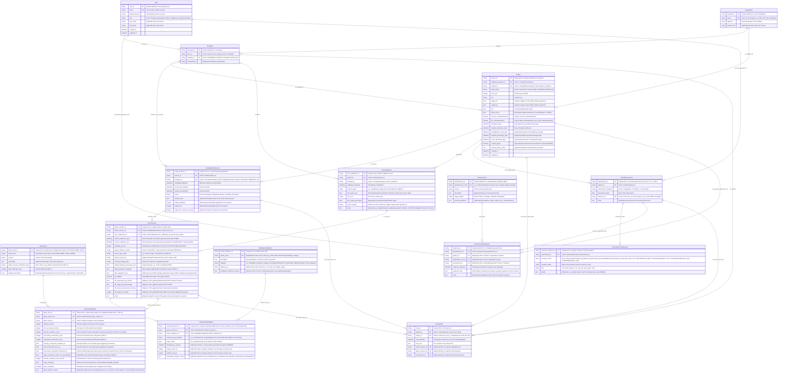

```mermaid
erDiagram
    User {
        string user_id PK "Unique identifier for any system user"
        string email UK "User's email, unique for login"
        string password_hash "Hashed password for security"
        string role "Enum: Therapist, Researcher, Admin, StudyNurse, ProjectCoordinator"
        string first_name "(Optional) User's first name"
        string last_name "(Optional) User's last name"
        datetime created_at
        datetime updated_at
    }

    HospitalSite {
        string hospital_id PK "Unique identifier for each hospital/site"
        string name UK "Name of the hospital, e.g., UZB, UZA, UZL Pellenberg"
        string address "Physical address of the hospital"
        string contact_info "(Optional) General contact for the site"
    }

    Therapist {
        string therapist_id PK "Unique identifier for a therapist"
        string user_id FK "Links to User.user_id, making a User a Therapist"
        string hospital_id FK "Links to HospitalSite.hospital_id, therapist's primary site"
        string specialization "(Optional) Therapist's specialization"
    }

    Patient {
        string patient_id PK "Study-specific pseudo-identifier for the patient"
        string assigned_therapist_id FK "Links to Therapist.therapist_id"
        string hospital_id FK "Links to HospitalSite.hospital_id where patient is admitted"
        string study_group "Enum: Intervention, Control (maps to C3D INFO.GROUP_ID)"
        integer birth_year "Patient's year of birth"
        string sex "Patient's sex"
        float height_cm "Patient's height in cm (for BMI, sEMG regression)"
        float weight_kg "Patient's weight in kg (for BMI, sEMG regression)"
        float bmi "Calculated Body Mass Index"
        float mmse_score "Mini-Mental State Examination score (Exclusion if <23/30)"
        boolean exercise_contraindications "Flag for exercise contraindications"
        boolean bfr_contraindications "Flag for BFR contraindications (e.g., blood clotting disorders)"
        datetime enrollment_date "Date patient was enrolled in the study"
        datetime hospital_admission_date "Date of hospital admission"
        datetime immobilization_start_date "(Optional) Start date of immobilization period"
        datetime expected_discharge_date "(Optional) Initially expected discharge date"
        datetime actual_discharge_date "(Optional) Actual date of hospital discharge"
        boolean consent_given "Flag indicating informed consent (text doc stored separately)"
        text medical_history_notes "(Optional) Relevant medical history summary"
        datetime created_at
        datetime updated_at
    }

    RehabilitationSession {
        string rehab_session_id PK "Unique ID for an overall therapy appointment"
        string patient_id FK "Links to Patient.patient_id"
        string therapist_id FK "Links to Therapist.therapist_id who configured/oversaw (maps to C3D INFO.THERAPIST_ID)"
        datetime scheduled_datetime "When the session was scheduled"
        datetime actual_start_datetime "Actual start time"
        datetime actual_end_datetime "Actual end time"
        string status "Enum: Scheduled, Completed, Missed, Cancelled, InProgress"
        text overall_notes "(Optional) Therapist notes for the entire rehab session"
        integer target_repetitions "(Optional) Overall target repetitions for the session"
        integer target_sets "(Optional) Overall target sets for the session"
        integer target_rest_interval_seconds "(Optional) Target rest between sets/activities"
    }

    MVCCalibration {
        string mvc_calibration_id PK "Unique ID for an MVC calibration event"
        string patient_id FK "Links to Patient.patient_id"
        string therapist_id FK "Links to Therapist.therapist_id who conducted"
        datetime calibration_datetime "Timestamp of calibration"
        string muscle_group "e.g., Quadriceps, Biceps (from C3D ANALOG.LABELS)"
        float mvc_value_raw "Recorded Maximum Voluntary Contraction value (raw sensor value)"
        string mvc_unit "Unit of mvc_value_raw"
        float mvc_value_processed "(Optional) Processed/normalized MVC value"
        string sensor_details "Details of sensor used (e.g., Delsys Trigno Avanti specific ID)"
        text notes "(Optional) e.g., adapted based on gameplay, patient condition, from WP2.4 adaptive muscle contraction"
    }

    GameLevel {
        string game_level_id PK "Unique ID for a game level configuration (maps to C3D INFO.GAME_LEVEL)"
        string level_name "Descriptive name (maps to C3D INFO.GAME_LEVEL_NAME)"
        string version "Version of the level design"
        text description "(Optional) Description of the level objectives"
        string target_muscle_contraction_type "Enum: Short, Long, Mixed, Sustained (from WP2.1)"
        integer base_difficulty_score "Baseline difficulty (WP2.1)"
        json default_parameters "(Optional) Default parameters for this level (e.g., target duration, thresholds)"
    }

    GameSession {
        string game_session_id PK "Unique ID for a single instance of game play"
        string rehab_session_id FK "Links to RehabilitationSession.rehab_session_id"
        string mvc_calibration_id FK "Links to MVCCalibration.mvc_calibration_id used for this session"
        datetime session_datetime_start "Start timestamp of the game play (from C3D INFO.TIME)"
        datetime session_datetime_end "End timestamp of the game play (calculated from DURATION or C3D metadata)"
        integer sampling_rate_hz "Sampling rate of EMG data in Hz (from C3D POINT/ANALOG.RATE)"
        string game_software_version "Version of GHOSTLY+ app used (from C3D INFO.VERSION)"
        string sensor_type_used "e.g., Delsys Trigno, CustomSensorX (WP2.2)"
        string specific_sensor_id "(Optional) Specific ID/serial of the sensor device used"
        string c3d_file_storage_path "Path to the C3D file in Supabase Storage"
        float target_intensity_percentage_mvc "Target intensity, e.g., 75 (% of calibrated MVC)"
        json dda_parameters_snapshot "DDA settings applied/active during this session (WP2.4)"
        text dda_adaptation_log "(Optional) Log of DDA changes during the session (WP2.4 adaptive level progression)"
        boolean bfr_applied "Flag if BFR was used in this game session"
        float bfr_measured_aop_mmHg "(Optional, if bfr_applied) Measured Arterial Occlusion Pressure"
        float bfr_target_aop_percentage "(Optional, if bfr_applied) Target %AOP for BFR"
        float bfr_actual_cuff_pressure_mmHg "(Optional, if bfr_applied) Actual cuff pressure maintained"
        integer bfr_duration_seconds "(Optional, if bfr_applied) Duration BFR was actively applied during game"
        text notes "(Optional) Specific notes for this game session by therapist or system"
    }

    EMGMetricDefinition {
        string metric_definition_id PK "Unique ID for an EMG metric type"
        string metric_name UK "Standardized name of the metric (e.g., RMS, MAV, DimitrovSpectralIndex_Fatigue)"
        text description "Brief explanation of what the metric represents"
        string category "e.g., Amplitude, Frequency, Fatigue, Force/Mass Estimation, Time-Domain, Spectral-Domain, Time-Frequency"
        string default_unit "Default unit for this metric (e.g., uV, N, kg, Hz, unitless_index)"
        text calculation_method_overview "General notes on how it is typically derived or key standard parameters"
    }

    EMGCalculatedMetric {
        string calculated_metric_id PK "Unique ID for a specific calculated EMG metric instance (WP2.3, from C3D Analog Data)"
        string game_session_id FK "Links to GameSession.game_session_id"
        string metric_definition_id FK "Links to EMGMetricDefinition.metric_definition_id"
        string muscle_group_analyzed "e.g., RectusFemoris, VastusMedialis (from C3D ANALOG.LABELS for CH1/CH2)"
        float metric_value "The calculated value of the metric for this instance"
        datetime timestamp_in_session "(Optional) if metric is a time-series point within the game (ISO8601)"
        integer window_start_ms "(Optional) Start of analysis window in ms from game session start"
        integer window_end_ms "(Optional) End of analysis window in ms from game session start"
        text calculation_instance_notes "(Optional) Specifics for this calculation (e.g., deviations from standard, exact library version/params)"
    }

    GamePlayStatistic {
        string game_stat_id PK "Unique ID for a game play statistic (for engagement/adherence - WP2.3)"
        string game_session_id FK "Links to GameSession.game_session_id"
        string game_level_id FK "Links to GameLevel.game_level_id played"
        integer attempt_number "Attempt number for this level in this session"
        integer time_on_level_seconds "Time spent on this specific level attempt"
        integer muscle_activation_count "Count of distinct muscle activations meeting criteria (from C3D CHn activated)"
        integer successful_contractions_short "Count of successful short contractions (WP2.1)"
        integer successful_contractions_long "Count of successful long contractions (WP2.1)"
        float average_contraction_duration_ms "Average duration of successful game-triggering contractions"
        float total_contraction_time_ms "Total time spent in successful game-triggering contractions"
        float time_above_activation_threshold_ms "Total time EMG signal was above game activation threshold (from C3D CHn activated)"
        float peak_contraction_value_mvc_percentage "Peak EMG value achieved during a game contraction (%MVC)"
        integer muscle_inactivity_total_seconds "Total duration of muscle inactivity periods during level"
        float score_achieved "Game score for this level (from C3D SUBJECTS.GAME_SCORE)"
        boolean level_completed "Whether this level attempt was completed successfully"
        json game_specific_events "(Optional) JSON array of timestamped events, e.g., [{ts:ms, event:'target_hit', value:x}] (from C3D Events)"
    }

    ClinicalAssessment {
        string assessment_id PK "Unique ID for a clinical assessment event (T0, T1, T2 - WP4)"
        string patient_id FK "Links to Patient.patient_id"
        string assessment_timepoint "Enum: T0_Baseline, T1_Week1, T2_Discharge"
        date assessment_date "Date of the assessment"
        string assessor_id FK "Links to User.user_id of the assessor (e.g., PhD student, therapist)"
        text notes "(Optional) Overall notes for this assessment event"
    }

    ClinicalOutcomeMeasure {
        string outcome_measure_id PK "Unique ID for a specific outcome measured (WP4)"
        string assessment_id FK "Links to ClinicalAssessment.assessment_id"
        string measure_name "Enum: MaxIsometricStrength_Quadriceps_Dynamometer_kg, MuscleMass_RectusFemoris_Ultrasound_CSA_cm2, 30SecSitToStand_Reps, FunctionalAmbulation_Score, ImmobilizationDuration_days, HospitalStayDuration_days"
        string measure_value "Value of the measure (can be numeric or text)"
        string unit "Unit of the measure, e.g., kg, cm2, reps, days, score"
        text details "(Optional) e.g., specific device used for measurement, side (left/right)"
    }

    ClinicalNote {
        string note_id PK "Unique ID for a clinical note"
        string patient_id FK "Links to Patient.patient_id the note is about"
        string author_id FK "Links to User.user_id (e.g., Therapist) who wrote the note"
        datetime note_datetime "Timestamp of when the note was created/updated"
        text note_text "The content of the clinical note"
        string rehab_session_id FK "(Optional) links to a specific RehabSession"
        string game_session_id FK "(Optional) links to a specific GameSession"
        string assessment_id FK "(Optional) links to a specific ClinicalAssessment"
    }

    Questionnaire {
        string questionnaire_id PK "Unique identifier for a questionnaire template (WP4)"
        string questionnaire_name UK "e.g., Patient Satisfaction Survey (T2), Therapist Fidelity Checklist"
        string version "Version of the questionnaire"
        text description "(Optional) Purpose of the questionnaire"
        string target_subject "Enum: Patient, Therapist, SiteStaff, PhDStudent"
        json schema_definition "JSON defining questions, types, options (e.g., JSON Schema)"
    }

    QuestionnaireResponse {
        string response_id PK "Unique identifier for a completed questionnaire"
        string questionnaire_id FK "Links to Questionnaire.questionnaire_id"
        string patient_id FK "(Optional) Links to Patient if respondent is patient"
        string respondent_user_id FK "(Optional) Links to User if respondent is staff"
        string assessment_id FK "(Optional) Links to ClinicalAssessment if tied to a timepoint"
        datetime response_datetime "Timestamp of when the response was submitted"
        json response_data "JSON object containing the answers, keyed by question IDs from schema"
        text notes "(Optional) Any additional notes about this specific response"
    }

    User ||--o{ Therapist : "can_be_a"
    HospitalSite ||--o{ Therapist : "employs"
    HospitalSite ||--o{ Patient : "is_admitted_at"
    Therapist ||--o{ Patient : "is_assigned_to"
    Therapist ||--o{ RehabilitationSession : "conducts_or_oversees"
    Therapist ||--o{ MVCCalibration : "conducts"
    Therapist ||--o{ ClinicalNote : "can_author"
    Patient ||--o{ RehabilitationSession : "has_many"
    Patient ||--o{ MVCCalibration : "undergoes"
    Patient ||--o{ ClinicalAssessment : "has_assessments"
    Patient ||--o{ ClinicalNote : "can_have_notes_about"
    Patient ||--o{ QuestionnaireResponse : "can_provide_responses_for"
    User ||--o{ QuestionnaireResponse : "can_provide_responses_for"
    User ||--o{ ClinicalAssessment : "can_be_assessor_for"
    RehabilitationSession ||--o{ GameSession : "includes_many"
    RehabilitationSession ||--o{ ClinicalNote : "can_have_notes_for"
    MVCCalibration ||--o{ GameSession : "is_used_for"
    GameLevel ||--o{ GamePlayStatistic : "is_played_in"
    GameSession ||--o{ EMGCalculatedMetric : "generates_many"
    GameSession ||--o{ GamePlayStatistic : "records_many_stats_for"
    GameSession ||--o{ ClinicalNote : "can_have_notes_for"
    EMGMetricDefinition ||--o{ EMGCalculatedMetric : "defines_type_for"
    ClinicalAssessment ||--o{ ClinicalOutcomeMeasure : "measures_many"
    ClinicalAssessment ||--o{ QuestionnaireResponse : "can_be_associated_with"
    ClinicalAssessment ||--o{ ClinicalNote : "can_have_notes_for"
    Questionnaire ||--o{ QuestionnaireResponse : "has_many"

``` 