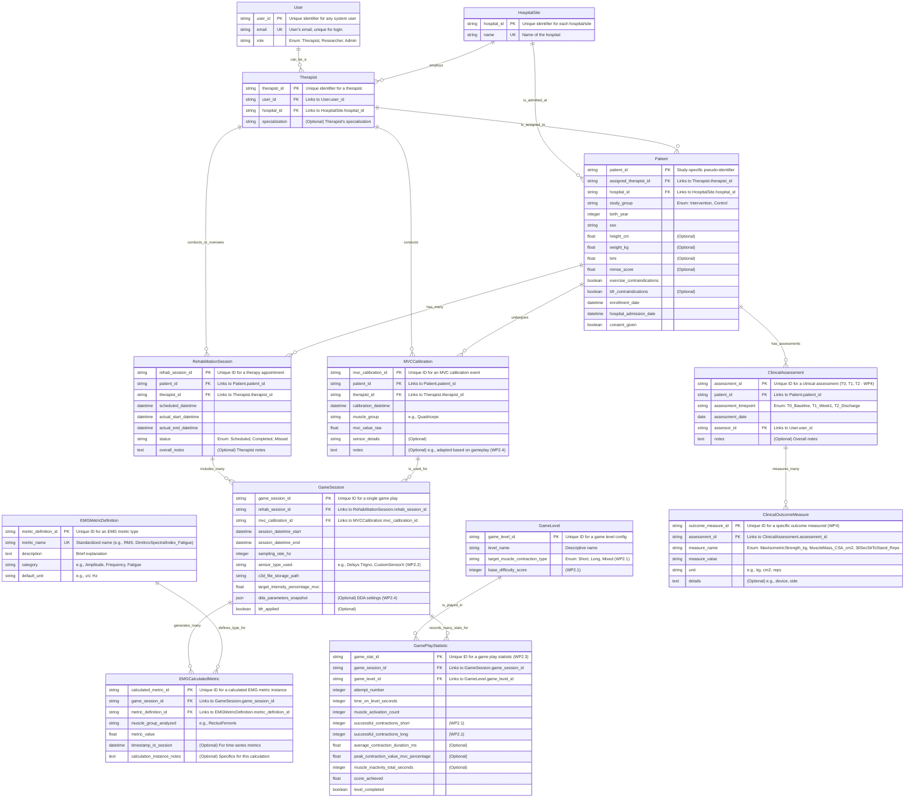

```mermaid
erDiagram
    User {
        string user_id PK "Unique identifier for any system user"
        string email UK "User's email, unique for login"
        string role "Enum: Therapist, Researcher, Admin"
    }

    HospitalSite {
        string hospital_id PK "Unique identifier for each hospital/site"
        string name UK "Name of the hospital"
    }

    Therapist {
        string therapist_id PK "Unique identifier for a therapist"
        string user_id FK "Links to User.user_id"
        string hospital_id FK "Links to HospitalSite.hospital_id"
        string specialization "(Optional) Therapist's specialization"
    }

    Patient {
        string patient_id PK "Study-specific pseudo-identifier"
        string assigned_therapist_id FK "Links to Therapist.therapist_id"
        string hospital_id FK "Links to HospitalSite.hospital_id"
        string study_group "Enum: Intervention, Control"
        integer birth_year
        string sex
        float height_cm "(Optional)"
        float weight_kg "(Optional)"
        float bmi "(Optional)"
        float mmse_score "(Optional)"
        boolean exercise_contraindications
        boolean bfr_contraindications "(Optional)"
        datetime enrollment_date
        datetime hospital_admission_date
        boolean consent_given
    }

    RehabilitationSession {
        string rehab_session_id PK "Unique ID for a therapy appointment"
        string patient_id FK "Links to Patient.patient_id"
        string therapist_id FK "Links to Therapist.therapist_id"
        datetime scheduled_datetime
        datetime actual_start_datetime
        datetime actual_end_datetime
        string status "Enum: Scheduled, Completed, Missed"
        text overall_notes "(Optional) Therapist notes"
    }

    MVCCalibration {
        string mvc_calibration_id PK "Unique ID for an MVC calibration event"
        string patient_id FK "Links to Patient.patient_id"
        string therapist_id FK "Links to Therapist.therapist_id"
        datetime calibration_datetime
        string muscle_group "e.g., Quadriceps"
        float mvc_value_raw
        string sensor_details "(Optional)"
        text notes "(Optional) e.g., adapted based on gameplay (WP2.4)"
    }

    GameLevel {
        string game_level_id PK "Unique ID for a game level config"
        string level_name "Descriptive name"
        string target_muscle_contraction_type "Enum: Short, Long, Mixed (WP2.1)"
        integer base_difficulty_score "(WP2.1)"
    }

    GameSession {
        string game_session_id PK "Unique ID for a single game play"
        string rehab_session_id FK "Links to RehabilitationSession.rehab_session_id"
        string mvc_calibration_id FK "Links to MVCCalibration.mvc_calibration_id"
        datetime session_datetime_start
        datetime session_datetime_end
        integer sampling_rate_hz
        string sensor_type_used "e.g., Delsys Trigno, CustomSensorX (WP2.2)"
        string c3d_file_storage_path
        float target_intensity_percentage_mvc
        json dda_parameters_snapshot "(Optional) DDA settings (WP2.4)"
        boolean bfr_applied "(Optional)"
    }

    EMGMetricDefinition {
        string metric_definition_id PK "Unique ID for an EMG metric type"
        string metric_name UK "Standardized name (e.g., RMS, DimitrovSpectralIndex_Fatigue)"
        text description "Brief explanation"
        string category "e.g., Amplitude, Frequency, Fatigue"
        string default_unit "e.g., uV, Hz"
    }

    EMGCalculatedMetric {
        string calculated_metric_id PK "Unique ID for a calculated EMG metric instance"
        string game_session_id FK "Links to GameSession.game_session_id"
        string metric_definition_id FK "Links to EMGMetricDefinition.metric_definition_id"
        string muscle_group_analyzed "e.g., RectusFemoris"
        float metric_value
        datetime timestamp_in_session "(Optional) For time-series metrics"
        text calculation_instance_notes "(Optional) Specifics for this calculation"
    }

    GamePlayStatistic {
        string game_stat_id PK "Unique ID for a game play statistic (WP2.3)"
        string game_session_id FK "Links to GameSession.game_session_id"
        string game_level_id FK "Links to GameLevel.game_level_id"
        integer attempt_number
        integer time_on_level_seconds
        integer muscle_activation_count
        integer successful_contractions_short "(WP2.1)"
        integer successful_contractions_long "(WP2.1)"
        float average_contraction_duration_ms "(Optional)"
        float peak_contraction_value_mvc_percentage "(Optional)"
        integer muscle_inactivity_total_seconds "(Optional)"
        float score_achieved
        boolean level_completed
    }

    ClinicalAssessment {
        string assessment_id PK "Unique ID for a clinical assessment (T0, T1, T2 - WP4)"
        string patient_id FK "Links to Patient.patient_id"
        string assessment_timepoint "Enum: T0_Baseline, T1_Week1, T2_Discharge"
        date assessment_date
        string assessor_id FK "Links to User.user_id"
        text notes "(Optional) Overall notes"
    }

    ClinicalOutcomeMeasure {
        string outcome_measure_id PK "Unique ID for a specific outcome measured (WP4)"
        string assessment_id FK "Links to ClinicalAssessment.assessment_id"
        string measure_name "Enum: MaxIsometricStrength_kg, MuscleMass_CSA_cm2, 30SecSitToStand_Reps"
        string measure_value
        string unit "e.g., kg, cm2, reps"
        text details "(Optional) e.g., device, side"
    }

    User ||--o{ Therapist : "can_be_a"
    HospitalSite ||--o{ Therapist : "employs"
    HospitalSite ||--o{ Patient : "is_admitted_at"
    Therapist ||--o{ Patient : "is_assigned_to"
    Therapist ||--o{ RehabilitationSession : "conducts_or_oversees"
    Therapist ||--o{ MVCCalibration : "conducts"
    Patient ||--o{ RehabilitationSession : "has_many"
    Patient ||--o{ MVCCalibration : "undergoes"
    Patient ||--o{ ClinicalAssessment : "has_assessments"
    RehabilitationSession ||--o{ GameSession : "includes_many"
    MVCCalibration ||--o{ GameSession : "is_used_for"
    GameLevel ||--o{ GamePlayStatistic : "is_played_in"
    GameSession ||--o{ EMGCalculatedMetric : "generates_many"
    GameSession ||--o{ GamePlayStatistic : "records_many_stats_for"
    EMGMetricDefinition ||--o{ EMGCalculatedMetric : "defines_type_for"
    ClinicalAssessment ||--o{ ClinicalOutcomeMeasure : "measures_many"

``` 