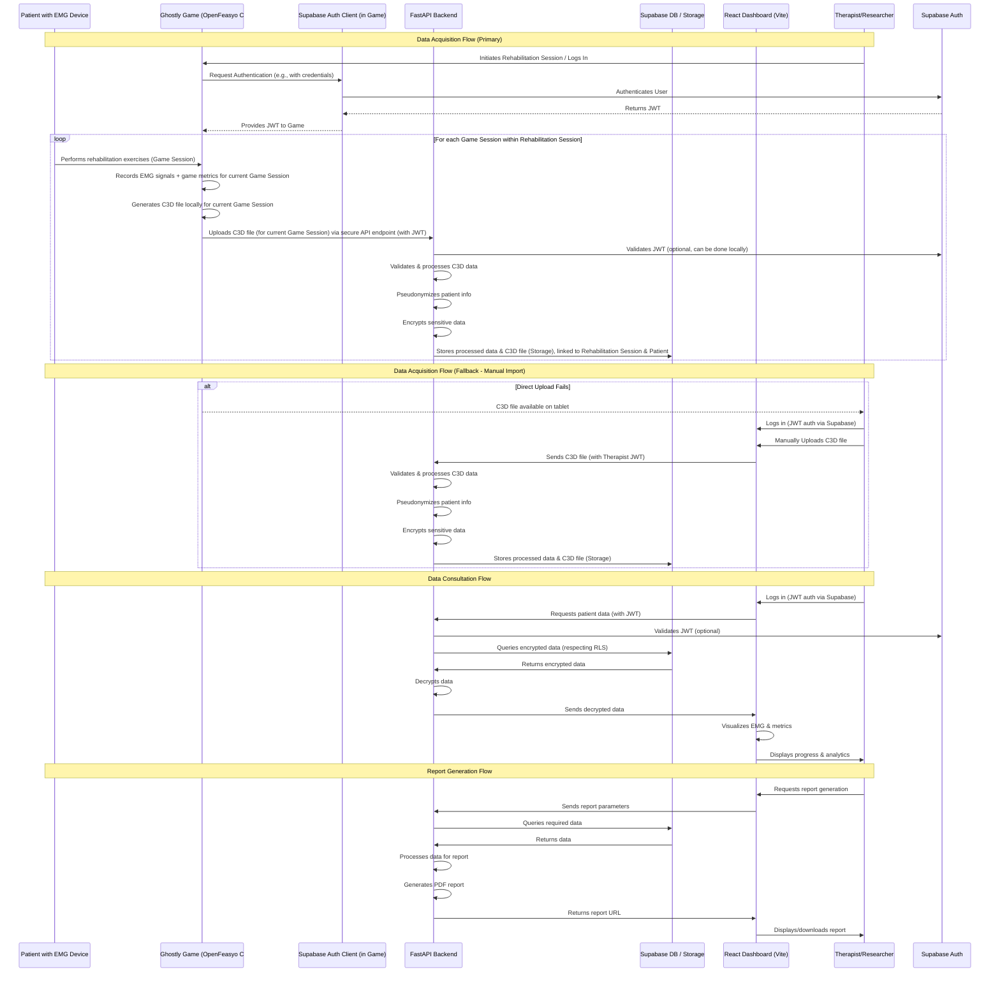

> [!note]
> IMPORTANT NOTICE: This document is preliminary and subject to change. All specifications, architectures, timelines, and requirements are tentative and will evolve as the project progresses and stakeholder feedback is incorporated.

## 1. INTRODUCTION

### 1.1 Project Purpose

GHOSTLY+ is an applied research project funded by the Research Foundation – Flanders (FWO) aimed at combating muscle strength loss in hospitalized patients, including stroke patients, elderly patients, and those recovering from COVID-19. The project combines blood flow restriction (BFR) with an electromyography (EMG)-driven serious game to create an effective, engaging, and measurable rehabilitation method.

### 1.2 Problem Statement

Muscle strength loss in hospitalized patients is a significant clinical problem that contributes to:

- Slower post-hospitalization recovery
- Increased risk of falls and injuries
- Decreased autonomy and quality of life
- Higher frequency of hospital readmissions
- Extended periods of immobility and bedridden status

This problem is particularly acute in three populations targeted by this study:
1. Acute and subacute stroke patients
2. Hospitalized elderly patients
3. Patients recovering from COVID-19 and ICU patients

### 1.3 Proposed Solution

The GHOSTLY+ system includes:

1. An EMG-driven serious game on Android tablets (existing component) that uses quadriceps muscle contractions to control gameplay
2. Delsys Trigno Avanti EMG sensors (existing component) to measure muscle activation
3. Optional blood flow restriction (BFR) applied during training for one experimental group
4. A web dashboard for patient monitoring and data analysis (to be developed)

### 1.4 Stakeholders

- **Interdisciplinary research team**: Prof. Eva Swinnen, Prof. David Beckwée, Prof. Bart Jansen, Ruben Debeuf (Principal Investigator)
- **Participating medical centers**: UZ Brussels, UAntwerpen/UZA, KU Leuven
- **End users**:
    - Therapists/clinicians
    - Researchers
- **Study participants**:
    - Acute and subacute stroke patients
    - Hospitalized elderly patients (65+ years)
    - Patients recovering from COVID-19 and ICU patients

## 2. EXISTING PRODUCT OVERVIEW

### 2.1 OpenFeasyo Serious Game

The Ghostly app uses the OpenFeasyo platform, a software framework for creating sensor-driven games:

- Runs on Android tablets
- Gamified interface adapted for users
- Captures EMG signals from quadriceps muscles to control the game
- Offers three training protocols:
  - **Standard training**: Three sets of twelve muscle contractions with 120 seconds of rest between sets
  - **Cluster set 1**: Three sets of twelve repetitions with ten seconds of rest between each contraction
  - **Cluster set 2**: Three sets of twelve repetitions with 30 seconds of rest after three consecutive contractions
- Training intensity set at 75% of maximum voluntary contraction (MVC)

### 2.2 Current Data Collection

The current system:

- Collects data from Delsys Trigno EMG sensors placed on quadriceps muscles
- Stores data in C3D format (standard biomechanics format); multiple C3D files may be generated if a single rehabilitation session involves multiple distinct game plays.
- Records game metrics (level, score, duration) within each C3D file or associated metadata.
- Saves C3D files locally on the tablet.
- Does not currently support centralized storage or analysis for multiple C3D files from a single rehabilitation session in an aggregated manner.

### 2.3 Limitations of Current System (Prior to Web Dashboard Development)

*The following limitations describe the GHOSTLY+ system's capabilities before the introduction of the proposed Web Dashboard. The dashboard is designed to address these points.*

- Lack of centralized patient data
- Inability for remote monitoring by clinicians
- Difficulty in comparative analysis between patients and treatment groups
- Lack of tools to measure progression over time
- No capacity for statistical analysis across the three RCTs
- Limited ability to visualize and compare key outcome measures (muscle strength, cross-sectional area, pennation angle, echo intensity)

## 3. WEB DASHBOARD REQUIREMENTS

### 3.1 Primary Functional Objectives

### 3.1.1 Therapist-Focused Features

**Essential for MVP**:
- View results of patients' **Rehabilitation Sessions**, with the ability to inspect data from individual **Game Sessions (C3D files)** within them.
- Visualize EMG signals and game metrics from individual or aggregated **Game Sessions** composing a **Rehabilitation Session**.
- Track individual patient progress with basic trend visualization of key quadriceps metrics (data potentially aggregated from multiple **Game Sessions** per **Rehabilitation Session**).
- Track population-specific assessment measures:
  - Motricity Index for stroke patients 
  - 30-second sit-to-stand test for elderly patients
  - Manual muscle testing for COVID-19/ICU patients
- Configure exercise programs and game parameters
- Manage patient profiles and demographic information
- Record therapy compliance and adherence metrics

**Future Releases**:
- Generate comprehensive clinical reports
- Compare patient cohorts with advanced analytics across the three study populations
- Create and share treatment templates
- Access detailed longitudinal progress tracking
- Collaborate with other therapists on treatment plans
- Support Global Perceived Effect (GPE) questionnaire analysis
- Integrate USE (Usefulness, Satisfaction, and Ease of use) questionnaire data

### 3.1.2 Researcher-Focused Features

**Essential for MVP**:
- Access pseudonymized patient data for analysis
- Export data for external statistical analysis in SPSS 27 (or SPSS-compatible formats)
- Create and manage patient cohorts based on study arm (Ghostly, Ghostly+BFR, Control/Leaflet)
- Generate simple multi-site statistics
- Filter and segment data based on key parameters
- Compare treatment groups within each population
- Visualize 2-week and 6-week intervention outcomes

**Future Releases**:
- Perform advanced comparative data analysis
- Access sophisticated statistical tools directly in the platform, including:
  - Two-way repeated measures ANOVA
  - Tukey post hoc test
  - Descriptive statistics with Levene's test for normal distribution
- Create custom research dashboards
- Generate publication-ready visualizations
- Define complex cohort criteria with multiple parameters

### 3.1.3 Administrator-Focused Features

**Essential for MVP**:
- Manage user accounts and role-based permissions
- Basic system monitoring and troubleshooting
- Data backup and restoration capabilities
- Security and access control management
- Patient data pseudonymization enforcement

**Future Releases**:
- Detailed system analytics and usage reporting
- Advanced audit logging and compliance reporting
- Institution-specific settings and customization
- Bulk user and data management operations
- System optimization and performance tuning

### 3.2 Detailed Functional Requirements

> **Implementation Mapping**: For a detailed mapping of these requirements to specific UI screens, please see the [UX_UI_specifications.md](UX_UI_specifications.md) in the Ghostly+ Dashboard: Functional Design and UI/UX Specifications document.

### 3.2.1 Authentication and Authorization

**Essential for MVP**:
- Role-based authentication system (therapist, researcher, administrator)
- Secure login with email/password using Supabase Auth
- Basic password management and account recovery
- Permission system controlling access to patient data
- Row-level security implementation for data access control

**Future Releases**:
- Multi-factor authentication (MFA)
- Single Sign-On (SSO) integration
- Advanced permission management with granular access controls
- Institutional access management
- Session management with automatic timeouts and lockouts
- Enhanced audit logging of all authentication events

### 3.2.2 Patient Management

**Essential for MVP**:
- Patient registration and profile creation with population categorization (stroke, elderly, COVID-19/ICU)
- Assignment of patients to therapists
- Treatment group assignment (Ghostly, Ghostly+BFR, Control/Leaflet)
- Program adherence tracking (potentially distinguishing between adherence to overall Rehabilitation Session schedule and completion of all prescribed Game Sessions within it).
- Core intervention history recording, including a clear structure for **Rehabilitation Sessions** and their constituent **Game Sessions (C3D files)**.
- Demographic data management
- Recording of inclusion/exclusion criteria status

**Future Releases**:
- Advanced medical history integration
- Treatment outcome prediction
- Detailed protocol compliance analytics
- Patient self-service portal access
- Inter-institutional patient transfers

### 3.2.3 Cohort Management

**Essential for MVP**:
- Create and manage patient cohorts by population and treatment group
- Simple assignment of therapists to cohorts
- Fundamental cohort-level metrics
- Basic cohort comparison functionality
- Track 2-week and 6-week intervention outcomes by cohort

**Future Releases**:
- Advanced cohort analytics and statistical tools
- Sophisticated multi-parameter cohort definition
- Detailed cohort-level reports with customizable templates
- Inter-institutional cohort comparisons
- Longitudinal cohort tracking with predictive modeling

### 3.2.4 EMG Data Visualization

**Essential for MVP**:
- Temporal graphs showing quadriceps EMG signals
- Muscle strength analysis visualization (MVC measurements)
- Muscle contraction detection and pattern display
- Session-to-session comparison of EMG data
- Visualization of different training protocols (standard, cluster set 1, cluster set 2)

**Future Releases**:
- Advanced muscle fatigue analysis with predictive indicators
- Multi-dimensional EMG visualization with muscle mapping
- Machine learning assisted pattern recognition
- Real-time collaborative visualization review
- Custom visualization parameters for research applications

### 3.2.5 Quadriceps Measurement Visualization

**Essential for MVP**:
- Visualization of key quadriceps measurements:
  - Muscle strength (MicroFET dynamometer data)
  - Cross-sectional area (ultrasound measurements)
  - Pennation angle (ultrasound measurements)
  - Echo intensity (ultrasound measurements)
- Comparison between left and right legs
- Baseline vs. 2-week vs. 6-week visualization
- Treatment group comparison views

**Future Releases**:
- Integration with ultrasound image data
- Advanced analysis of muscle quality metrics
- Correlation analysis between different measurement types
- Predictive modeling of strength gains based on early measurements

### 3.2.6 Game Performance Analysis

**Essential for MVP**:
- Basic scores and progressions in the game (per **Game Session**).
- **Rehabilitation Session** and **Game Session** duration and frequency tracking.
- Correlation between EMG activity and game performance (analyzed per **Game Session**).
- Short-term performance tracking (across multiple **Game Sessions** and **Rehabilitation Sessions**).
- Therapy compliance and adherence metrics:
  - Number of **Rehabilitation Sessions** completed vs. prescribed.
  - Number of **Game Sessions** completed vs. prescribed within each **Rehabilitation Session** (if applicable).
  - Training load achieved vs. prescribed (potentially aggregated per **Rehabilitation Session** from its **Game Sessions**).
  - Repetitions performed vs. prescribed (similarly aggregated or tracked per **Game Session**).

**Future Releases**:
- Advanced long-term trend analysis with predictive modeling
- Detailed game-EMG correlation with machine learning insights
- Performance benchmarking against similar patient profiles
- Adaptive difficulty recommendations based on performance
- Multi-factor analysis incorporating clinical variables

### 3.2.7 Reports and Exports

- **Essential for MVP**:
  - Basic data export capabilities for researchers (CSV, Excel, SPSS-compatible formats)
  - Session summary views for therapists
  - EMG visualization exports for clinical documentation
  - Summary data for USE questionnaire analysis
  - Data export in formats compatible with REDCap for archival/clinical trial master data.

- **Future Releases**:
  - PDF clinical report generation with customizable templates
  - Printable comprehensive dashboards
  - Summary reports by medical center
  - Advanced visualization exports with annotations
  - Statistical analysis reports (ANOVA, post-hoc tests)

### 3.3 Non-Functional Requirements

### 3.3.1 Security and Privacy

- End-to-end encryption of sensitive data
- Patient identifier pseudonymization
- Access logging (audit logs)
- Compliance with medical security standards
- Data deletion process (right to be forgotten)

### 3.3.2 Performance

- Page load times < 2 seconds
- Simultaneous support for 100+ users
- Efficient processing of C3D files (>100MB)
- Optimization for variable internet connections

### 3.3.3 Accessibility

- WCAG 2.1 level AA compliance (Target, to be confirmed based on project resources and final scope)
- Multilingual support (English, Dutch, French)

### 3.3.4 Availability and Reliability

- 99.5%+ availability
- Daily backups
- Disaster recovery plan
- Error detection and notification mechanisms

## 4. TECHNICAL ARCHITECTURE

The GHOSTLY+ project is structured into six distinct work packages that together form the complete system architecture:

### 4.1 WORK PACKAGE 1: Existing System Integration
*This package focuses on understanding and interfacing with the current components of the GHOSTLY+ system, including the OpenFeasyo game, EMG sensors, and local C3D file storage. Source code modification of the OpenFeasyo game is possible.*

#### 4.1.1 Current Components
- OpenFeasyo game (MonoGame/C# based) running on Android tablets
- Delsys Trigno Avanti EMG sensors
- Local C3D file storage (prior to authenticated upload)

#### 4.1.2 Integration Requirements
- Analysis of C3D file format and structure.
- Understanding game metrics and data export capabilities.
- **Integrate Supabase Authentication into the OpenFeasyo (MonoGame/C#) application:**
    - Implement user login (therapist/researcher) within the game interface using Supabase Auth (via REST API or C# client library).
    - Securely handle JWT tokens within the game application.
- **Implement direct, authenticated C3D file upload from the game:**
    - After each **Game Session** (i.e., a single instance of playing the game), the game application will generate a C3D file.
    - The game application should be capable of uploading each generated C3D file directly to a secure backend API endpoint, either immediately after the Game Session or potentially batched at the end of the overall **Rehabilitation Session**. The exact timing (per game vs. per rehab session) needs confirmation.
    - Each upload request must include the user's valid JWT for authentication and clear identifiers to associate the C3D file with the correct patient and the overarching Rehabilitation Session.
- Define fallback mechanism (e.g., manual dashboard upload) in case of direct upload failure, allowing for upload of one or more C3D files per Rehabilitation Session.

### 4.2 WORK PACKAGE 2: Web Dashboard (Frontend)
*This package covers the development of the user-facing web application using **React**. It includes UI/UX design, component development, state management, and routing.*

-   **Technology**: React (v19+), React Router, TypeScript, Tailwind CSS, shadcn/ui, Vite.
-   **Key Responsibilities**: Role-based interfaces (Therapist, Researcher, Admin), data visualization, interaction with backend services.
-   **Supabase Interaction**: Uses `@supabase/js` client library primarily for **user authentication** and interacting with Supabase Database/Storage **within the user's security context (respecting RLS)**. It **does not** use the `service_role` key.

**Note**: The project uses **React with Vite** for a client-side focused dashboard application. (Previous considerations for other frameworks like Vue.js or Next.js have been superseded by this choice for simplicity, performance, and maintainability).

### 4.3 WORK PACKAGE 3: Service Layer (Backend API)
*This package focuses on the **dedicated Python backend service** built with **FastAPI**. It handles core business logic, data processing detached from the frontend framework, and future advanced analytics.*

-   **Technology**: FastAPI, Python 3.11+, Pydantic, SQLAlchemy (potentially), appropriate analytics libraries (e.g., Pandas, NumPy later).
-   **Key Responsibilities**: Secure C3D file processing, complex business logic, EMG analysis (potentially), application-level encryption/decryption, pseudonymization, advanced analytics.
-   **Supabase Interaction**: Primarily **verifies JWTs** issued by Supabase Auth. For data access, it often interacts **directly with the PostgreSQL database** for complex operations. May use `supabase-py` client optionally for simple utility tasks.

### 4.4 WORK PACKAGE 4: Data Infrastructure
*This package covers the setup, configuration, and management of the **self-hosted Supabase instance**, including the database, authentication service, storage, and edge functions. Supabase serves as the primary operational database and BaaS for the dashboard.*

-   **Technology**: Supabase (Self-Hosted), PostgreSQL (v15+), Supabase Auth (GoTrue), Supabase Storage, Supabase Edge Functions (Deno).
-   **Key Responsibilities**: Data persistence (PostgreSQL), file storage, user authentication/JWT issuance (Auth), enforcing Row-Level Security (RLS), providing secure environment for privileged backend logic (Edge Functions).
-   **Supabase Edge Functions**: Provide serverless backend logic capability within the Supabase ecosystem. They are the designated place to use the Supabase JS client **with the `service_role` key** for **privileged operations** that need to bypass RLS.
-   **Note on Clinical Trial Data Archival**: While Supabase provides the operational data infrastructure for the dashboard, the GHOSTLY+ FWO proposal indicates that **REDCap** will be utilized for the primary, GDPR-compliant archival and master storage of clinical trial data. The dashboard should support data export in formats compatible with REDCap.

### 4.5 WORK PACKAGE 5: Security and Compliance
*This package outlines the critical measures for data privacy, security, GDPR compliance, and ethical handling of patient data throughout the system.*

#### 4.5.1 Personal Data Protection

- **Pseudonymization**: Separation of personal identifiers from medical data
- **Encryption**: Use of standard encryption algorithms (Fernet)
- **Key management**: Secure storage of encryption keys

#### 4.5.2 GDPR Compliance

- Explicit patient consent
- Data access and portability
- Right to erasure
- Data retention limitations
- Audit logging of all data access and modifications

#### 4.5.3 Application Security
- Strong authentication via Supabase Auth and JWT verification in the backend.
- Protection against OWASP Top 10 vulnerabilities (Input validation, parameterized queries via SQLAlchemy, CSRF protection if applicable, etc.).
- Rate limiting on API endpoints.
- Regular dependency scanning (e.g., using `pip-audit`, `npm audit`).
- Secure configuration management (no hardcoded secrets).
- Consider infrastructure security scanning and penetration testing before production launch.

#### 4.5.4 Ethical Considerations

- Documentation support for ethics committees
- Data breach procedures
- Consent management system

### 4.6 WORK PACKAGE 6: Deployment and Operations
*This package describes the strategy for containerizing using Docker, deploying, and maintaining the GHOSTLY+ system, considering scalability and different hosting models.*

#### 4.6.1 Containerization
- **Technology**: Docker & Docker Compose
- **Setup**:
    - Separate Dockerfiles for backend (FastAPI) and frontend (React - using multi-stage builds for efficiency).
    - `docker-compose.yml` for orchestrating local development environment (backend, frontend, potentially a local Supabase instance via its Docker image for testing).
- Considerations for scalability (e.g., running multiple backend instances) and ease of deployment.

#### 4.6.2 Deployment Options

- Centralized model: all hospitals connect to VUB instance
- Hybrid model: core data at VUB with local processing at each site
- Distributed model: independent instances with anonymized data sharing

### 4.7 Architecture Summary & Interaction Patterns

*(This section summarizes the hybrid approach)*

-   The **React frontend** (developed with Vite) handles user presentation and interacts directly with **Supabase Auth** (using client libraries like `@supabase/js`) for authentication. For data, it can fetch directly from Supabase (respecting RLS) or call the FastAPI backend or Supabase Edge Functions.
-   The React frontend is primarily client-side. Server-side logic is handled by **Supabase Edge Functions** (for privileged Supabase operations requiring the `service_role` key) and the **dedicated FastAPI backend** (for complex Python-specific logic, advanced analytics, and tasks decoupled from the primary web UI).
-   **Supabase** acts as the central BaaS platform providing Auth, Database (with RLS), Storage, and Edge Functions.

### 4.8 Data Flow
*This section illustrates how data moves through the system, prioritizing the authenticated flow from the game. It assumes that a **Rehabilitation Session** can consist of one or more **Game Sessions**, each resulting in a C3D file.*

#### 4.8.1 Data Acquisition (Primary Flow)
1. Therapist logs into the Ghostly Game on the Android tablet using Supabase Auth and initiates a **Rehabilitation Session** for a patient.
2. Patient undertakes one or more **Game Sessions** (plays the serious game) with EMG sensors on quadriceps muscles.
3. Data is recorded locally during each **Game Session**.
4. After each **Game Session** completion, the Game application generates a C3D file.
5. The Game application authenticates with the Backend API using the therapist's JWT.
6. The Game application uploads each C3D file (from each Game Session) directly to the secure backend endpoint. This may occur after each Game Session or be batched at the end of the Rehabilitation Session.
7. Backend validates the JWT, processes each C3D file, pseudonymizes patient info (if needed at this stage), encrypts sensitive data.
8. Backend stores processed data and each C3D file in Supabase Storage, associating them with the correct patient and the specific **Rehabilitation Session** (and potentially a Game Session identifier within that Rehabilitation Session).

#### 4.8.2 Data Acquisition (Fallback Flow)
1. If direct upload fails for any C3D files from a **Rehabilitation Session**, they remain on the tablet.
2. Therapist logs into the Web Dashboard.
3. Therapist manually uploads the C3D file(s) via the dashboard interface, selecting the relevant patient and associating them with the correct **Rehabilitation Session**.
4. Dashboard sends the file(s) to the Backend.
5. Backend processes and stores the data as in the primary flow (steps 7-8), ensuring each C3D is linked to the overarching Rehabilitation Session.

#### 4.8.3 Data Consultation
*(Previously 4.7.3)*
1. User (Therapist/Researcher) authenticates on the Web Dashboard using Supabase Auth.
2. Frontend makes a request to the backend with JWT
3. Backend verifies permissions
4. Encrypted data is retrieved and decrypted
5. Data is returned and visualized in the dashboard

### 4.9 Data Flow Diagram
*Sequence diagram updated for primary authenticated game upload and to reflect multiple C3D files per rehabilitation session.*


### 4.10 Recommended Project Structure
*This structure organizes the backend, frontend, Docker configurations, and deployment settings logically. Inspired by common practices for FastAPI + React projects.*

```plaintext
ghostly-plus/
│
├── backend/                      # FastAPI backend (Python)
│   ├── app/
│   │   ├── __init__.py
│   │   ├── main.py               # FastAPI application entry point
│   │   ├── core/                 # Core logic (config, security)
│   │   │   └── ...
│   │   ├── api/                  # API endpoints/routers
│   │   │   └── ...
│   │   ├── models/               # Pydantic models
│   │   │   └── ...
│   │   ├── schemas/              # Database interaction schemas (if needed)
│   │   │   └── ...
│   │   ├── services/             # Business logic services
│   │   │   └── ...
│   │   └── utils/                # Utility functions
│   │       └── ...
│   ├── tests/                    # Unit & integration tests
│   │   └── ...
│   ├── alembic/                  # Database migrations (if using Alembic)
│   ├── pyproject.toml            # Dependencies (using Poetry recommended)
│   └── requirements.txt          # Fallback dependencies
│
├── frontend/                     # React frontend (TypeScript, Vite)
│   ├── src/
│   │   ├── assets/               # Static assets (images, fonts)
│   │   ├── components/           # Reusable UI components (incl. shadcn/ui)
│   │   │   └── ...
│   │   ├── contexts/             # React Context API providers
│   │   │   └── authContext.tsx   # Example: Auth context
│   │   ├── hooks/                # Custom React hooks
│   │   │   └── useAuth.ts        # Example: Auth hook
│   │   ├── pages/                # Page-level components
│   │   │   └── ...
│   │   ├── routes/               # React Router configuration
│   │   │   └── index.tsx
│   │   ├── services/             # API interaction layer
│   │   │   └── apiClient.ts      # Recommended: Axios instance with interceptors
│   │   ├── types/                # TypeScript type definitions
│   │   ├── lib/                  # shadcn/ui library utils
│   │   │   └── utils.ts
│   │   ├── App.tsx               # Root React component
│   │   └── main.tsx              # Application entry point
│   ├── public/                   # Static assets copied to dist root
│   ├── index.html                # Main HTML file
│   ├── package.json              # Frontend dependencies & scripts
│   ├── tsconfig.json             # TypeScript configuration
│   ├── vite.config.ts            # Vite build/dev server config
│   │                               # Recommended: Configure server.proxy for dev
│   ├── tailwind.config.js        # Tailwind CSS configuration
│   ├── components.json           # shadcn/ui configuration
│   └── postcss.config.js         # PostCSS configuration (often needed for Tailwind)
│
├── docker/                       # Docker configurations
│   ├── backend/
│   │   └── Dockerfile            # Backend container definition
│   └── frontend/
│       └── Dockerfile            # Frontend container definition (multi-stage build)
│
├── nginx/                        # Nginx configuration for production
│   └── conf.d/
│       └── default.conf          # Nginx reverse proxy & static serving config
│
├── supabase/                     # Supabase local dev/migrations (if needed)
│   ├── config.toml
│   └── migrations/
│       └── ...
│
├── .env                          # Root environment variables (DB URLs, secrets)
├── .env.example                  # Example environment variables
├── .gitignore                    # Git ignore file
├── docker-compose.yml            # Docker Compose for development environment orchestration
└── README.md                     # Project documentation
```

**Notes on Structure & Configuration:**

*   **Development:** Use `docker-compose.yml` to run the backend, frontend (with Vite dev server), and database containers. Configure `vite.config.ts` with `server.proxy` to forward frontend `/api` requests to the backend container, avoiding CORS issues.
*   **Production Deployment:** Build static frontend assets (`npm run build`). Use Nginx (or similar web server/reverse proxy) configured via `nginx/conf.d/default.conf`. Nginx should:
    *   Serve the static frontend assets (HTML, JS, CSS) from the built `frontend/dist` directory.
    *   Act as a reverse proxy, forwarding requests starting with `/api` (or another chosen prefix) to the backend FastAPI container.
*   **API Client (`frontend/src/services/apiClient.ts`):** Implement using Axios or Fetch, potentially with interceptors to automatically attach JWT tokens from the auth store and handle 401 Unauthorized errors globally.
*   **Auth Store (`frontend/src/contexts/authContext.tsx`):** Use React Context API to manage user authentication state (token, user info) and provide login/logout actions.
*   **Environment Variables:** Use `.env` files (loaded by Docker Compose, FastAPI settings, and Vite) to manage configuration secrets and environment-specific settings. Provide a `.env.example` for guidance.

## 5. DEVELOPMENT AND DEPLOYMENT

### 5.1 Development Environment

- Git repository for code versioning
- CI/CD for automated testing and deployment
- Separate development, testing, and production environments

### 5.2 Deployment Strategy

- Containerization with Docker (multi-container setup)
- Deployment on VUB private VM for central services
- Options for distributed deployment:
    - Centralized model: all hospitals connect to VUB instance
    - Hybrid model: core data at VUB with local processing at each site
    - Distributed model: independent instances with anonymized data sharing
- CI/CD pipeline for streamlined updates across all deployment models

### 5.3 Development Methodology

#### 5.3.1 Test-Driven Development

- Backend: Unit and integration tests for all critical components
    - FastAPI endpoint testing
    - C3D file parsing validation
    - EMG data processing verification
- Frontend: Component and integration testing
    - React component tests (e.g., using React Testing Library, Vitest)
    - End-to-end testing with Cypress or Playwright
- Continuous integration with automated test runs on each commit

#### 5.3.2 User Testing

- Three rounds of UX testing with therapists and researchers:
    - Round 1: Early prototype feedback (Week 10)
    - Round 2: Core functionality validation (Week 15)
    - Round 3: Final usability assessment (Week 19)
- Structured feedback collection and iteration based on user input
- Usability metrics tracking across testing rounds
- Incorporation of USE questionnaire feedback for dashboard improvement

## 6. PLANNING AND MILESTONES

The project timeline is designed to complete all essential work within 5 months, providing a safety margin for the 6-month contract period.

### 6.1 Phase 1: Discovery and Infrastructure (Weeks 1-4)

- Requirements gathering and architecture documentation
- Supabase infrastructure setup on VUB VM
- Authentication system and security implementation
- FastAPI framework setup with core endpoints

### 6.2 Phase 2: Data Integration (Weeks 5-8)

- C3D parser development
- Database schema implementation
- Encryption and pseudonymization system
- Integration with OpenFeasyo game system
- Support for quadriceps muscle EMG data processing

### 6.3 Phase 3: Dashboard Development (Weeks 9-14)

- React project setup and component architecture (with Vite)
- Therapist interface implementation
- EMG visualization and quadriceps analytics features
- Authentication and user management
- Study population and treatment group management

### 6.4 Phase 4: Advanced Features and Testing (Weeks 15-18)

- Advanced EMG analysis and reporting
- Cross-cohort comparison functionality
- 2-week vs. 6-week intervention comparison features
- Performance optimization
- Security testing and vulnerability fixes

### 6.5 Phase 5: Finalization and Deployment (Weeks 19-20)

- Final user testing and UI refinements
- Documentation completion
- Production deployment and user training
- Knowledge transfer and handover

## 7. SUCCESS METRICS AND EVALUATION

### 7.1 Evaluation Approach

The project success will be measured through system performance monitoring, security assessments, and user feedback from therapists and researchers across the three clinical trial populations.

### 7.2 Key Metrics

Core metrics include system response times, data import reliability, cross-center data exchange effectiveness, and alignment with clinical trial measurement requirements.

### 7.3 User Feedback

Regular therapist and researcher feedback will be collected to evaluate usability, integration with clinical workflows, and quality of visualizations, particularly for the USE questionnaire analysis.

## 8. OPEN QUESTIONS / ITEMS TO CLARIFY

To finalize this PRD, we would need to clarify the following points:

### 8.1 Technical Questions

1. **C3D Format Details**:
    - Which library is currently used to generate C3D files?
    - What is the exact structure of EMG data in these files?
    - What volume of data is generated per **Game Session** (i.e., per C3D file)?
    - What is the typical number of **Game Sessions** (and thus C3D files) per **Rehabilitation Session** for each training protocol/patient population?
    - Are quadriceps-specific measurements already captured in the C3D files?
2. **OpenFeasyo Integration**:
    - Can the game be modified to automatically send data?
    - Is there an API or communication mechanism with the game?
    - Is the game source code accessible to the development team?
    - *New Question:* Which Supabase client library or approach (e.g., direct REST API calls) is most suitable for integration within the MonoGame/C# environment?
3. **Infrastructure Constraints**:
    - What are the specific VUB regulations regarding hosting (Cloud vs. Private VM)?
    - What is the level of access to VUB IT resources?
    - Are there specific security protocols to follow?

### 8.2 Functional Questions

1. **Specific Therapist Needs**:
    - Which quadriceps EMG metrics are most clinically relevant? *(Preliminary analysis completed in [technical/emg_analysis.md](../technical/emg_analysis.md) - pending final validation with therapists)*
    - How should the different population-specific assessment tools be visualized?
    - What type of reports would be most useful for each patient population?
    - How to structure comparisons between treatment groups?
2. **Research Needs**:
    - How should SPSS 27 integration be handled?
    - What specific formats are required for ANOVA and Tukey post-hoc analysis?
    - What statistical visualizations would be most valuable?
    - Are there specific requirements for publishing results from the three RCTs?

### 8.3 Organizational Questions

1. **Multi-site Coordination**:
    - How will collaboration between different centers be organized?
    - Will there be centralized data sharing or separate instances?
    - How to manage potential protocol differences between sites?
2. **Training and Support**:
    - Who will be responsible for user training?
    - What level of technical support will be needed?
    - How to document procedures for new users?

## 9. APPENDICES

### 9.1 UI Mockups

[Wireframes for therapist interfaces]

### 9.2 Glossary

- **BFR (Blood Flow Restriction)**: Technique that restricts venous blood flow return while allowing arterial flow during exercise
- **C3D (Coordinate 3D)**: File format for recording synchronized 3D and analog data. In this project, one C3D file is typically generated per **Game Session**.
- **Cohort**: Group of patients participating in the study under similar conditions
- **Docker**: Platform for developing, shipping, and running applications in containers
- **EMG (Electromyography)**: Technique for recording the electrical activity of muscle tissue
- **FastAPI**: Modern Python web framework for building APIs
- **Game Session**: A single, distinct instance of a patient playing the GHOSTLY+ serious game, typically resulting in the generation of one C3D file. Multiple Game Sessions can occur within a single **Rehabilitation Session**.
- **GDPR (General Data Protection Regulation)**: EU regulation on data protection and privacy
- **JWT (JSON Web Token)**: Compact, URL-safe means of representing claims to be transferred between parties
- **MVC (Maximum Voluntary Contraction)**: The maximum force output of a muscle during voluntary contraction
- **OpenFeasyo**: Software platform for creating rehabilitation games
- **Pennation Angle**: The angle at which muscle fibers are arranged relative to the line of action of the muscle
- **PostgreSQL**: Open-source relational database system
- **Pseudonymization**: Processing personal data so it can no longer be attributed to a specific data subject without additional information
- **PWA (Progressive Web App)**: Web application that functions like a native app
- **RCT (Randomized Controlled Trial)**: Study design where participants are randomly allocated to intervention or control groups
- **Rehabilitation Session**: An overall therapy appointment or interaction between a therapist and a patient. A Rehabilitation Session may include one or more **Game Sessions** where the patient plays the serious game.
- **RLS (Row-Level Security)**: Security feature in PostgreSQL that restricts which rows users can access
- **Sarcopenia**: Loss of skeletal muscle mass and strength as a result of aging
- **SPSS**: Statistical Package for the Social Sciences, software for statistical analysis
- **Supabase**: Open-source Firebase alternative providing database, authentication, and storage services
- **USE Questionnaire**: Usefulness, Satisfaction, and Ease of use questionnaire for evaluating user experience
