# GHOSTLY+ System Architecture

## Introduction

The GHOSTLY+ system extends the existing GHOSTLY rehabilitation game platform with a comprehensive web dashboard, analytics capabilities, and multi-center support. This document explains the system's architecture, technology stack, and design principles.

> **Important Note:** While this document provides an architectural overview, the project's **Memory Bank** serves as the single point of truth for all project documentation. The Memory Bank contains comprehensive and continuously updated information in files such as `projectbrief.md`, `productContext.md`, `systemPatterns.md`, and others. Please refer to the Memory Bank for the most current project details.

## Architectural Overview

GHOSTLY+ follows a modern, layered architecture that prioritizes security, scalability, and maintainability. The system comprises six distinct layers, each with a specific purpose and technology stack:

### Layered Architecture Diagram

```mermaid
flowchart TD
    %% --- Layer Definitions ---
    classDef clientLayer fill:#FDEBD0,stroke:#D35400,stroke-width:2px,color:#000
    classDef edgeLayer fill:#FCF3CF,stroke:#F39C12,stroke-width:2px,color:#000
    classDef apiLayer fill:#D6EAF8,stroke:#2980B9,stroke-width:2px,color:#000
    classDef serviceLayer fill:#D5F5E3,stroke:#27AE60,stroke-width:2px,color:#000
    classDef dataLayer fill:#EBDEF0,stroke:#8E44AD,stroke-width:2px,color:#000
    classDef infraLayer fill:#EAECEE,stroke:#7F8C8D,stroke-width:2px,color:#000
    classDef complianceLayer fill:#FDEDEC,stroke:#C0392B,stroke-width:2px,color:#000

    %% --- Layer 0: Client Applications ---
    subgraph LAYER_CLIENTS [CLIENT APPLICATIONS]
        direction LR
        CLIENT_DASHBOARD["💻 Web Dashboard (Vue.js)\n- Therapist UI\n- Researcher UI\n- Admin UI"]:::clientLayer
        CLIENT_GAME["📱 Ghostly Game (OpenFeasyo C#)"]:::clientLayer
    end

    %% --- Layer 1: Edge / Reverse Proxy ---
    subgraph LAYER_EDGE [EDGE / REVERSE PROXY]
        EDGE_NGINX["🌐 Nginx"]:::edgeLayer
    end

    %% --- Layer 2: API Gateway ---
    subgraph LAYER_API [API GATEWAY]
        API_FASTAPI["🔌 REST API (FastAPI - Python)"]:::apiLayer
    end

    %% --- Layer 3: Backend Services / Business Logic ---
    subgraph LAYER_SERVICES [BACKEND SERVICES & BUSINESS LOGIC]
        direction LR
        SERVICE_CORE["⚙️ Core Application Services\n(FastAPI/SQLAlchemy)"]:::serviceLayer
        SERVICE_ANALYTICS["📈 Analytics Services\n(Python/FastAPI)"]:::serviceLayer
    end
    
    %% --- Layer 4: Data Platform & Authentication (Self-Hosted Supabase) ---
    subgraph LAYER_DATA_AUTH [DATA PLATFORM & AUTHENTICATION - Self-Hosted Supabase]
        direction TB
        DATA_AUTH_SUPA["🔑 Supabase Auth (JWT)"]:::dataLayer
        DATA_DB_SUPA["💾 Supabase PostgreSQL (RLS)"]:::dataLayer
        DATA_STORE_SUPA["📁 Supabase Storage (C3D, Reports)"]:::dataLayer
    end

    %% --- Layer 5: Cross-Cutting Compliance ---
    subgraph LAYER_COMPLIANCE [CROSS-CUTTING COMPLIANCE]
        COMPLIANCE_GDPR["🛡️ GDPR Compliance Mechanisms\n(Pseudonymization, Encryption, RLS, Auditing)"]:::complianceLayer
    end

    %% --- Layer 6: Underlying Infrastructure ---
    subgraph LAYER_INFRA [UNDERLYING INFRASTRUCTURE]
        INFRA_DOCKER["🐳 Docker Environment"]:::infraLayer
        INFRA_VM["☁️ VUB Private VM"]:::infraLayer
    end

    %% --- Layer Connections / Dependencies ---
    LAYER_CLIENTS --> LAYER_EDGE
    LAYER_EDGE --> LAYER_API
    
    LAYER_API --> LAYER_SERVICES
    LAYER_API --> LAYER_DATA_AUTH
    %% API validates JWTs from Supabase Auth

    LAYER_SERVICES --> LAYER_DATA_AUTH
    %% Services interact with DB & Storage

    %% Client applications authenticate directly with Supabase Auth
    CLIENT_DASHBOARD -.-> DATA_AUTH_SUPA
    CLIENT_GAME -.-> DATA_AUTH_SUPA
    
    %% Compliance mechanisms are invoked by relevant layers
    LAYER_API -.-> LAYER_COMPLIANCE
    LAYER_SERVICES -.-> LAYER_COMPLIANCE
    LAYER_DATA_AUTH -.-> LAYER_COMPLIANCE
    %% RLS is a DB-level compliance part

    %% All application/service layers run on the infrastructure
    LAYER_EDGE --> LAYER_INFRA
    LAYER_API --> LAYER_INFRA
    LAYER_SERVICES --> LAYER_INFRA
    LAYER_DATA_AUTH --> LAYER_INFRA
    LAYER_COMPLIANCE --> LAYER_INFRA
    %% Compliance logic is embedded in services running on infra
```

## Architectural Layers in Detail

### 1. Client Applications

**What it is:** The user-facing interfaces that different stakeholders interact with.

**Components:**
- **Web Dashboard (Vue.js)** with separate interfaces for:
  - Therapists to monitor patient progress and manage treatments
  - Researchers to analyze data across patients and centers
  - Administrators to manage system access and settings
- **GHOSTLY Game (OpenFeasyo/C#)** running on Android tablets with EMG sensors

**Technologies:**
- **Vue.js 3** - Modern JavaScript framework for building the interfaces
- **Tailwind CSS** - Utility-first CSS framework for efficient styling
- **shadcn-vue** - Pre-built accessible UI components
- **Pinia** - State management for Vue applications
- **Vue Router** - Handles navigation between dashboard views
- **OpenFeasyo/C#** - C# framework for rehabilitation games

**Business value:** Provides intuitive, role-appropriate interfaces that make rehabilitation data accessible and actionable for all stakeholders while ensuring patients engage with effective, gamified therapy.

### 2. Security & Access Layer

**What it is:** The system's front door that secures and directs incoming traffic.

**Components:**
- **Nginx** reverse proxy with SSL encryption

**Technologies:**
- **Nginx** - High-performance web server and reverse proxy
  - Provides **SSL termination**
  - Offers load balancing and caching capabilities
  - Works with **Let's Encrypt** for automatic SSL certificate management

**Business value:** Protects sensitive patient data, ensures secure communications, and efficiently directs traffic to appropriate services, reducing security risks and improving system reliability.

### 3. API Gateway

**What it is:** The central access point for all data operations.

**Components:**
- **FastAPI (Python)** REST API with comprehensive validation and documentation

**Technologies:**
- **FastAPI** - High-performance web framework for building APIs
- **Pydantic** - Data validation and settings management using Python type annotations
- **python-jose** - Library for JWT token validation

**Business value:** Provides a consistent interface for accessing system functionality, enforces data validation rules, offers automatic API documentation, and streamlines development of new features.

### 4. Business Services

**What it is:** The brain of the system that implements core functionality and analytics.

**Components:**
- **Core Application Services** handling patient data, session management, and clinical operations
- **Analytics Services** processing rehabilitation data to generate insights and progress metrics

**Technologies:**
- **FastAPI/SQLAlchemy** - Core services with SQL toolkit and ORM for database interactions
- **Python Data Science Stack** (NumPy, Pandas) - For analytics processing

**Business value:** Separates business logic into maintainable, testable units that can evolve independently, enabling more rapid development cycles and easier adaptation to new research findings or clinical requirements.

### 4.2 WORK PACKAGE 2: Web Dashboard (Frontend)
*This package covers the development of the user-facing web application using **React**. It includes UI/UX design, component development, state management, and routing.*

-   **Technology**: React (v19+), React Router, TypeScript, Tailwind CSS, shadcn/ui, Vite.
-   **Key Responsibilities**: Role-based interfaces (Therapist, Researcher, Admin), data visualization, interaction with backend services.
-   **Supabase Interaction**: Uses `@supabase/js` client library primarily for **user authentication** and interacting with Supabase Database/Storage **within the user's security context (respecting RLS)**. It **does not** use the `service_role` key.

**Note**: Initially planned with Next.js, the project now uses standard React with Vite for a lighter, more appropriate solution for our primarily client-side dashboard application.

### 5. Data Platform

**What it is:** The centralized system for data storage, authentication, and file management.

**Components:**
- **Supabase (self-hosted)** providing:
  - Authentication with JWT tokens
  - PostgreSQL database with row-level security
  - Storage solution for rehabilitation session data (C3D files) and reports

**Technologies:**
- **PostgreSQL** - Robust relational database with Row Level Security (RLS)
  - Configured with proper indices for query performance
  - Implements database-level constraints for data integrity
  - Uses declarative RLS policies for fine-grained access control
- **Supabase Auth** - Authentication service with JWT support
  - Manages user sessions and role-based permissions
  - Supports email/password authentication with MFA options
  - Integrates with API through JWT validation
- **Supabase Storage** - File storage for C3D files and generated reports
  - Secures files with access policies linked to database roles
  - Handles versioning of rehabilitation session recordings
  - Provides optimized retrieval for dashboard visualizations

**Business value:** Ensures consistent data access control, maintains data integrity, implements GDPR compliance at the database level, and simplifies authentication across the entire platform.

### 6. Infrastructure

**What it is:** The foundation all other components run on.

**Components:**
- **Docker** containerization
- **VUB Private Virtual Machine** hosting

**Technologies:**
- **Docker** - Containerization for consistent deployment environments
  - **Docker Compose** - Multi-container orchestration with defined service dependencies
  - Separates application into microservices for better isolation and scalability
  - Enables reproducible builds with version pinning
  - **Docker volumes** - For data persistence between container restarts
- **VUB Private VM** - Hosting infrastructure provided by the university
  - Runs all containerized services with appropriate resource allocation
  - **Backup solution** - External backup system for database and file storage
  - Provides monitoring capabilities
  - Meets institutional security requirements for clinical data

**Business value:** Creates consistent, reproducible environments from development to production, simplifies deployment and updates, and meets institutional hosting requirements for clinical data.

## Architecture Layers Overview Table

| Layer | Technologies | Purpose & Value to Project |
|-------|-------------|----------------------------|
| **1. Client Applications** | Vue.js 3, Tailwind CSS, shadcn-vue (Dashboard) C#/MonoGame (OpenFeasyo Game) | **Provides intuitive interfaces for all users** - Enables therapists to monitor progress, researchers to analyze results, and patients to engage with rehabilitation exercises through games. |
| **2. Reverse Proxy** | Nginx | **Secures and routes traffic** - Provides SSL termination, load balancing, and a security boundary, allowing controlled access to internal services. |
| **3. API Gateway** | FastAPI (Python) | **Centralizes API management** - Offers a single entry point for data operations with robust validation via Pydantic, automatic OpenAPI documentation, and JWT verification. |
| **4. Services** | FastAPI/SQLAlchemy (Core Services) Python/FastAPI (Analytics) | **Implements business logic** - Handles core application operations and data analysis, separating concerns for better maintainability and extensibility. |
| **5. Data Platform** | Supabase (Auth, PostgreSQL, Storage) | **Manages data and authentication** - Provides unified authentication, row-level security for GDPR compliance, and structured data storage with reliable file management. |
| **6. Infrastructure** | Docker, VUB Private VM | **Ensures consistent deployment** - Creates isolated, reproducible environments, simplifying deployment across development and production, while meeting institutional hosting requirements. | 

## Cross-Cutting Concerns

### GDPR & Security Considerations

The architecture embeds privacy and security at multiple levels:

- **Data Pseudonymization:** Patient identifiers are separated from clinical data
- **Row-Level Security:** Database enforces access control at the data level
- **End-to-End Encryption:** Sensitive data is protected in transit and at rest
- **Access Controls:** Users only see data appropriate to their role
- **Audit Logging:** System maintains logs of all data access and changes
- **Patient Data Rights:** Architecture supports data export and deletion requests

For comprehensive security details, refer to [security.md](security.md).

### Key Data Flows

The system implements several critical data flows:

1. **Rehabilitation Session Flow:**
   - Patient performs exercises with the GHOSTLY game and EMG sensors
   - Game uploads session data securely to the API
   - Data is stored in the database and file storage
   - Therapists and researchers access and analyze the data via the dashboard

2. **Authentication Flow:**
   - Users authenticate directly with Supabase Auth
   - Secure JWT tokens are issued
   - All subsequent API requests include these tokens
   - API verifies token validity before processing requests

For detailed data flow diagrams and sequence descriptions, refer to [data_flow.md](data_flow.md).

## Additional Tools

**Chart.js/D3.js** - Data visualization libraries
- Used for creating interactive charts and graphs in the dashboard
- Enables both standard clinical views and advanced research visualizations

**Security Tools:**
- **HTTPS/SSL** - Secure communication
- **Let's Encrypt** - Free, automated, and open certificate authority providing TLS certificates
- **JWT (JSON Web Tokens)** - Secure authentication
- **Fernet** - Symmetric encryption for sensitive data

## Conclusion

The GHOSTLY+ architecture provides a secure, scalable foundation for rehabilitation gaming and analytics. By separating concerns into distinct layers, the system can evolve and adapt to changing requirements while maintaining core functionality. This architecture supports the project's key goals of improving rehabilitation outcomes through gamification, enhancing clinical decision-making through analytics, and enabling multi-center research collaboration. 

### 4.7 Architecture Summary & Interaction Patterns

*(This section summarizes the hybrid approach)*

-   The **React frontend** handles user presentation and interacts directly with **Supabase Auth** (using client libraries like `@supabase/js`) for authentication. For data, it can fetch directly from Supabase (respecting RLS) or call the FastAPI backend.
-   **Supabase Edge Functions** provide secure, isolated endpoints for operations requiring **privileged access** (using the `service_role` key via the JS client).
-   The **dedicated FastAPI backend** handles **complex Python-specific logic**, advanced analytics, and tasks decoupled from the primary web UI. It verifies JWTs and typically interacts **directly with the PostgreSQL database**.
-   **Supabase** acts as the central BaaS platform providing Auth, Database (with RLS), Storage, and Edge Functions. 