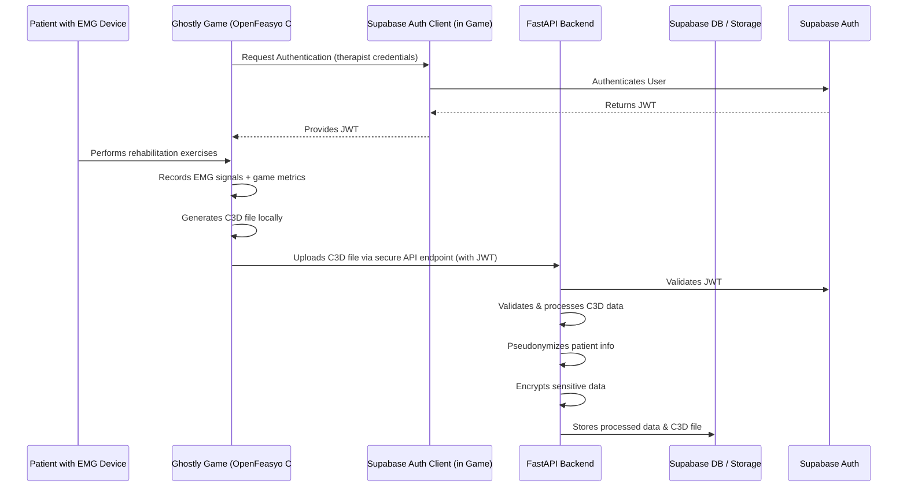
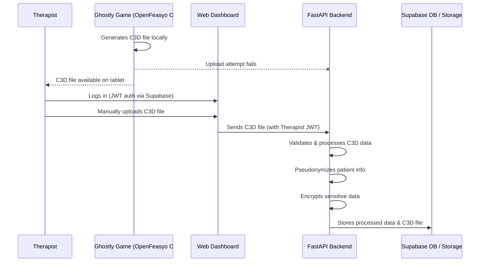
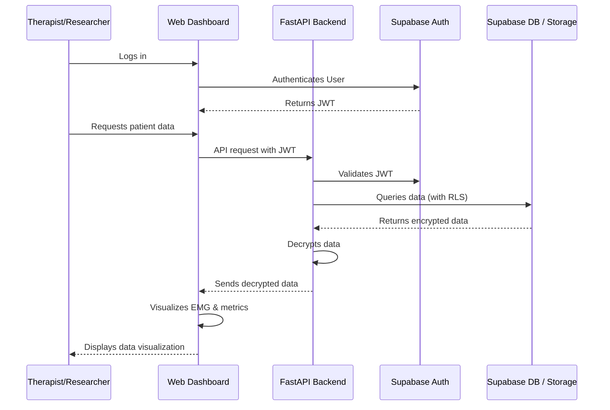
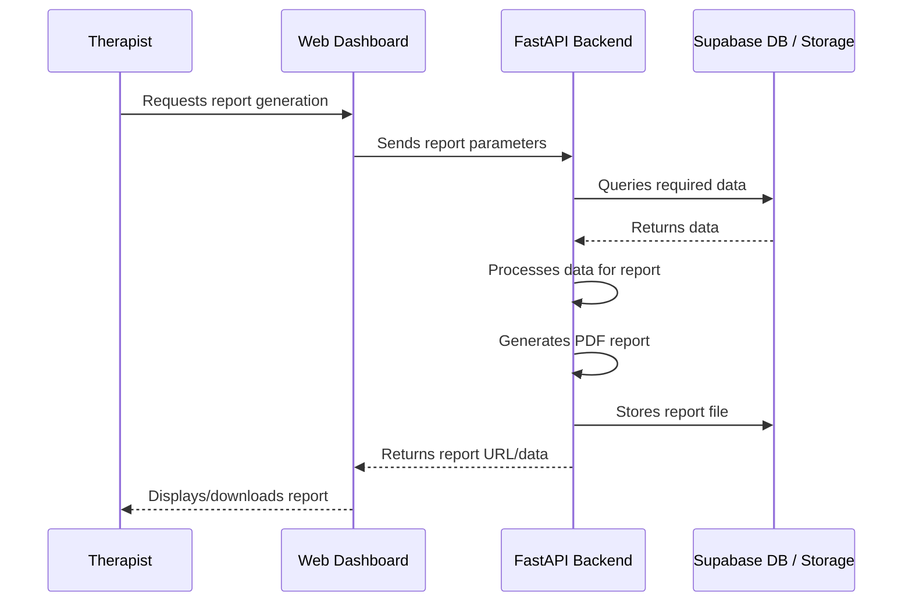

# Data Flow Documentation

This document describes the key data flows within the Ghostly+ system, detailing how information moves between components, is processed, and stored.

> **Important Note:** While this document provides data flow details, the project's **Memory Bank** serves as the single point of truth for all project documentation. For the most current and comprehensive information, please refer to the Memory Bank.

## Primary Data Acquisition Flow

This represents the main path for data collection from the serious game to the database:

1. Therapist logs into the Ghostly Game on the Android tablet using Supabase Auth
2. Patient uses the serious game with EMG sensors
3. Data is recorded locally during the session
4. Upon session completion, the Game application generates the C3D file
5. The Game application authenticates with the Backend API using the therapist's JWT
6. The Game application uploads the C3D file directly to the secure backend endpoint
7. Backend validates the JWT, processes the C3D file, pseudonymizes patient info (if needed), encrypts sensitive data
8. Backend stores processed data in the Supabase Database and the C3D file in Supabase Storage, associating it with the correct patient and session

## Fallback Data Flow (Manual Upload)

In case direct upload from the game fails:

1. C3D file remains saved on the tablet
2. Therapist logs into the Web Dashboard
3. Therapist manually uploads the C3D file via the dashboard interface, selecting the relevant patient/session
4. Dashboard sends the file to the Backend
5. Backend processes and stores the data as in the primary flow (steps 7-8)

## Data Consultation Flow

When therapists or researchers access patient data:

1. User (Therapist/Researcher) authenticates on the Web Dashboard using Supabase Auth
2. Frontend makes a request to the backend with JWT
3. Backend verifies permissions
4. Encrypted data is retrieved and decrypted
5. Data is returned and visualized in the dashboard

## Report Generation Flow

Process for generating clinical reports:

1. Therapist requests report generation
2. Dashboard sends report parameters to backend
3. Backend queries required data from database
4. Backend processes data for report
5. Backend generates PDF report and stores it
6. Dashboard receives report URL or data
7. Dashboard displays/downloads report for therapist

## Data Flow Security Considerations

* All data flows use HTTPS for transport security
* JWT authentication is required for all sensitive operations
* Row-Level Security (RLS) enforces access control at the database level
* Pseudonymization separates patient identifiers from medical data where appropriate
* Sensitive data is encrypted at rest using standard cryptographic methods
* Database backup and restore operations are restricted to administrator users 