# 🔐 GHOSTLY+ Application Security Overview

> **Important Note:** While this document provides security details, the project's **Memory Bank** serves as the single point of truth for all project documentation. For the most current and comprehensive security information, please refer to the Memory Bank.

> **Document Status:** This security architecture document represents our initial planning and approach at the beginning of the project. As implementation progresses, we will discover new insights, adapt to changing requirements, and refine our security strategies accordingly. This is a living document that will evolve throughout the project lifecycle as we learn and implement. The actual implementation may differ from these initial plans as we optimize for the specific needs of the GHOSTLY+ system.

This document provides a **comprehensive explanation of the planned security architecture** for the GHOSTLY+ application, designed to handle **sensitive medical data** in a private environment (VUB virtual machine), using **Supabase (self-hosted/local), FastAPI, and Vue 3**.

## Table of Contents

- [🔐 GHOSTLY+ Application Security Overview](#-ghostly-application-security-overview)
  - [Table of Contents](#table-of-contents)
  - [1. Overview of Core Security Measures](#1-overview-of-core-security-measures)
    - [1.1. 🔑 User Authentication](#11--user-authentication)
    - [Optional: Two-Factor Authentication (2FA/MFA)](#optional-two-factor-authentication-2famfa)
    - [Detailed Authentication and Data Access Flow](#detailed-authentication-and-data-access-flow)
    - [1.2. 🧱 Authorization \& Access Control](#12--authorization--access-control)
      - [Technology: **Self-hosted Supabase with Row Level Security (RLS)**](#technology-self-hosted-supabase-with-row-level-security-rls)
    - [1.3. 🔒 Encryption of Sensitive Data (Planned)](#13--encryption-of-sensitive-data-planned)
      - [Planned Technology: **Fernet (Python Cryptography)**](#planned-technology-fernet-python-cryptography)
    - [1.4. 🔐 Pseudonymization (Planned)](#14--pseudonymization-planned)
      - [Planned Technology: **Cryptographic Hashing (SHA-256)**](#planned-technology-cryptographic-hashing-sha-256)
    - [1.5. 📦 Database Access Security (Self-hosted Supabase)](#15--database-access-security-self-hosted-supabase)
    - [1.6. 📡 Transport Security (HTTPS)](#16--transport-security-https)
    - [1.7. 🧪 Server and Infrastructure Isolation](#17--server-and-infrastructure-isolation)
      - [Visualizing Security Boundaries](#visualizing-security-boundaries)
      - [Local Supabase Deployment Notes](#local-supabase-deployment-notes)
    - [1.8. 🧾 Audit \& Logging (Planned)](#18--audit--logging-planned)
    - [1.9. 🛡️ C3D File Security](#19-️-c3d-file-security)
  - [2. Conclusion](#2-conclusion)
  - [3. References](#3-references)

---

## 1. Overview of Core Security Measures

This section provides a general introduction to the security strategy and how various measures are layered across the application architecture.

The GHOSTLY+ application security relies on a combination of measures, each addressing specific aspects of data protection and system integrity. The following key areas are detailed in the subsections below:

*   User Authentication (see 1.1)
*   Authorization & Access Control (see 1.2)
*   Encryption of Sensitive Data (see 1.3)
*   Pseudonymization (see 1.4)
*   Database Access Security (see 1.5)
*   Transport Security (see 1.6)
*   Server and Infrastructure Isolation (see 1.7)
*   Audit & Logging (see 1.8)
*   C3D File Security (see 1.9)

**Security by Layer (Planned Architecture):**

| Layer                    | Planned Protection Measures                                        |
| ------------------------ | ------------------------------------------------------------------ |
| **Frontend (Vue 3)**     | JWT handling, input sanitization (standard framework features)     |
| **API (FastAPI)**        | JWT validation, input validation, rate limiting (optional), encryption, pseudonymization |
| **Database (Local Supabase)** | RLS policies, backend-managed encryption, database-level security |
| **Transport**            | HTTPS/TLS (external access mandatory, internal recommended)        |
| **Infrastructure**       | Private VM, network controls, containerization (Docker)            |

---

### 1.1. 🔑 User Authentication

**Core Technology**: **Self-hosted Supabase Auth** utilizing **JWT (JSON Web Tokens)**.

*   **Mechanism**:
    *   Users authenticate via email + password.
    *   Clients (Vue.js Dashboard, C# Game) initiate this authentication process *directly* with the self-hosted Supabase Auth service.
    *   Supabase Auth issues a signed JWT upon successful login.
    *   Clients (Vue.js Dashboard, C# Game) send the JWT with each API request to the FastAPI backend.
    *   FastAPI backend verifies JWT validity (e.g., using `python-jose` library and Supabase public keys) before authorizing access. FastAPI's role is JWT *verification*, not handling the initial credential exchange for login.
    *   Client-side token expiration and refresh mechanisms are required.
*   **Key Principle: Unified Authentication**:
    *   **Single Source of Truth**: Both Game and Dashboard use the same self-hosted Supabase Auth instance.
    *   **Consistent Experience**: Identical credentials and authentication flow across applications.
    *   **Centralized Management**: User accounts, permissions, and password resets are managed centrally.
*   **Implementation Details**:
    *   **Game (C#/MonoGame)**: Requires REST API calls to Supabase Auth endpoints.
    *   **Dashboard (Vue.js)**: Will use the Supabase JavaScript client library.
    *   Both will handle JWTs validated by the FastAPI backend.
*   **Benefits**:
    *   Complete control over authentication data and flows (due to local deployment).
    *   Consistent security enforcement and simplified auditing.
    *   Reduced attack surface and improved user experience (single credential set).
*   **Status**:
    *   Supabase Auth infrastructure: Established (Task 1).
    *   JWT handling (Vue), validation (FastAPI), Game integration: Planned for **Task 2 (User Authentication & Authorization)**.
*   ✅ **Planned Result**: Only authenticated users can interact with the application.

### Optional: Two-Factor Authentication (2FA/MFA)

*   **Availability**: Supabase Auth supports MFA (e.g., TOTP via authenticator apps).
*   **Implementation Status**: Optional feature, not planned for initial core functionality.
*   **Recommendation**: Offer as an optional security enhancement later if required.

### Detailed Authentication and Data Access Flow

The following diagram illustrates the authentication sequence and subsequent data access patterns:

---

### 1.2. 🧱 Authorization & Access Control

#### Technology: **Self-hosted Supabase with Row Level Security (RLS)**

*   Database access will be controlled using **custom RLS policies** defined directly in PostgreSQL.
*   **Goal**: Ensure users can only access data they are explicitly permitted to see (e.g., therapists see assigned patients, researchers see authorized cohorts).
*   RLS enforces rules at the database level, providing strong data isolation.
*   **Benefit of local deployment**: Security policies remain within the private network.
*   **Status**: Supabase DB infrastructure is set up (Task 1). Specific RLS policies need to be designed and implemented alongside the database schema and API endpoints in **Phase 2 (Core Functionality)**.

✅ **Planned Result**: Granular data access control based on user roles and permissions.

---

### 1.3. 🔒 Encryption of Sensitive Data (Planned)

#### Planned Technology: **Fernet (Python Cryptography)**

*   **Plan**: Sensitive medical data (e.g., specific assessment details, potentially parts of EMG metadata) **will be encrypted** by the FastAPI backend before being stored in the database.
*   Encryption keys will be managed securely on the backend and **never exposed** to the frontend or stored insecurely.
*   The backend will decrypt data only when authorized users request it.
*   **Benefit of local deployment**: Encryption keys remain within the secure VUB VM environment.
*   **Status**: This is a **planned feature** for **Phase 4 (Security & Compliance)**. Secure key management strategies must also be defined and implemented.

✅ **Planned Result**: Sensitive data at rest is unreadable even if the database is compromised.

---

### 1.4. 🔐 Pseudonymization (Planned)

#### Planned Technology: **Cryptographic Hashing (SHA-256)**

*   **Plan**: Directly identifying patient information (e.g., names, specific IDs if not already opaque) **will be pseudonymized** by the FastAPI backend using irreversible hashing before storage or logging where appropriate.
*   This allows for data analysis using anonymous identifiers.
*   **Benefit of local deployment**: Pseudonymization processes and any mapping remain within the secure environment.
*   **Status**: This is a **planned feature** for **Phase 4 (Security & Compliance)**. Specific fields and implementation details need definition.

✅ **Planned Result**: Enhanced data privacy and GDPR compliance.

---

### 1.5. 📦 Database Access Security (Self-hosted Supabase)

*   The self-hosted Supabase instance uses standard security keys:
    *   `anon` key: **Limited access**, intended primarily for authentication calls or potentially very limited, safe frontend operations (if any).
    *   `service_role` key: **Full database access**, restricted to the **FastAPI backend only**.
*   **Principle**: Critical operations (data writing, reading sensitive data) MUST go through the FastAPI backend for validation, authorization checks, and encryption/decryption.
*   **Benefit of local deployment**: Database access is restricted to the internal network of the VUB VM.
*   **Status**: The architectural *intent* is for this access model, leveraging the Supabase/FastAPI tools whose initial infrastructure was set up in **Task 1** (Project Setup) and **Task 2.2** (Supabase Service Deployment). Full implementation and validation of backend-only `service_role` key usage and frontend `anon` key restrictions will occur during the development of authentication mechanisms (**Task 2.3**: Supabase Configuration) and subsequent API endpoint development (**Phase 2 & beyond**).

✅ **Planned Result**: Reduced database attack surface, enforcement of backend logic through centralized API control.

---

### 1.6. 📡 Transport Security (HTTPS)

*   **Goal**: All network communication will use **HTTPS/TLS** encryption.
*   **Internal (Docker)**: Communication between Nginx, FastAPI, and Supabase containers within the Docker network should ideally be configured for TLS, though this might be deferred if the Docker network is considered sufficiently isolated within the VM.
*   **External**: Access to the dashboard via the browser MUST be over HTTPS. Nginx is responsible for handling TLS termination.
*   **Benefit of local deployment**: Internal traffic stays within the trusted VM network.
*   **Status**: Nginx is set up (Task 1). Configuration of TLS certificates for external access on the VUB VM is required during **Phase 6 (Deployment)**. Internal TLS is a potential enhancement.

✅ **Planned Result**: Data in transit is protected against eavesdropping.

---

### 1.7. 🧪 Server and Infrastructure Isolation

*   The application runs on a **private VUB virtual machine**.
*   Backend (FastAPI) and Supabase services run in **separate Docker containers**, providing process isolation.
*   File storage uses **local Supabase Storage** within the private network.
*   **Benefit of local deployment**: Complete control over the infrastructure.
*   **Status**: Docker environment established in **Task 1**.

✅ **Planned Result**: Secure, controlled, and isolated deployment environment.

#### Visualizing Security Boundaries

This diagram illustrates the security boundaries and encryption zones in the GHOSTLY+ system:

```mermaid
flowchart TD
    classDef external fill:#f9f9f9,stroke:#999,stroke-width:1px
    classDef encrypted fill:#d5f5e3,stroke:#2ecc71,stroke-width:2px
    classDef secured fill:#d6eaf8,stroke:#3498db,stroke-width:2px
    classDef sensitive fill:#fadbd8,stroke:#e74c3c,stroke-width:2px

    subgraph Internet["☁️ Internet Zone"]
        Client1["📱 Ghostly Game\n(OpenFeasyo)"]
        Client2["💻 Web Dashboard\n(Browser)"]
    end
    
    subgraph VUB["🔐 VUB Private VM (Secured Network)"]
        subgraph AppLayer["Application Layer"]
            API["⚙️ FastAPI Backend"]:::secured
            WebServer["🌐 Web Server\n(Nginx)"]:::secured
        end
        
        subgraph DatabaseLayer["Database Layer"]
            SupaDB["📊 Supabase PostgreSQL"]:::secured
            SupaAuth["🔑 Supabase Auth"]:::secured
            SupaStorage["📁 Supabase Storage"]:::secured
        end
        
        subgraph EncryptionLayer["Encryption Layer"]
            Keys["🔐 Encryption Keys"]:::sensitive
            Decrypt["🔓 Decryption Service"]:::sensitive
        end
    end
    
    subgraph DataStorage["Data Storage"]
        EncryptedData["🔒 Encrypted Patient\nData in DB"]:::encrypted
        EncryptedFiles["🔒 Encrypted C3D\nFiles in Storage"]:::encrypted
    end
    
    %% Connections
    Client1 -->|"HTTPS + JWT"| WebServer
    Client2 -->|"HTTPS + JWT"| WebServer
    WebServer --> API
    API -->|"Validate JWT"| SupaAuth
    API -->|"RLS Protected\nQueries"| SupaDB
    API -->|"Restricted\nAccess"| SupaStorage
    API -->|"Use for\nDecryption"| Keys
    
    SupaDB --- EncryptedData
    SupaStorage --- EncryptedFiles
    
    %% Access patterns
    Keys -.->|"Never exposed\noutside backend"| Decrypt
    Decrypt -.->|"Only decrypts in\nmemory for\nauthorized users"| API
```

#### Local Supabase Deployment Notes

*   The project uses `docker-compose` to run Supabase services locally within the VUB VM.
*   Authentication, database, and storage services are contained within this private environment.
*   No data is transmitted to external Supabase cloud services.

---

### 1.8. 🧾 Audit & Logging (Planned)

*   **Plan**: Key security events (logins, data access, administrative changes) **will be logged** by the FastAPI application.
*   Logs should be stored securely, potentially separate from application data, and should not contain sensitive data in plain text.
*   **Benefit of local deployment**: Logs remain within the controlled environment.
*   **Status**: This is a **planned feature** for **Phase 4/6**. Specific logging mechanisms and storage need definition.

✅ **Planned Result**: Traceability and monitoring capabilities.

---

### 1.9. 🛡️ C3D File Security

*   **Plan**: C3D files **will be uploaded** securely via authenticated FastAPI endpoints.
*   Files **will be stored** in local Supabase Storage with access controlled via backend logic (verifying JWT and user permissions).
*   Processing of C3D files will occur securely on the backend.
*   **Benefit of local deployment**: EMG data files remain within the private network.
*   **Status**: Supabase Storage is set up (Task 1). Specific upload endpoints, access control logic, and processing implementations are planned for **Phase 2/3**.

✅ **Planned Result**: Secure handling of raw EMG data files.

---

## 2. Conclusion

The GHOSTLY+ application design incorporates:

*   A plan for **end-to-end security**.
*   Alignment with **healthcare data security best practices**.
*   Emphasis on **data sovereignty** through local self-hosting of Supabase.

This planned security model *aims to provide* a strong foundation, which will be built upon and validated throughout the project's development phases. The specific implementation details for features like encryption, pseudonymization, RLS, and logging will be addressed in their respective development phases as outlined.

---

## 3. References

*   [GDPR Official Site](https://gdpr.eu/)
*   [OWASP Top 10](https://owasp.org/www-project-top-ten/)
*   [FastAPI Security Documentation](https://fastapi.tiangolo.com/tutorial/security/)
*   [Supabase Self-Hosting Guide](https://supabase.com/docs/guides/self-hosting)