# Layered System Architecture

This diagram provides a high-level overview of the GHOSTLY+ system, illustrating its components organized by architectural layers.

## Simplified Version

```mermaid
flowchart TD
    %% --- Layer Definitions ---
    classDef clientLayer fill:#FDEBD0,stroke:#D35400,stroke-width:2px,color:#000
    classDef edgeLayer fill:#FCF3CF,stroke:#F39C12,stroke-width:2px,color:#000
    classDef apiLayer fill:#D6EAF8,stroke:#2980B9,stroke-width:2px,color:#000
    classDef serviceLayer fill:#D5F5E3,stroke:#27AE60,stroke-width:2px,color:#000
    classDef dataLayer fill:#EBDEF0,stroke:#8E44AD,stroke-width:2px,color:#000
    classDef infraLayer fill:#EAECEE,stroke:#7F8C8D,stroke-width:2px,color:#000
    classDef complianceLayer fill:#FDEDEC,stroke:#C0392B,stroke-width:2px,color:#000

    %% --- Layer 0: Client Applications ---
    subgraph LAYER_CLIENTS [CLIENT APPLICATIONS]
        direction LR
        CLIENT_DASHBOARD["💻 Web Dashboard (Vue.js)\n- Therapist UI\n- Researcher UI\n- Admin UI"]:::clientLayer
        CLIENT_GAME["📱 Ghostly Game (OpenFeasyo C#)"]:::clientLayer
    end

    %% --- Layer 1: Edge / Reverse Proxy ---
    subgraph LAYER_EDGE [EDGE / REVERSE PROXY]
        EDGE_NGINX["🌐 Nginx"]:::edgeLayer
    end

    %% --- Layer 2: API Gateway ---
    subgraph LAYER_API [API GATEWAY]
        API_FASTAPI["🔌 REST API (FastAPI - Python)"]:::apiLayer
    end

    %% --- Layer 3: Backend Services / Business Logic ---
    subgraph LAYER_SERVICES [BACKEND SERVICES & BUSINESS LOGIC]
        direction LR
        SERVICE_CORE["⚙️ Core Application Services\n(FastAPI/SQLAlchemy)"]:::serviceLayer
        SERVICE_ANALYTICS["📈 Analytics Services\n(Python/FastAPI)"]:::serviceLayer
    end
    
    %% --- Layer 4: Data Platform & Authentication (Self-Hosted Supabase) ---
    subgraph LAYER_DATA_AUTH [DATA PLATFORM & AUTHENTICATION - Self-Hosted Supabase]
        direction TB
        DATA_AUTH_SUPA["🔑 Supabase Auth (JWT)"]:::dataLayer
        DATA_DB_SUPA["💾 Supabase PostgreSQL (RLS)"]:::dataLayer
        DATA_STORE_SUPA["📁 Supabase Storage (C3D, Reports)"]:::dataLayer
    end

    %% --- Layer 5: Cross-Cutting Compliance ---
    subgraph LAYER_COMPLIANCE [CROSS-CUTTING COMPLIANCE]
        COMPLIANCE_GDPR["🛡️ GDPR Compliance Mechanisms\n(Pseudonymization, Encryption, RLS, Auditing)"]:::complianceLayer
    end

    %% --- Layer 6: Underlying Infrastructure ---
    subgraph LAYER_INFRA [UNDERLYING INFRASTRUCTURE]
        INFRA_DOCKER["🐳 Docker Environment"]:::infraLayer
        INFRA_VM["☁️ VUB Private VM"]:::infraLayer
    end

    %% --- Layer Connections / Dependencies ---
    LAYER_CLIENTS --> LAYER_EDGE
    LAYER_EDGE --> LAYER_API
    
    LAYER_API --> LAYER_SERVICES
    LAYER_API --> LAYER_DATA_AUTH
    %% API validates JWTs from Supabase Auth

    LAYER_SERVICES --> LAYER_DATA_AUTH
    %% Services interact with DB & Storage

    %% Client applications authenticate directly with Supabase Auth
    CLIENT_DASHBOARD -.-> DATA_AUTH_SUPA
    CLIENT_GAME -.-> DATA_AUTH_SUPA
    
    %% Compliance mechanisms are invoked by relevant layers
    LAYER_API -.-> LAYER_COMPLIANCE
    LAYER_SERVICES -.-> LAYER_COMPLIANCE
    LAYER_DATA_AUTH -.-> LAYER_COMPLIANCE
    %% RLS is a DB-level compliance part

    %% All application/service layers run on the infrastructure
    LAYER_EDGE --> LAYER_INFRA
    LAYER_API --> LAYER_INFRA
    LAYER_SERVICES --> LAYER_INFRA
    LAYER_DATA_AUTH --> LAYER_INFRA
    LAYER_COMPLIANCE --> LAYER_INFRA
    %% Compliance logic is embedded in services running on infra
``` 




## Architecture Layers Overview Table

| Layer | Technologies | Purpose & Value to Project |
|-------|-------------|----------------------------|
| **1. Client Applications** | Vue.js 3, Tailwind CSS, shadcn-vue (Dashboard)<br>C#/MonoGame (OpenFeasyo Game) | **Provides intuitive interfaces for all users** - Enables therapists to monitor progress, researchers to analyze results, and patients to engage with rehabilitation exercises through games. |
| **2. Reverse Proxy** | Nginx | **Secures and routes traffic** - Provides SSL termination, load balancing, and a security boundary, allowing controlled access to internal services. |
| **3. API Gateway** | FastAPI (Python) | **Centralizes API management** - Offers a single entry point for data operations with robust validation via Pydantic, automatic OpenAPI documentation, and JWT verification. |
| **4. Services** | FastAPI/SQLAlchemy (Core Services)<br>Python/FastAPI (Analytics) | **Implements business logic** - Handles core application operations and data analysis, separating concerns for better maintainability and extensibility. |
| **5. Data Platform** | Supabase (Auth, PostgreSQL, Storage) | **Manages data and authentication** - Provides unified authentication, row-level security for GDPR compliance, and structured data storage with reliable file management. |
| **6. Infrastructure** | Docker, VUB Private VM | **Ensures consistent deployment** - Creates isolated, reproducible environments, simplifying deployment across development and production, while meeting institutional hosting requirements. | 

## Mermaid Table View

```mermaid
classDiagram
    class "Layer 1: Client Applications" {
        Technologies: Vue.js, C#/MonoGame
        Purpose: User interfaces and game
    }
    
    class "Layer 2: Reverse Proxy" {
        Technologies: Nginx
        Purpose: Security and routing
    }
    
    class "Layer 3: API Gateway" {
        Technologies: FastAPI (Python)
        Purpose: API management
    }
    
    class "Layer 4: Services" {
        Technologies: FastAPI, SQLAlchemy
        Purpose: Business logic
    }
    
    class "Layer 5: Data Platform" {
        Technologies: Supabase
        Purpose: Data and authentication
    }
    
    class "Layer 6: Infrastructure" {
        Technologies: Docker, VM
        Purpose: Deployment environment
    }
    
    "Layer 1: Client Applications" --> "Layer 2: Reverse Proxy"
    "Layer 2: Reverse Proxy" --> "Layer 3: API Gateway"
    "Layer 3: API Gateway" --> "Layer 4: Services"
    "Layer 3: API Gateway" --> "Layer 5: Data Platform"
    "Layer 4: Services" --> "Layer 5: Data Platform"
    "Layer 1: Client Applications" ..> "Layer 5: Data Platform" : Auth only
``` 