<aside>
💡

IMPORTANT NOTICE: This document is preliminary and subject to change. All specifications, architectures, timelines, and requirements are tentative and will evolve as the project progresses and stakeholder feedback is incorporated.

</aside>

## 1. INTRODUCTION

### 1.1 Project Purpose

GHOSTLY+ is an applied research project funded by the Research Foundation – Flanders (FWO) aimed at combating muscle strength loss in hospitalized elderly patients. The project combines blood flow restriction (BFR) with an electromyography (EMG)-driven serious game to create an effective, engaging, and measurable rehabilitation method.

### 1.2 Problem Statement

Muscle strength loss due to hospitalization in older adults is a significant clinical problem that contributes to:

- Slower post-hospitalization recovery
- Increased risk of falls and injuries
- Decreased autonomy and quality of life
- Higher frequency of hospital readmissions

### 1.3 Proposed Solution

The GHOSTLY+ system includes:

1. An EMG-driven serious game on Android tablets (existing component)
2. Delsys Trigno Avanti EMG sensors (existing component)
3. A web dashboard for patient monitoring and data analysis (to be developed)

### 1.4 Stakeholders

- **Interdisciplinary research team**: Prof. Eva Swinnen, Prof. David Beckwée, Prof. Bart Jansen
- **Participating medical centers**: UZ Brussels, UAntwerpen/UZA, KU Leuven
- **End users**:
    - Therapists/clinicians
    - Researchers

## 2. EXISTING PRODUCT OVERVIEW

### 2.1 OpenFeasyo Serious Game

The game uses the OpenFeasyo platform, a software framework for creating sensor-driven games:

- Runs on Android tablets
- Gamified interface adapted for elderly users
- Captures EMG signals to control the game

### 2.2 Current Data Collection

The current system:

- Collects data from Delsys Trigno EMG sensors
- Stores data in C3D format (standard biomechanics format)
- Records game metrics (level, score, duration)
- Saves files locally on the tablet

### 2.3 Limitations of Current System (Prior to Web Dashboard Development)

*The following limitations describe the GHOSTLY+ system's capabilities before the introduction of the proposed Web Dashboard. The dashboard is designed to address these points.*

- Lack of centralized patient data
- Inability for remote monitoring by clinicians
- Difficulty in comparative analysis between patients
- Lack of tools to measure progression over time

## 3. WEB DASHBOARD REQUIREMENTS

### 3.1 Primary Functional Objectives

### 3.1.1 For Therapists

- View results of their patients' sessions
- Visualize EMG signals and game metrics
- Track patient progress
- Configure exercise programs
- Compare patient cohorts
- Generate clinical reports

### 3.1.2 For Researchers

- Comparative data analysis
- Export data for external analyses
- Generate multi-site statistics
- Filter and segment data

### 3.2 Detailed Functional Requirements

### 3.2.1 Authentication and Authorization

- Secure multi-level login system
- Role management (therapist, researcher, administrator)
- Granular data permissions
- GDPR compliance with explicit consent

### 3.2.2 Patient Management

- Patient registration and profile (demographic data, medical history)
- Assignment to therapists and centers
- Program adherence tracking
- Intervention history

### 3.2.3 Cohort Management

- Create and manage patient cohorts
- Assign therapists to cohorts
- Compare metrics across cohorts
- Generate cohort-level reports

### 3.2.4 EMG Data Visualization

- Temporal graphs of EMG signals
- Muscle strength analysis
- Muscle contraction detection
- Muscle fatigue analysis
- Session comparison

### 3.2.5 Game Performance Analysis

- Scores and progressions in the game
- Session duration and frequency
- Correlation between EMG activity and game performance
- Long-term trends

### 3.2.6 Session Management

- Session scheduling
- Results recording
- Therapist comments
- Notifications and reminders

### 3.2.7 Reports and Exports

- PDF clinical report generation
- Raw data export (CSV, Excel)
- Printable dashboards
- Summary reports by medical center

### 3.3 Non-Functional Requirements

### 3.3.1 Security and Privacy

- End-to-end encryption of sensitive data
- Patient identifier pseudonymization
- Access logging (audit logs)
- Compliance with medical security standards
- Data deletion process (right to be forgotten)

### 3.3.2 Performance

- Page load times < 2 seconds
- Simultaneous support for 100+ users
- Efficient processing of C3D files (>100MB)
- Optimization for variable internet connections

### 3.3.3 Accessibility

- WCAG 2.1 level AA compliance
- Support for screen readers
- Multilingual support (English, Dutch, French)

### 3.3.4 Availability and Reliability

- 99.5%+ availability
- Daily backups
- Disaster recovery plan
- Error detection and notification mechanisms

## 4. TECHNICAL ARCHITECTURE

The GHOSTLY+ project is structured into six distinct work packages that together form the complete system architecture:

### 4.1 WORK PACKAGE 1: Existing System Integration
*This package focuses on understanding and interfacing with the current components of the GHOSTLY+ system, including the OpenFeasyo game, EMG sensors, and local C3D file storage. Source code modification of the OpenFeasyo game is possible.*

#### 4.1.1 Current Components
- OpenFeasyo game (MonoGame/C# based) running on Android tablets
- Delsys Trigno Avanti EMG sensors
- Local C3D file storage (prior to authenticated upload)

#### 4.1.2 Integration Requirements
- Analysis of C3D file format and structure.
- Understanding game metrics and data export capabilities.
- **Integrate Supabase Authentication into the OpenFeasyo (MonoGame/C#) application:**
    - Implement user login (therapist/researcher) within the game interface using Supabase Auth (via REST API or C# client library).
    - Securely handle JWT tokens within the game application.
- **Implement direct, authenticated C3D file upload from the game:**
    - Upon session completion, the game application will upload the generated C3D file directly to a secure backend API endpoint.
    - The upload request must include the user's valid JWT for authentication and association with the correct patient/session.
- Define fallback mechanism (e.g., manual dashboard upload) in case of direct upload failure.

### 4.2 WORK PACKAGE 2: Web Dashboard
*This package covers the design and development of the user-facing web application using Vue.js 3, focusing on a responsive interface for therapists and researchers.*

#### 4.2.1 Frontend (Web Dashboard)
- **Technology**:
    - **Framework**: Vue.js 3 (Composition API)
    - **UI Library**: Tailwind CSS with **shadcn/ui** components for a modern, customizable interface.
    - **State Management**: Pinia
    - **Routing**: Vue Router
    - **Charting**: Chart.js or potentially D3.js for complex EMG visualizations.
    - **Build Tool**: Vite
    - **Language**: TypeScript
- **UI Features**:
    - Responsive interface (mobile, tablet, desktop).
    - Dynamic data visualizations for EMG signals and game metrics.
    - Role-based interfaces adapting content for therapists and researchers.
    - Potential for PWA features for partial offline access (e.g., viewing cached data).

#### 4.2.2 User Interfaces
- Therapist dashboard: Patient management, session scheduling, progress tracking.
- Researcher dashboard: Cohort management, comparative analytics, data export.
- Shared components: EMG data visualization, session analysis tools, report generation interface.
- Secure login/authentication interface using Supabase Auth.

### 4.3 WORK PACKAGE 3: Service Layer
*This package details the backend API built with FastAPI (Python) and core services responsible for business logic, secure data processing, C3D handling, EMG analysis, and communication.*

#### 4.3.1 Backend API
- **Technology**:
    - **Framework**: FastAPI (Python 3.10+)
    - **Data Validation**: Pydantic
    - **Database Interaction**: SQLAlchemy Core or ORM (aligned with Supabase/PostgreSQL)
    - **Authentication**: JWT verification (using `python-jose` or similar library) validating tokens issued by Supabase Auth.
    - **Asynchronous Processing**: Leverage FastAPI's async capabilities; potentially use Celery for long-running background tasks (e.g., complex report generation).
- **Core Services**:
    - Authentication and authorization (verifying JWT, checking roles/permissions).
    - **Secure endpoint for receiving authenticated C3D uploads from the game client.**
    - Session and patient management CRUD operations.
    - EMG signal processing and analysis (NumPy, Pandas, SciPy).
    - Report generation (e.g., using libraries like `reportlab` or rendering HTML to PDF).
    - Data import/export (processing C3D files, generating CSV/Excel).
    - Advanced EMG analytics (muscle fatigue analysis, progress tracking).

#### 4.3.2 Business Logic

- Patient and therapist management
- Session recording and analysis
- C3D file parsing and transformation
- Statistical analysis of EMG signals

### 4.4 WORK PACKAGE 4: Data Infrastructure
*This package defines the data storage strategy using Supabase, encompassing the PostgreSQL database for structured data and Supabase Storage for files.*

#### 4.4.1 Database
- **Technology**: Supabase (PostgreSQL 15+)
- **Characteristics**:
    - Deployment potentially on a private VM (VUB server) or Supabase Cloud (pending VUB regulations).
    - Optimized relational schema designed for EMG/session data and user management.
    - Row-level security (RLS) enforced rigorously based on user roles and patient assignments.
    - Encryption of sensitive data columns (e.g., patient PII) using `pgcrypto` or application-level encryption.
    - Utilization of PostgreSQL features like JSONB for flexible data storage where appropriate.

#### 4.4.2 File Storage
- **Technology**: Supabase Storage
- **File types**:
    - Raw C3D files (uploaded directly from the game or via fallback).
    - Generated PDF reports.
    - Data exports (CSV, Excel).
- **Security**: Access controlled via Supabase Storage policies integrated with user authentication and RLS.

### 4.5 WORK PACKAGE 5: Security and Compliance
*This package outlines the critical measures for data privacy, security, GDPR compliance, and ethical handling of patient data throughout the system.*

#### 4.5.1 Personal Data Protection

- **Pseudonymization**: Separation of personal identifiers from medical data
- **Encryption**: Use of standard encryption algorithms (Fernet)
- **Key management**: Secure storage of encryption keys

#### 4.5.2 GDPR Compliance

- Explicit patient consent
- Data access and portability
- Right to erasure
- Data retention limitations
- Audit logging of all data access and modifications

#### 4.5.3 Application Security
- Strong authentication via Supabase Auth and JWT verification in the backend.
- Protection against OWASP Top 10 vulnerabilities (Input validation, parameterized queries via SQLAlchemy, CSRF protection if applicable, etc.).
- Rate limiting on API endpoints.
- Regular dependency scanning (e.g., using `pip-audit`, `npm audit`).
- Secure configuration management (no hardcoded secrets).
- Consider infrastructure security scanning and penetration testing before production launch.

#### 4.5.4 Ethical Considerations

- Documentation support for ethics committees
- Data breach procedures
- Consent management system

### 4.6 WORK PACKAGE 6: Deployment and Operations
*This package describes the strategy for containerizing using Docker, deploying, and maintaining the GHOSTLY+ system, considering scalability and different hosting models.*

#### 4.6.1 Containerization
- **Technology**: Docker & Docker Compose
- **Setup**:
    - Separate Dockerfiles for backend (FastAPI) and frontend (Vue.js - using multi-stage builds for efficiency).
    - `docker-compose.yml` for orchestrating local development environment (backend, frontend, potentially a local Supabase instance via its Docker image for testing).
- Considerations for scalability (e.g., running multiple backend instances) and ease of deployment.

#### 4.6.2 Deployment Options

- Centralized model: all hospitals connect to VUB instance
- Hybrid model: core data at VUB with local processing at each site
- Distributed model: independent instances with anonymized data sharing

### 4.7 Data Flow
*This section illustrates how data moves through the system, prioritizing the authenticated flow from the game.*

#### 4.7.1 Data Acquisition (Primary Flow)
1. Therapist logs into the Ghostly Game on the Android tablet using Supabase Auth.
2. Patient uses the serious game with EMG sensors.
3. Data is recorded locally during the session.
4. Upon session completion, the Game application generates the C3D file.
5. The Game application authenticates with the Backend API using the therapist's JWT.
6. The Game application uploads the C3D file directly to the secure backend endpoint.
7. Backend validates the JWT, processes the C3D file, pseudonymizes patient info (if needed at this stage), encrypts sensitive data.
8. Backend stores processed data in the Supabase Database and the C3D file in Supabase Storage, associating it with the correct patient and session.

#### 4.7.2 Data Acquisition (Fallback Flow)
1. If direct upload fails, the C3D file remains on the tablet.
2. Therapist logs into the Web Dashboard.
3. Therapist manually uploads the C3D file via the dashboard interface, selecting the relevant patient/session.
4. Dashboard sends the file to the Backend.
5. Backend processes and stores the data as in the primary flow (steps 7-8).

#### 4.7.3 Data Consultation
*(Renumbered from 4.3.2)*
1. User (Therapist/Researcher) authenticates on the Web Dashboard using Supabase Auth.
2. Frontend makes a request to the backend with JWT
3. Backend verifies permissions
4. Encrypted data is retrieved and decrypted
5. Data is returned and visualized in the dashboard

### 4.8 Proposed Architecture Diagram
*Diagram updated to reflect direct game-to-API upload as primary.*

```mermaid
flowchart TD
    %% Cohesive color scheme with clearer distinctions
    classDef existing fill:#D4F1F9,stroke:#2E86C1,stroke-width:2px
    classDef newSystem fill:#E8DAEF,stroke:#7D3C98,stroke-width:2px
    classDef frontend fill:#FDEBD0,stroke:#333,stroke-width:1px
    classDef backend fill:#D5F5E3,stroke:#333,stroke-width:1px
    classDef api fill:#D6EAF8,stroke:#3498DB,stroke-width:1.5px
    classDef database fill:#F5B7B1,stroke:#C0392B,stroke-width:1.5px
    classDef security fill:#FEF9E7,stroke:#333,stroke-width:1px
    classDef supabase fill:#3ECF8E30,stroke:#3ECF8E,stroke-width:2px
    classDef option1 stroke:#E74C3C,stroke-width:2.5px,stroke-dasharray: 5 5
    classDef option2 stroke:#3498DB,stroke-width:2.5px,stroke-dasharray: 5 5
    classDef legend fill:none,stroke:none
    classDef docker fill:#F5F5F580,stroke:#2C3E50,stroke-width:2px,stroke-dasharray: 5 5

    subgraph CurrentSystem["🏥 EXISTING SYSTEM (Client-Side)"]
        direction LR
        Android["📱 Android Tablet"]:::existing
        Sensors["💪 EMG Sensors<br>Delsys Trigno"]:::existing
        Ghostly["🎮 Ghostly Game<br>(OpenFeasyo / MonoGame C#)<br>**MODIFIABLE**"]:::existing
        %% LocalFiles["📄 C3D Files (Temporary)"]:::existing
    end

    subgraph DockerEnv["🐳 DOCKER ENVIRONMENT (Server-Side)"]
      subgraph NewSystem["🌐 GHOSTLY+ EXTENSION"]
          subgraph UserDashboard["📊 WEB DASHBOARD"]
              Dashboard["Vue.js 3 / Tailwind / shadcn/ui<br>👨‍⚕️ Therapists (Multi-center)<br>🧪 Researchers (Analytics)"]:::frontend
          end

          API["🔌 REST API<br>(FastAPI)"]:::api

          subgraph CoreServices["⚙️ SERVICES"]
              direction TB
              PythonServices["🔄 Core Services<br>FastAPI/SQLAlchemy (Python)"]:::backend
              Analytics["📈 Analytics Services<br>(Python/NumPy/Pandas)"]:::backend
          end

          subgraph SupabaseCloud["☁️ SUPABASE PLATFORM"]
              Database["💾 PostgreSQL<br>Database (RLS)"]:::database
              FileStore["📁 Supabase Storage<br>(Reports/C3D)"]:::database
              Auth["🔑 Supabase Auth<br>(JWT)"]:::supabase
          end

          subgraph GDPRCompliance["🔒 GDPR COMPLIANCE"]
              direction TB
              Pseudonymization["👤 Pseudonymization<br>of Patient Data"]:::security
              DataEncryption["🔐 End-to-End<br>Encryption"]:::security
              AccessControl["📝 Patient Access<br>& Deletion Rights"]:::security
              AuditLogs["📋 Audit Logs<br>& Traceability"]:::security
          end
      end
    end
    class DockerEnv docker


    %% Connections
    Sensors --> Android
    Android --> Ghostly

    %% Authentication Flow
    Ghostly --> |"1. Authenticate User"| Auth
    Dashboard --> |"1. Authenticate User"| Auth
    Auth -.-> |"Issues JWT"| Ghostly
    Auth -.-> |"Issues JWT"| Dashboard
    API --> |"Validates JWT"| Auth

    %% Primary Data Flow (Game Upload)
    Ghostly --> |"2. Upload C3D (Authenticated)"| API

    %% Fallback Data Flow (Manual Upload)
    Ghostly -.-> |"Alt: Save Locally"| Android
    Android --> |"3. Manual Upload via Dashboard (Fallback)"| Dashboard
    Dashboard --> |"Upload C3D (Authenticated)"| API

    %% Backend Processing
    API --> PythonServices
    PythonServices --> Database
    PythonServices --> Analytics
    API --> |"Store C3D"| FileStore
    Analytics --> Database
    Analytics --> FileStore

    %% Dashboard Interaction
    Dashboard --> |"Request Data"| API
    FileStore --> |"Serve Files"| Dashboard
    %% Or via signed URLs from API

    %% GDPR links remain the same
    PythonServices --> GDPRCompliance
    Database --> GDPRCompliance
    API --> GDPRCompliance
```


### 4.9 Data Flow Diagram
*Sequence diagram updated for primary authenticated game upload.*


### 4.10 Recommended Project Structure
*This structure organizes the backend, frontend, Docker configurations, and deployment settings logically. Inspired by common practices for FastAPI + Vue projects.*

```plaintext
ghostly-plus/
│
├── backend/                      # FastAPI backend (Python)
│   ├── app/
│   │   ├── __init__.py
│   │   ├── main.py               # FastAPI application entry point
│   │   ├── core/                 # Core logic (config, security)
│   │   │   └── ...
│   │   ├── api/                  # API endpoints/routers
│   │   │   └── ...
│   │   ├── models/               # Pydantic models
│   │   │   └── ...
│   │   ├── schemas/              # Database interaction schemas (if needed)
│   │   │   └── ...
│   │   ├── services/             # Business logic services
│   │   │   └── ...
│   │   └── utils/                # Utility functions
│   │       └── ...
│   ├── tests/                    # Unit & integration tests
│   │   └── ...
│   ├── alembic/                  # Database migrations (if using Alembic)
│   ├── pyproject.toml            # Dependencies (using Poetry recommended)
│   └── requirements.txt          # Fallback dependencies
│
├── frontend/                     # Vue 3 frontend (TypeScript)
│   ├── src/
│   │   ├── assets/               # Static assets (images, fonts)
│   │   ├── components/           # Reusable UI components (incl. shadcn/ui)
│   │   │   └── ...
│   │   ├── composables/          # Vue 3 composables (shared logic)
│   │   │   └── ...
│   │   ├── views/                # Page-level components
│   │   │   └── ...
│   │   ├── router/               # Vue Router configuration
│   │   │   └── index.ts
│   │   ├── stores/               # Pinia state management stores
│   │   │   └── auth.ts           # Recommended: Auth store example
│   │   ├── services/             # API interaction layer
│   │   │   └── api.ts            # Recommended: Axios instance with interceptors
│   │   ├── types/                # TypeScript type definitions
│   │   ├── lib/                  # shadcn/ui library utils
│   │   │   └── utils.ts
│   │   ├── App.vue               # Root Vue component
│   │   └── main.ts               # Application entry point
│   ├── public/                   # Static assets copied to dist root
│   ├── index.html                # Main HTML file
│   ├── package.json              # Frontend dependencies & scripts
│   ├── tsconfig.json             # TypeScript configuration
│   ├── vite.config.ts            # Vite build/dev server config
│   │                               # Recommended: Configure server.proxy for dev
│   ├── tailwind.config.js        # Tailwind CSS configuration
│   ├── components.json           # shadcn/ui configuration
│   └── postcss.config.js         # PostCSS configuration (often needed for Tailwind)
│
├── docker/                       # Docker configurations
│   ├── backend/
│   │   └── Dockerfile            # Backend container definition
│   └── frontend/
│       └── Dockerfile            # Frontend container definition (multi-stage build)
│
├── nginx/                        # Nginx configuration for production
│   └── conf.d/
│       └── default.conf          # Nginx reverse proxy & static serving config
│
├── supabase/                     # Supabase local dev/migrations (if needed)
│   ├── config.toml
│   └── migrations/
│       └── ...
│
├── .env                          # Root environment variables (DB URLs, secrets)
├── .env.example                  # Example environment variables
├── .gitignore                    # Git ignore file
├── docker-compose.yml            # Docker Compose for development environment orchestration
└── README.md                     # Project documentation
```

**Notes on Structure & Configuration:**

*   **Development:** Use `docker-compose.yml` to run the backend, frontend (with Vite dev server), and database containers. Configure `vite.config.ts` with `server.proxy` to forward frontend `/api` requests to the backend container, avoiding CORS issues.
*   **Production Deployment:** Build static frontend assets (`npm run build`). Use Nginx (or similar web server/reverse proxy) configured via `nginx/conf.d/default.conf`. Nginx should:
    *   Serve the static frontend assets (HTML, JS, CSS) from the built `frontend/dist` directory.
    *   Act as a reverse proxy, forwarding requests starting with `/api` (or another chosen prefix) to the backend FastAPI container.
*   **API Client (`frontend/src/services/api.ts`):** Implement using Axios or Fetch, potentially with interceptors to automatically attach JWT tokens from the auth store and handle 401 Unauthorized errors globally.
*   **Auth Store (`frontend/src/stores/auth.ts`):** Use Pinia to manage user authentication state (token, user info) and provide login/logout actions.
*   **Environment Variables:** Use `.env` files (loaded by Docker Compose, FastAPI settings, and Vite) to manage configuration secrets and environment-specific settings. Provide a `.env.example` for guidance.

## 5. DEVELOPMENT AND DEPLOYMENT

### 5.1 Development Environment

- Git repository for code versioning
- CI/CD for automated testing and deployment
- Separate development, testing, and production environments

### 5.2 Deployment Strategy

- Containerization with Docker (multi-container setup)
- Deployment on VUB private VM for central services
- Options for distributed deployment:
    - Centralized model: all hospitals connect to VUB instance
    - Hybrid model: core data at VUB with local processing at each site
    - Distributed model: independent instances with anonymized data sharing
- CI/CD pipeline for streamlined updates across all deployment models

### 5.3 Development Methodology

#### 5.3.1 Test-Driven Development

- Backend: Unit and integration tests for all critical components
    - FastAPI endpoint testing
    - C3D file parsing validation
    - EMG data processing verification
- Frontend: Component and integration testing
    - Vue component tests with Vue Test Utils
    - End-to-end testing with Cypress
- Continuous integration with automated test runs on each commit

#### 5.3.2 User Testing

- Three rounds of UX testing with therapists and researchers:
    - Round 1: Early prototype feedback (Week 10)
    - Round 2: Core functionality validation (Week 15)
    - Round 3: Final usability assessment (Week 19)
- Structured feedback collection and iteration based on user input
- Usability metrics tracking across testing rounds

## 6. PLANNING AND MILESTONES

The project timeline is designed to complete all essential work within 5 months, providing a safety margin for the 6-month contract period.

### 6.1 Phase 1: Discovery and Infrastructure (Weeks 1-4)

- Requirements gathering and architecture documentation
- Supabase infrastructure setup on VUB VM
- Authentication system and security implementation
- FastAPI framework setup with core endpoints

### 6.2 Phase 2: Data Integration (Weeks 5-8)

- C3D parser development
- Database schema implementation
- Encryption and pseudonymization system
- Integration with OpenFeasyo game system

### 6.3 Phase 3: Dashboard Development (Weeks 9-14)

- Vue.js project setup and component architecture
- Therapist interface implementation
- EMG visualization and analytics features
- Authentication and user management

### 6.4 Phase 4: Advanced Features and Testing (Weeks 15-18)

- Advanced EMG analysis and reporting
- Cross-cohort comparison functionality
- Performance optimization
- Security testing and vulnerability fixes

### 6.5 Phase 5: Finalization and Deployment (Weeks 19-20)

- Final user testing and UI refinements
- Documentation completion
- Production deployment and user training
- Knowledge transfer and handover

## 7. SUCCESS METRICS AND EVALUATION

### 7.1 Evaluation Approach

The project success will be measured through system performance monitoring, security assessments, and user feedback from therapists and researchers.

### 7.2 Key Metrics

Core metrics include system response times, data import reliability, and cross-center data exchange effectiveness.

### 7.3 User Feedback

Regular therapist and researcher feedback will be collected to evaluate usability, integration with clinical workflows, and quality of visualizations.

## 8. OPEN QUESTIONS / ITEMS TO CLARIFY

To finalize this PRD, we would need to clarify the following points:

### 8.1 Technical Questions

1. **C3D Format Details**:
    - Which library is currently used to generate C3D files?
    - What is the exact structure of EMG data in these files?
    - What volume of data is generated per game session?
2. **OpenFeasyo Integration**:
    - Can the game be modified to automatically send data?
    - Is there an API or communication mechanism with the game?
    - Is the game source code accessible to the development team?
    - *New Question:* Which Supabase client library or approach (e.g., direct REST API calls) is most suitable for integration within the MonoGame/C# environment?
3. **Infrastructure Constraints**:
    - What are the specific VUB regulations regarding hosting (Cloud vs. Private VM)?
    - What is the level of access to VUB IT resources?
    - Are there specific security protocols to follow?

### 8.2 Functional Questions

1. **Specific Therapist Needs**:
    - Which EMG metrics are most clinically relevant?
    - What type of reports would be most useful?
    - How to structure comparisons between patients?
2. **Research Needs**:
    - Which statistical analyses should be integrated?
    - What export formats are required?
    - Are there specific requirements for publishing results?

### 8.3 Organizational Questions

1. **Multi-site Coordination**:
    - How will collaboration between different centers be organized?
    - Will there be centralized data sharing or separate instances?
    - How to manage potential protocol differences between sites?
2. **Training and Support**:
    - Who will be responsible for user training?
    - What level of technical support will be needed?
    - How to document procedures for new users?

## 9. APPENDICES

### 9.1 UI Mockups

[Wireframes for therapist interfaces]

### 9.2 Glossary

- **BFR (Blood Flow Restriction)**: Technique that restricts venous blood flow return while allowing arterial flow during exercise
- **C3D (Coordinate 3D)**: File format for recording synchronized 3D and analog data
- **Cohort**: Group of patients participating in the study under similar conditions
- **Docker**: Platform for developing, shipping, and running applications in containers
- **EMG (Electromyography)**: Technique for recording the electrical activity of muscle tissue
- **FastAPI**: Modern Python web framework for building APIs
- **GDPR (General Data Protection Regulation)**: EU regulation on data protection and privacy
- **JWT (JSON Web Token)**: Compact, URL-safe means of representing claims to be transferred between parties
- **OpenFeasyo**: Software platform for creating rehabilitation games
- **PostgreSQL**: Open-source relational database system
- **Pseudonymization**: Processing personal data so it can no longer be attributed to a specific data subject without additional information
- **PWA (Progressive Web App)**: Web application that functions like a native app
- **RLS (Row-Level Security)**: Security feature in PostgreSQL that restricts which rows users can access
- **Supabase**: Open-source Firebase alternative providing database, authentication, and storage services
- **Vue.js**: Progressive JavaScript framework for building user interfaces