# 🔐 GHOSTLY+ Application Security Overview

This document provides a **comprehensive explanation of the planned security architecture** for the GHOSTLY+ application, designed to handle **sensitive medical data** in a private environment (VUB virtual machine), using **Supabase (self-hosted/local), FastAPI, and Vue 3**.

## Executive Summary

The GHOSTLY+ dashboard is designed with a multi-layered security approach to protect sensitive EMG data and patient information. This document outlines the planned security measures to ensure GDPR compliance and protection of medical data. **All Supabase services are self-hosted locally on the VUB VM** for complete data sovereignty and control (Infrastructure established in Task 1).

---

## 1. 🔑 User Authentication

### Technology: **Self-hosted Supabase Auth**

*   Authentication will use **email + password** (optional social logins can be added if needed).
*   Security relies on **JWT (JSON Web Tokens)**:
    *   Supabase Auth issues a **signed token** upon successful login.
    *   The token must be **sent with each request** from the client (Vue/Game) to the backend API (FastAPI).
    *   The **FastAPI backend will verify token validity** (using Supabase public keys) before authorizing API access.
    *   Token expiration and refresh mechanisms need to be implemented in clients.
*   **Benefit of local deployment**: Complete control over authentication data and flows.
*   **Status**: Supabase Auth infrastructure is part of the local setup (Task 1). Actual JWT handling in Vue, validation in FastAPI, and integration with the Game are planned for **Task 2 (User Authentication & Authorization)**.

✅ **Planned Result**: Only authenticated users can interact with the application.

### Optional: Two-Factor Authentication (2FA/MFA)

*   **Availability**: Supabase Auth supports MFA (e.g., TOTP via authenticator apps).
*   **Implementation Status**: Optional feature, not planned for initial core functionality.
*   **Recommendation**: Offer as an optional security enhancement later if required.

### Unified Authentication System and Flow

One of the core security features of the GHOSTLY+ system is the **unified authentication approach** that works across both client applications:

#### How Unified Authentication Works

- **Single Source of Truth**: Both the Ghostly Game (on Android tablets) and the Web Dashboard connect to the **same Supabase Auth instance** running on the VUB VM.
- **Same User Accounts**: Therapists and researchers use identical credentials regardless of which application they're accessing.
- **Identical Authentication Flow**:
  1. User enters credentials in either the game or the dashboard
  2. Application connects to the self-hosted Supabase Auth service
  3. Supabase Auth validates the credentials
  4. Upon successful validation, a JWT (JSON Web Token) is issued
  5. The JWT is stored securely in the application (game or dashboard)
  6. The JWT is included in all subsequent API requests
- **Centralized User Management**: User accounts, permissions, and password resets are managed in one place, simplifying administration and security auditing.

#### Technical Implementation

- The **Ghostly Game** (C#/MonoGame) **will need to implement** authentication using REST API calls to the Supabase Auth endpoints.
- The **Web Dashboard** (Vue.js) **will use** the Supabase JavaScript client library to handle authentication (Implementation in Task 2).
- Both applications **will receive and store** the same type of JWT tokens **to be validated** by the FastAPI backend (Implementation in Task 2).

#### Key Security Benefits

- **Consistent Security Enforcement**: Same authentication rules and policies across all entry points
- **Simplified Auditing**: All authentication attempts are logged in a single system
- **Reduced Attack Surface**: Only one authentication system to secure and monitor
- **Better User Experience**: Users only need to remember one set of credentials

This unified approach ensures that regardless of how users interact with the GHOSTLY+ ecosystem, the same robust authentication controls are applied, maintaining consistent security throughout the system.

#### Detailed Authentication and Data Access Flow

The following diagram shows the specific authentication sequence and subsequent data access patterns for both applications:

---

## 2. 🧱 Authorization & Access Control

### Technology: **Self-hosted Supabase with Row Level Security (RLS)**

*   Database access will be controlled using **custom RLS policies** defined directly in PostgreSQL.
*   **Goal**: Ensure users can only access data they are explicitly permitted to see (e.g., therapists see assigned patients, researchers see authorized cohorts).
*   RLS enforces rules at the database level, providing strong data isolation.
*   **Benefit of local deployment**: Security policies remain within the private network.
*   **Status**: Supabase DB infrastructure is set up (Task 1). Specific RLS policies need to be designed and implemented alongside the database schema and API endpoints in **Phase 2 (Core Functionality)**.

✅ **Planned Result**: Granular data access control based on user roles and permissions.

---

## 3. 🔒 Encryption of Sensitive Data (Planned)

### Planned Technology: **Fernet (Python Cryptography)**

*   **Plan**: Sensitive medical data (e.g., specific assessment details, potentially parts of EMG metadata) **will be encrypted** by the FastAPI backend before being stored in the database.
*   Encryption keys will be managed securely on the backend and **never exposed** to the frontend or stored insecurely.
*   The backend will decrypt data only when authorized users request it.
*   **Benefit of local deployment**: Encryption keys remain within the secure VUB VM environment.
*   **Status**: This is a **planned feature** for **Phase 4 (Security & Compliance)**. Secure key management strategies must also be defined and implemented.

✅ **Planned Result**: Sensitive data at rest is unreadable even if the database is compromised.

---

## 4. 🔐 Pseudonymization (Planned)

### Planned Technology: **Cryptographic Hashing (SHA-256)**

*   **Plan**: Directly identifying patient information (e.g., names, specific IDs if not already opaque) **will be pseudonymized** by the FastAPI backend using irreversible hashing before storage or logging where appropriate.
*   This allows for data analysis using anonymous identifiers.
*   **Benefit of local deployment**: Pseudonymization processes and any mapping remain within the secure environment.
*   **Status**: This is a **planned feature** for **Phase 4 (Security & Compliance)**. Specific fields and implementation details need definition.

✅ **Planned Result**: Enhanced data privacy and GDPR compliance.

---

## 5. 📦 Database Access Security (Self-hosted Supabase)

*   The self-hosted Supabase instance uses standard security keys:
    *   `anon` key: **Limited access**, intended primarily for authentication calls or potentially very limited, safe frontend operations (if any).
    *   `service_role` key: **Full database access**, restricted to the **FastAPI backend only**.
*   **Principle**: Critical operations (data writing, reading sensitive data) MUST go through the FastAPI backend for validation, authorization checks, and encryption/decryption.
*   **Benefit of local deployment**: Database access is restricted to the internal network of the VUB VM.
*   **Status**: This access model is inherent to the Supabase/FastAPI architecture established in **Task 1**.

✅ **Result**: Reduced database attack surface, enforcement of backend logic.

---

## 6. 📡 Transport Security (HTTPS)

*   **Goal**: All network communication will use **HTTPS/TLS** encryption.
*   **Internal (Docker)**: Communication between Nginx, FastAPI, and Supabase containers within the Docker network should ideally be configured for TLS, though this might be deferred if the Docker network is considered sufficiently isolated within the VM.
*   **External**: Access to the dashboard via the browser MUST be over HTTPS. Nginx is responsible for handling TLS termination.
*   **Benefit of local deployment**: Internal traffic stays within the trusted VM network.
*   **Status**: Nginx is set up (Task 1). Configuration of TLS certificates for external access on the VUB VM is required during **Phase 6 (Deployment)**. Internal TLS is a potential enhancement.

✅ **Planned Result**: Data in transit is protected against eavesdropping.

---

## 7. 🧪 Server and Infrastructure Isolation

*   The application runs on a **private VUB virtual machine**.
*   Backend (FastAPI) and Supabase services run in **separate Docker containers**, providing process isolation.
*   File storage uses **local Supabase Storage** within the private network.
*   **Benefit of local deployment**: Complete control over the infrastructure.
*   **Status**: Docker environment established in **Task 1**.

✅ **Result**: Secure, controlled, and isolated deployment environment.

#### Visualizing Security Boundaries

This diagram illustrates the security boundaries and encryption zones in the GHOSTLY+ system:

```mermaid
flowchart TD
    classDef external fill:#f9f9f9,stroke:#999,stroke-width:1px
    classDef encrypted fill:#d5f5e3,stroke:#2ecc71,stroke-width:2px
    classDef secured fill:#d6eaf8,stroke:#3498db,stroke-width:2px
    classDef sensitive fill:#fadbd8,stroke:#e74c3c,stroke-width:2px

    subgraph Internet["☁️ Internet Zone"]
        Client1["📱 Ghostly Game\n(OpenFeasyo)"]
        Client2["💻 Web Dashboard\n(Browser)"]
    end
    
    subgraph VUB["🔐 VUB Private VM (Secured Network)"]
        subgraph AppLayer["Application Layer"]
            API["⚙️ FastAPI Backend"]:::secured
            WebServer["🌐 Web Server\n(Nginx)"]:::secured
        end
        
        subgraph DatabaseLayer["Database Layer"]
            SupaDB["📊 Supabase PostgreSQL"]:::secured
            SupaAuth["🔑 Supabase Auth"]:::secured
            SupaStorage["📁 Supabase Storage"]:::secured
        end
        
        subgraph EncryptionLayer["Encryption Layer"]
            Keys["🔐 Encryption Keys"]:::sensitive
            Decrypt["🔓 Decryption Service"]:::sensitive
        end
    end
    
    subgraph DataStorage["Data Storage"]
        EncryptedData["🔒 Encrypted Patient\nData in DB"]:::encrypted
        EncryptedFiles["🔒 Encrypted C3D\nFiles in Storage"]:::encrypted
    end
    
    %% Connections
    Client1 -->|"HTTPS + JWT"| WebServer
    Client2 -->|"HTTPS + JWT"| WebServer
    WebServer --> API
    API -->|"Validate JWT"| SupaAuth
    API -->|"RLS Protected\nQueries"| SupaDB
    API -->|"Restricted\nAccess"| SupaStorage
    API -->|"Use for\nDecryption"| Keys
    
    SupaDB --- EncryptedData
    SupaStorage --- EncryptedFiles
    
    %% Access patterns
    Keys -.->|"Never exposed\noutside backend"| Decrypt
    Decrypt -.->|"Only decrypts in\nmemory for\nauthorized users"| API
```

---

## 8. 🧾 Audit & Logging (Planned)

*   **Plan**: Key security events (logins, data access, administrative changes) **will be logged** by the FastAPI application.
*   Logs should be stored securely, potentially separate from application data, and should not contain sensitive data in plain text.
*   **Benefit of local deployment**: Logs remain within the controlled environment.
*   **Status**: This is a **planned feature** for **Phase 4/6**. Specific logging mechanisms and storage need definition.

✅ **Planned Result**: Traceability and monitoring capabilities.

---

## 9. 🛡️ C3D File Security

*   **Plan**: C3D files **will be uploaded** securely via authenticated FastAPI endpoints.
*   Files **will be stored** in local Supabase Storage with access controlled via backend logic (verifying JWT and user permissions).
*   Processing of C3D files will occur securely on the backend.
*   **Benefit of local deployment**: EMG data files remain within the private network.
*   **Status**: Supabase Storage is set up (Task 1). Specific upload endpoints, access control logic, and processing implementations are planned for **Phase 2/3**.

✅ **Planned Result**: Secure handling of raw EMG data files.

---

## 🔁 Security by Layer (Planned Architecture)

| Layer                    | Planned Protection Measures                                        |
| ------------------------ | ------------------------------------------------------------------ |
| **Frontend (Vue 3)**     | JWT handling, input sanitization (standard framework features)     |
| **API (FastAPI)**        | JWT validation, input validation, rate limiting (optional), encryption, pseudonymization |
| **Database (Local Supabase)** | RLS policies, backend-managed encryption, database-level security |
| **Transport**            | HTTPS/TLS (external access mandatory, internal recommended)        |
| **Infrastructure**       | Private VM, network controls, containerization (Docker)            |

---

## ✅ Conclusion

The GHOSTLY+ application design incorporates:

*   A plan for **end-to-end security**.
*   Alignment with **healthcare data security best practices**.
*   Emphasis on **data sovereignty** through local self-hosting of Supabase.

This security model provides a strong foundation. The specific implementation details for features like encryption, pseudonymization, RLS, and logging will be addressed in their respective development phases.

---

## Local Supabase Deployment Notes

*   The project uses `docker-compose` to run Supabase services locally within the VUB VM.
*   Authentication, database, and storage services are contained within this private environment.
*   No data is transmitted to external Supabase cloud services.

---

## References

*   [GDPR Official Site](https://gdpr.eu/)
*   [OWASP Top 10](https://owasp.org/www-project-top-ten/)
*   [FastAPI Security Documentation](https://fastapi.tiangolo.com/tutorial/security/)
*   [Supabase Self-Hosting Guide](https://supabase.com/docs/guides/self-hosting)