# 🔐 GHOSTLY+ Application Security Overview

This document provides a **comprehensive explanation of the application's security architecture**, designed to handle **sensitive medical data** in a private environment (VUB virtual machine), while utilizing modern tools: **Supabase (self-hosted/local), FastAPI, and Vue 3**.

## Executive Summary

The GHOSTLY+ dashboard implements a multi-layered security approach to protect sensitive EMG data and patient information at all levels: authentication, transportation, storage, and data access. This document outlines the security measures in place to ensure GDPR compliance and protection of medical data. **All Supabase services are self-hosted locally on the VUB VM** for complete data sovereignty and control.

---

## 1. 🔑 User Authentication

### Technology: **Self-hosted Supabase Auth**

* Authentication via **email + password** (with optional Google/GitHub integration if needed)
* Security ensured through **JWT (JSON Web Tokens)**:
  * Each user receives a **signed token** upon login
  * The token is **sent with each request** to the API
  * Backend (**FastAPI**) **verifies token validity** before authorizing access
  * Token expiration and refresh mechanisms implemented
* **Benefit of local deployment**: Complete control over authentication data and flows

✅ **Result**: Only authenticated users can interact with the application, with strict session management

### Optional: Two-Factor Authentication (2FA/MFA)

* **Availability**: Supabase Auth supports Multi-Factor Authentication (MFA), typically via Time-based One-Time Passwords (TOTP) using authenticator apps (e.g., Google Authenticator, Authy).
* **Implementation Status**: This feature is **currently optional** for the GHOSTLY+ dashboard.
* **Rationale**:
    * Given the highly controlled private VM environment and existing security layers (RLS, encryption, HTTPS), mandatory 2FA might add unnecessary friction for therapist users.
    * However, it can be enabled on a per-user basis or enforced organization-wide if future security policies require it.
* **Considerations**:
    * **User Experience**: Requires users to install and use an authenticator app during login.
    * **Developer Effort**: Requires UI elements for setup/enrollment and verification during login.
    * **Recommendation**: Offer as an optional security enhancement, allowing users or administrators to enable it as needed. Use TOTP for better security than SMS.

---

## 2. 🧱 Authorization & Access Control

### Technology: **Self-hosted Supabase with Row Level Security (RLS)**

* **Each database row** is protected by **custom security policies**
* Examples:
  * Therapists can only view their assigned patients' data
  * Researchers can only access authorized cohorts
  * Administrators have broader but still controlled access
* RLS rules execute **at the database level**, so even if vulnerabilities exist elsewhere, data remains compartmentalized
* **Benefit of local deployment**: Security policies remain within the private network

✅ **Result**: No user can view another's data without explicit authorization, enforcing data isolation

---

## 3. 🔒 Encryption of Sensitive Data

### Technology: **Fernet (Python Cryptography)**

* All **sensitive medical data** (e.g., EMG readings, patient notes) are **encrypted on the backend**
* Encryption keys are **never transmitted to the frontend**
* The backend encrypts data **before sending to local Supabase instance**, and decrypts it **before sending to Vue**
* Implementation of secure key management practices
* **Benefit of local deployment**: Encryption keys never leave the secure environment

✅ **Result**: Even if a third party accesses the database, they **cannot read sensitive information**

---

## 4. 🔐 Pseudonymization

* Sensitive identifiers (patient IDs, names) are **pseudonymized** using cryptographic hashing (SHA-256)
* This allows the use of **anonymous identifiers** without direct links to real identities
* Implementation of consistent pseudonymization across the system
* **Benefit of local deployment**: Pseudonymization mapping tables remain within the secure environment

✅ **Result**: Enhanced GDPR compliance, de-identified data storage

---

## 5. 📦 Database Access Security (Self-hosted Supabase)

* Local Supabase instance uses the same security model:
  * `anon` key: **limited read/write access** (frontend)
  * `service_role` key: **full access**, **used only on the backend**
* All critical operations (writing, decrypted reading) go **through the backend**, never directly from the frontend
* Implementation of least privilege principle for database operations
* **Benefit of local deployment**: Database is not exposed to the public internet, only accessible within VM network

✅ **Result**: The attack surface is significantly reduced

---

## 6. 📡 Transport Security (HTTPS)

* All communication between:
  * Browser and frontend (Vue)
  * Vue and FastAPI (REST API)
  * FastAPI and local Supabase
  
  ... occurs via **HTTPS/TLS** even for local services
* Strong cipher suites and TLS 1.3 where possible
* HTTP Strict Transport Security (HSTS) implementation
* **Benefit of local deployment**: Internal service communication remains within trusted network boundaries

✅ **Result**: Data in transit is **protected against eavesdropping (MITM attacks)**

---

## 7. 🧪 Server and Infrastructure Isolation

* The application runs on a **private virtual machine** (VUB VM)
* Backend FastAPI and local Supabase are **isolated in separate Docker containers**
* File storage (medical images, C3D files) is handled by local Supabase Storage within the private network
* Docker containers provide additional isolation between services
* **Benefit of local deployment**: Complete control over infrastructure security

✅ **Result**: Closed architecture that is difficult to penetrate

---

## 8. 🧾 Audit & Logging

* Sensitive access events (logins, medical record consultations) are logged
* Logs are stored **separately** (with alerts for abnormal access)
* No sensitive data is logged in plain text
* Logs include timestamp, user ID, action type, and resource accessed
* **Benefit of local deployment**: All logs remain within the controlled environment, easier to comply with data residency requirements

✅ **Result**: Traceability, compliance, and rapid response to anomalies

---

## 9. 🛡️ C3D File Security

* C3D files containing EMG data are transmitted securely via authenticated API endpoints
* Files are stored in local Supabase Storage with access controls
* Metadata is separated from the actual files for enhanced security
* Processing of sensitive files occurs in memory with secure handling practices
* **Benefit of local deployment**: EMG data files never leave the private network

✅ **Result**: Specialized EMG data remains secure throughout its lifecycle

---

## 🔁 Security by Layer

| Layer | Protection Measures |
|-------|---------------------|
| **Frontend (Vue 3)** | JWT implementation, no direct access to sensitive data, XSS protections |
| **API (FastAPI)** | JWT verification, encryption/decryption, input validation, rate limiting |
| **Database (Local Supabase)** | RLS policies, encrypted storage, pseudonymization, parametrized queries |
| **Transport** | HTTPS/TLS between all services, secure headers |
| **Infrastructure** | Isolated virtual machine, network controls, containerization |

---

## ✅ Conclusion

The GHOSTLY+ application implements:

* **End-to-end security** (authentication → transport → storage)
* Compliance with **healthcare data security best practices**
* Easily maintainable and auditable security architecture
* Robust protection even in case of partial compromise (e.g., raw DB access)
* **Data sovereignty** through local self-hosting of all Supabase services

This security model aligns with the requirements outlined in the PRD (section 4.5) and follows industry best practices for applications handling sensitive healthcare data.

---

## Local Supabase Deployment Notes

* The project uses `docker-compose` to run Supabase services locally
* Authentication, database, and storage all run within the private VM environment
* Security configurations are version-controlled and consistent across deployments
* Backups remain within the secure environment
* No data is transmitted to external Supabase cloud services

---

## References

* [GDPR Official Site](https://gdpr.eu/)
* [OWASP Top 10](https://owasp.org/www-project-top-ten/)
* [FastAPI Security Documentation](https://fastapi.tiangolo.com/tutorial/security/)
* [Supabase Self-Hosting Guide](https://supabase.com/docs/guides/self-hosting)

## Data Flow Diagrams

### Authentication and Data Flow Overview

The following diagram illustrates the authentication and data flows in the GHOSTLY+ system, highlighting how both the Ghostly Game (OpenFeasyo on Android) and the Web Dashboard authenticate using the same self-hosted Supabase Auth service:

```mermaid
flowchart TD
    classDef external fill:#D4F1F9,stroke:#2E86C1,stroke-width:2px
    classDef frontend fill:#FDEBD0,stroke:#333,stroke-width:1px
    classDef backend fill:#D5F5E3,stroke:#333,stroke-width:1px
    classDef database fill:#F5B7B1,stroke:#C0392B,stroke-width:1.5px
    classDef security fill:#FEF9E7,stroke:#333,stroke-width:1px
    classDef supabase fill:#3ECF8E30,stroke:#3ECF8E,stroke-width:2px
    classDef highlight stroke:#E74C3C,stroke-width:2.5px

    User1["👨‍⚕️ Therapist"]:::external
    User2["🧪 Researcher"]:::external
    Patient["👴 Patient"]:::external
    
    Game["📱 Ghostly Game\n(OpenFeasyo/C#)"]:::frontend
    Dashboard["💻 Web Dashboard\n(Vue.js)"]:::frontend
    
    API["🔌 FastAPI Backend"]:::backend
    
    SupaAuth["🔑 Self-hosted\nSupabase Auth"]:::supabase
    SupaDB["🗄️ Self-hosted\nSupabase Database\n(with RLS)"]:::supabase
    SupaStorage["📂 Self-hosted\nSupabase Storage"]:::supabase
    
    Encrypt["🔒 Encryption/\nDecryption Service"]:::security
    Pseudo["👤 Pseudonymization\nService"]:::security
    
    %% Authentication flows
    User1 --> |"1a. Login to Game"| Game
    User1 --> |"1b. Login to Dashboard"| Dashboard
    User2 --> |"1c. Login to Dashboard"| Dashboard
    
    Game --> |"2a. Authenticate\n(JWT)"| SupaAuth
    Dashboard --> |"2b. Authenticate\n(JWT)"| SupaAuth
    
    SupaAuth --> |"3a. Issue JWT Token"| Game
    SupaAuth --> |"3b. Issue JWT Token"| Dashboard
    
    %% Game data flow (acquisition)
    Patient --> |"4. Use with EMG sensors"| Game
    Game --> |"5. Generate C3D file"| Game
    Game --> |"6. Upload data with JWT"| API
    
    %% API processing
    API --> |"7. Validate JWT"| SupaAuth
    API --> |"8a. Pseudonymize"| Pseudo
    Pseudo --> API
    API --> |"8b. Encrypt sensitive data"| Encrypt
    Encrypt --> API
    
    %% Storage flow
    API --> |"9a. Store processed data"| SupaDB
    API --> |"9b. Store C3D files"| SupaStorage
    
    %% Dashboard data flow (consultation)
    Dashboard --> |"10. Request data with JWT"| API
    API --> |"11. Validate JWT"| SupaAuth
    API --> |"12a. Query data with RLS"| SupaDB
    API --> |"12b. Access files"| SupaStorage
    SupaDB --> |"13a. Return data"| API
    SupaStorage --> |"13b. Return files"| API
    API --> |"14. Decrypt data"| Encrypt
    Encrypt --> API
    API --> |"15. Send decrypted data"| Dashboard
    Dashboard --> |"16. Display to user"| User1
    Dashboard --> |"16. Display to user"| User2
    
    %% Subgraph for security perimeter
    subgraph VUB_VM["🔐 VUB Private VM Security Perimeter"]
        API
        SupaAuth
        SupaDB
        SupaStorage
        Encrypt
        Pseudo
    end
    
    %% Highlight key security aspects
    class SupaAuth highlight
    class Encrypt highlight
    class SupaDB highlight
```

### Unified Authentication System

One of the core security features of the GHOSTLY+ system is the **unified authentication approach** that works across both client applications:

### How Unified Authentication Works

- **Single Source of Truth**: Both the Ghostly Game (on Android tablets) and the Web Dashboard connect to the **same Supabase Auth instance** running on the VUB VM.

- **Same User Accounts**: Therapists and researchers use identical credentials regardless of which application they're accessing.

- **Identical Authentication Flow**:
  1. User enters credentials in either the game or the dashboard
  2. Application connects to the self-hosted Supabase Auth service
  3. Supabase Auth validates the credentials
  4. Upon successful validation, a JWT (JSON Web Token) is issued
  5. The JWT is stored securely in the application (game or dashboard)
  6. The JWT is included in all subsequent API requests

- **Centralized User Management**: User accounts, permissions, and password resets are managed in one place, simplifying administration and security auditing.

### Technical Implementation

- The **Ghostly Game** (C#/MonoGame) implements authentication using REST API calls to the Supabase Auth endpoints.

- The **Web Dashboard** (Vue.js) uses the Supabase JavaScript client library to handle authentication.

- Both applications receive and store the **same type of JWT tokens** that are validated by the FastAPI backend.

### Key Security Benefits

- **Consistent Security Enforcement**: Same authentication rules and policies across all entry points
- **Simplified Auditing**: All authentication attempts are logged in a single system
- **Reduced Attack Surface**: Only one authentication system to secure and monitor
- **Better User Experience**: Users only need to remember one set of credentials

This unified approach ensures that regardless of how users interact with the GHOSTLY+ ecosystem, the same robust authentication controls are applied, maintaining consistent security throughout the system.

### Detailed Authentication Flow

The following diagram shows the specific authentication sequence for both applications:

### Security Boundaries

This diagram illustrates the security boundaries and encryption zones in the GHOSTLY+ system:

```mermaid
flowchart TD
    classDef external fill:#f9f9f9,stroke:#999,stroke-width:1px
    classDef encrypted fill:#d5f5e3,stroke:#2ecc71,stroke-width:2px
    classDef secured fill:#d6eaf8,stroke:#3498db,stroke-width:2px
    classDef sensitive fill:#fadbd8,stroke:#e74c3c,stroke-width:2px

    subgraph Internet["☁️ Internet Zone"]
        Client1["📱 Ghostly Game\n(OpenFeasyo)"]
        Client2["💻 Web Dashboard\n(Browser)"]
    end
    
    subgraph VUB["🔐 VUB Private VM (Secured Network)"]
        subgraph AppLayer["Application Layer"]
            API["⚙️ FastAPI Backend"]:::secured
            WebServer["🌐 Web Server\n(Nginx)"]:::secured
        end
        
        subgraph DatabaseLayer["Database Layer"]
            SupaDB["📊 Supabase PostgreSQL"]:::secured
            SupaAuth["🔑 Supabase Auth"]:::secured
            SupaStorage["📁 Supabase Storage"]:::secured
        end
        
        subgraph EncryptionLayer["Encryption Layer"]
            Keys["🔐 Encryption Keys"]:::sensitive
            Decrypt["🔓 Decryption Service"]:::sensitive
        end
    end
    
    subgraph DataStorage["Data Storage"]
        EncryptedData["🔒 Encrypted Patient\nData in DB"]:::encrypted
        EncryptedFiles["🔒 Encrypted C3D\nFiles in Storage"]:::encrypted
    end
    
    %% Connections
    Client1 -->|"HTTPS + JWT"| WebServer
    Client2 -->|"HTTPS + JWT"| WebServer
    WebServer --> API
    API -->|"Validate JWT"| SupaAuth
    API -->|"RLS Protected\nQueries"| SupaDB
    API -->|"Restricted\nAccess"| SupaStorage
    API -->|"Use for\nDecryption"| Keys
    
    SupaDB --- EncryptedData
    SupaStorage --- EncryptedFiles
    
    %% Access patterns
    Keys -.->|"Never exposed\noutside backend"| Decrypt
    Decrypt -.->|"Only decrypts in\nmemory for\nauthorized users"| API
```

These diagrams provide a clear visualization of:

1. How both the Ghostly Game and Web Dashboard authenticate against the same Supabase Auth service
2. The flow of data from collection to storage, with security measures at each step
3. The security boundaries that protect sensitive patient data
4. The encryption and decryption processes that ensure data privacy

The implementation ensures that sensitive medical data is protected throughout its lifecycle, from collection on the Android tablet to viewing in the web dashboard, while maintaining proper authentication and authorization controls. 