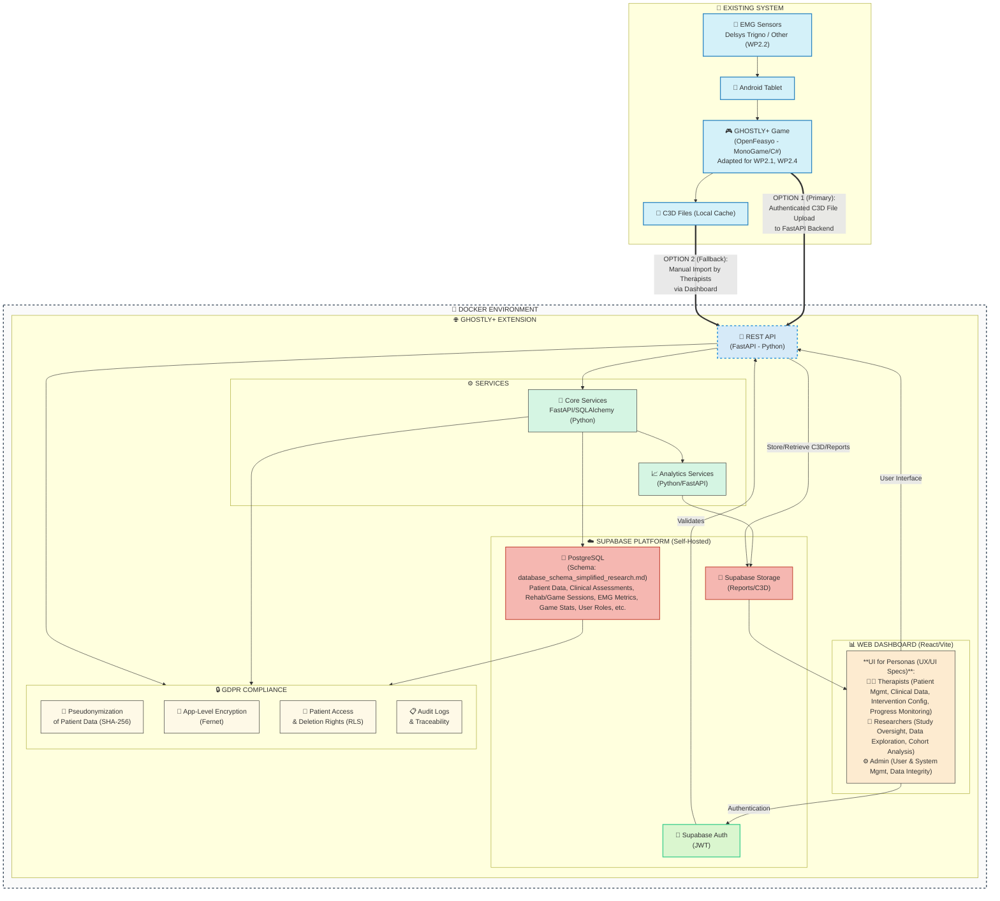

# GHOSTLY+ Dashboard: System Patterns

## 1. System Architecture Overview

The GHOSTLY+ system is composed of existing client-side components and a new server-side extension (Web Dashboard and supporting services). The architecture is designed around Work Packages (WP) as defined in [docs/prd.md](mdc:docs/prd.md) (Section 4) **and further detailed for WP2 in [WP2_proposal_detailed.md](mdc:docs/00_PROJECT_DEFINITION/ressources/WP2_proposal_detailed.md)**, now with a clear data structure outlined in `docs/00_PROJECT_DEFINITION/database_schema_simplified_research.md` and user interactions defined in `docs/00_PROJECT_DEFINITION/UX_UI_specifications.md`.

-   **WP1: Existing System Integration**: Interfacing with OpenFeasyo game (MonoGame/C# on Android) and Delsys Trigno EMG sensors. Key modification: game will authenticate via Supabase Auth and upload C3D files directly to the backend API. A single **Rehabilitation Session** (overall therapy appointment) can result in one or more C3D files, each representing a distinct **Game Session** (a single instance of playing the game). **WP2.2 outlines analysis and potential integration of alternative sEMG sensors.**
-   **WP2: Web Dashboard (Frontend)**: React with React Router, Tailwind CSS, shadcn/ui, Context API/Zustand. Provides role-based interfaces for **Therapists, Researchers, and Administrators** in a single consolidated codebase, as detailed in `docs/00_PROJECT_DEFINITION/UX_UI_specifications.md`. *(Migrated from Next.js to standard React with Vite for simplicity and performance, and consolidated into a single directory)*
    -   Handles UI rendering, client-side validation, and user interactions tailored to each persona.
    -   Organized by feature with clean component hierarchy.
    -   Communicates with backend services through secure API calls.
    -   Manages authentication through Supabase client, with custom fetch implementation for token handling.
    -   **Will display detailed sEMG-derived metrics (activation, fatigue, force/mass estimations), game engagement/adherence reports (WP2.3, WP2.5), DDA-related data (WP2.4, WP2.5), and comprehensive clinical assessment data.**
-   **WP3: Service Layer (Backend API)**: FastAPI (Python), Pydantic, SQLAlchemy. Handles business logic, secure data processing, C3D handling (parsing, storing C3D file path), **calculation and processing of sEMG-derived metrics (activation, fatigue, force/mass estimations as per WP2.3)**, game statistic aggregation, DDA parameter logging, JWT verification. Interacts with the database structured as per `docs/00_PROJECT_DEFINITION/database_schema_simplified_research.md`.
-   **WP4: Data Infrastructure**: Self-hosted Supabase (PostgreSQL for structured data based on `docs/00_PROJECT_DEFINITION/database_schema_simplified_research.md`, Supabase Storage for files like C3D and reports). Features RLS and encryption. **Database will store raw EMG data references (C3D paths), processed sEMG metrics (e.g., `EMGCalculatedMetric` table), game statistics (e.g., `GamePlayStatistic` table), DDA parameters (e.g., in `GameSession` table), clinical assessments (e.g., `ClinicalAssessment`, `ClinicalOutcomeMeasure` tables), patient/user/session management data, and other data as specified in WP2 and the UI/UX specifications.**
-   **WP5: Security and Compliance**: Focus on pseudonymization (SHA-256), encryption (Fernet), GDPR, role-based access control (RBAC), Row-Level Security (RLS), audit logs, OWASP Top 10 protections. Uses Supabase Auth for authentication (JWTs) with optional 2FA/MFA.
-   **WP6: Deployment and Operations**: Docker & Docker Compose for containerization, Nginx for reverse proxy in production. Deployment on VUB private VM.

Refer to the architecture diagram in [docs/prd.md](mdc:docs/prd.md) (Section 4.8) and security diagrams in [docs/security.md](mdc:docs/security.md).



## 2. Key Technical Decisions & Design Patterns

-   **Unified Authentication**: Both the OpenFeasyo game and the Web Dashboard will use the same self-hosted Supabase Auth instance for user authentication (therapists, researchers). Clients authenticate *directly* with Supabase Auth, which then issues JWTs. The FastAPI backend's role is to subsequently *verify* these JWTs for API request authorization, not to handle the initial credential exchange. (Source: [docs/prd.md](mdc:docs/prd.md) 4.1.2, [docs/security.md](mdc:docs/security.md) Unified Authentication System)
-   **Direct Authenticated Game Upload**: The OpenFeasyo game will be modified to upload C3D files directly to a secure FastAPI backend endpoint, authenticated with a JWT (obtained from Supabase Auth). A manual dashboard upload serves as a fallback. (Source: [docs/prd.md](mdc:docs/prd.md) 4.1.2, 4.7.1)
-   **Self-Hosted Supabase**: All Supabase services (Auth, Database, Storage) will be self-hosted on the VUB private VM for data sovereignty and control. (Source: [docs/security.md](mdc:docs/security.md) Executive Summary, Local Supabase Deployment Notes)
-   **Security by Layers**: Multi-layered security approach (authentication, authorization, encryption at rest and in transit, pseudonymization, RLS). (Source: [docs/security.md](mdc:docs/security.md))
-   **Row-Level Security (RLS)**: Supabase (PostgreSQL) RLS will be extensively used to ensure users can only access data they are authorized to see. (Source: [docs/prd.md](mdc:docs/prd.md) 4.4.1, [docs/security.md](mdc:docs/security.md) Section 2)
-   **Application-Level Encryption**: Sensitive medical data will be encrypted by the FastAPI backend using Fernet before storage in Supabase and decrypted upon retrieval for authorized users. (Source: [docs/prd.md](mdc:docs/prd.md) 4.5.1, [docs/security.md](mdc:docs/security.md) Section 3)
-   **Pseudonymization**: Patient identifiers will be pseudonymized (e.g., using SHA-256) to enhance privacy. (Source: [docs/prd.md](mdc:docs/prd.md) 4.5.1, [docs/security.md](mdc:docs/security.md) Section 4)
-   **API-Driven Architecture**: The **React frontend** interacts with the FastAPI backend primarily through REST APIs. Next.js server-side logic (Server Components, Route Handlers) may interact directly with Supabase for initial loads/RLS-protected data or handle specific backend tasks, complementing the separate FastAPI service. *(Frontend switched to React for its integrated full-stack capabilities and ecosystem benefits)*.
-   **Containerization**: Docker will be used for packaging the frontend (`frontend-2`) and backend applications, orchestrated with Docker Compose for development and simplifying deployment.
    -   For local development, Supabase services are also containerized using a dedicated `supabase_config/docker-compose.yml`. Currently, core services like `studio`, `kong`, `auth`, `rest`, `storage`, `db`, `meta`, and `supavisor` are active, while others (`realtime`, `functions`, etc.) are commented out to streamline the local environment.
    (Source: [docs/prd.md](mdc:docs/prd.md) 4.6.1)
-   **Modular Project Structure**: The codebase will follow a recommended structure separating backend, frontend (`frontend-2`), Docker configs, etc. (Source: [docs/prd.md](mdc:docs/prd.md) 4.10)

### 2.1. API Structure and Routing Pattern

The application follows a **versioned API structure** with clear domain separation:

- **API Paths**: Organized with the following pattern:
  - Generic system endpoints: `/api/endpoint` (e.g., `/api/health`)
  - Domain-specific API endpoints: `/v1/domain/endpoint` (e.g., `/v1/c3d/upload`)
  
- **NGINX Configuration**:
  - Location `/api/` proxies directly to backend FastAPI service
  - Location `/v1/` proxies directly to backend FastAPI service
  - Each path maintained separately for clear routing

- **FastAPI Router Organization**:
  - Domain-specific routers with tags for API documentation:
    ```python
    # Example router setup
    from fastapi import APIRouter
    
    router = APIRouter(prefix="/v1/c3d", tags=["C3D Processing"])
    
    @router.post("/upload")
    async def upload_c3d_file():
        # Implementation
    ```

- **Frontend API Client**:
  - Centralized API client that maps to backend endpoints:
    ```typescript
    // Example API client
    export const ghostlyApi = {
      async uploadC3DFile(file: File, options = {}): Promise<Result> {
        const formData = new FormData();
        formData.append('file', file);
        // Add options to formData
        
        const response = await fetch(`${API_BASE_URL}/v1/c3d/upload`, {
          method: 'POST',
          body: formData,
        });
        
        return await response.json();
      }
    };
    ```

## 3. Component Relationships

-   **GHOSTLY+ Game (OpenFeasyo Adaptation)**: Collects EMG data for each **Game Session** -> Authenticates *directly* with Supabase Auth -> Uploads C3D file(s) (one per Game Session, potentially batched per **Rehabilitation Session**) to FastAPI Backend (sending JWT). Game stores/sends data related to game levels, DDA parameters used, and basic performance (WP2.1, WP2.3, WP2.4). C3D file path stored in `GameSession` table.
-   **Web Dashboard (React)**: User Interface (React components specific to Therapist, Researcher, Admin roles) -> Authenticates *directly* with Supabase Auth -> Manages auth state -> Communicates with FastAPI Backend (sending JWT) to manage **Rehabilitation Sessions**, their associated **Game Session** data (C3D file paths, **processed sEMG metrics from `EMGCalculatedMetric`**, **game stats from `GamePlayStatistic`**, DDA data logged in `GameSession`), **clinical assessments from `ClinicalAssessment` & `ClinicalOutcomeMeasure`**, and user/patient data from relevant tables. Fetches and displays this structured data according to persona needs.
-   **FastAPI Backend**: Receives requests from Game & Dashboard -> **Verifies JWTs** (issued by Supabase Auth) -> Processes business logic (e.g., associating multiple C3D files/Game Sessions with a single Rehabilitation Session, **calculating sEMG metrics per WP2.3 and storing them in `EMGCalculatedMetric`**, aggregating game stats for `GamePlayStatistic`, logging DDA parameters to `GameSession`) -> Interacts **directly with Supabase DB (PostgreSQL)** via ORM/driver according to the schema in `docs/00_PROJECT_DEFINITION/database_schema_simplified_research.md` for complex logic/analytics -> Handles encryption/decryption & pseudonymization -> May use `supabase-py` optionally for simple tasks.
-   **Supabase Auth**: Issues JWTs upon successful authentication. User roles stored in `User` table are used by backend/RLS.
-   **Supabase Database (PostgreSQL)**: Stores application data according to `docs/00_PROJECT_DEFINITION/database_schema_simplified_research.md`, including a clear structure for `User`, `Patient`, `HospitalSite`, `Therapist`, `RehabilitationSession`, `GameSession`, `MVCCalibration`, `GameLevel`, `EMGMetricDefinition`, `EMGCalculatedMetric`, `GamePlayStatistic`, `ClinicalAssessment`, `ClinicalOutcomeMeasure`. Enforces RLS based on JWT claims and user roles for direct access from React/clients where appropriate.
-   **Supabase Storage**: Stores files (C3D from each **Game Session**, reports); access controlled by RLS policies.
-   **Supabase Edge Functions:** Execute specific backend logic -> Use `supabase-js` client **with `service_role` key** for privileged Supabase operations (bypassing RLS when needed).

See diagrams in [docs/prd.md](mdc:docs/prd.md) (Sections 4.8, 4.9) and [docs/security.md](mdc:docs/security.md) (Data Flow Diagrams) for visual representations. **Note:** Diagrams may need manual updates to reflect the React frontend and these interaction patterns. *Refer to Section 5 below for a detailed guide on choosing the appropriate backend implementation strategy.*

## 4. Critical Implementation Paths

-   **Authentication Flow**: Ensuring seamless and secure JWT-based authentication for both the C# game client and the React web client against the central Supabase Auth service, leveraging libraries like `@supabase/ssr`.
-   **C3D Data Pipeline**: The flow of C3D files from game generation, authenticated upload to API, processing (parsing, pseudonymization, encryption), storage in Supabase Storage, and retrieval/visualization in the dashboard.
-   **EMG Data Visualization and Metrics Reporting**: Efficiently fetching, decrypting, processing, and rendering potentially large EMG datasets in the React frontend (using React components) with interactive charts. **This includes the calculation (backend) and display (frontend) of specific sEMG-derived metrics (fatigue, strength, mass trends as per WP2.3) and game engagement/adherence reports.**
-   **RLS Policy Implementation**: Correctly defining and implementing PostgreSQL RLS policies in Supabase to ensure strict data segregation and access control.
-   **Security Measures**: Proper implementation of encryption/decryption services, pseudonymization, and other security controls outlined in [docs/security.md](mdc:docs/security.md).
-   **Hybrid Backend Strategy**: Defining clear boundaries between logic handled by Next.js server-side features, Supabase Edge Functions, and the potential separate FastAPI analytics service. *Refer to Section 5 below for detailed guidance.*
-   **Dynamic Difficulty Adjustment (DDA) Data Flow and Dashboard Interaction**: If the dashboard is to display or influence DDA parameters (WP2.4, WP2.5), ensuring this data is correctly logged, stored, and presented is critical.

### 4.1. Authentication

```
┌────────────┐     ┌────────────┐     ┌────────────┐     ┌────────────┐
│  Login     │────▶│  Auth API  │────▶│  JWT Gen   │────▶│  Store     │
│  Form      │     │  Endpoint  │     │  (Supabase)│     │  Token     │
└────────────┘     └────────────┘     └────────────┘     └────────────┘
                                                               │
                                                               ▼
┌────────────┐     ┌────────────┐     ┌────────────┐     ┌────────────┐
│  Protected │◀────│  Auth      │◀────│  Check     │◀────│  Load      │
│  Content   │     │  Context   │     │  Valid     │     │  User Data │
└────────────┘     └────────────┘     └────────────┘     └────────────┘
```

### 4.2. C3D File Processing

*This describes processing for C3D files, typically one per Game Session, which are then associated with an overall Rehabilitation Session.*

```
┌────────────┐     ┌────────────┐     ┌────────────┐     ┌────────────┐
│  Upload    │────▶│  API       │────▶│  Process   │────▶│  Store     │
│  C3D File(s)│     │  Client    │     │  C3D Data  │     │  Results   │
│ (per Game  │     │            │     │ (per file) │     │ (link to  │
│  Session)  │     │            │     │            │     │ Rehab Ses)│
└────────────┘     └────────────┘     └────────────┘     └────────────┘
                                                               │
                                                               ▼
┌────────────┐     ┌────────────┐     ┌────────────┐     ┌────────────┐
│  Display   │◀────│  Format    │◀────│  Transform │◀────│  Load      │
│  Results   │     │  For UI    │     │  Data      │     │  Results   │
│ (Aggregated│     │ (Aggregate │     │ (per file) │     │ (per Rehab│
│ per Rehab  │     │  if needed)│     │            │     │  Session)  │
│  Session)  │     │            │     │            │     │            │
└────────────┘     └────────────┘     └────────────┘     └────────────┘
```

## 5. Implementation Strategy Selection

For interacting with the database and implementing backend logic, multiple options are available, each suited to different scenarios:

1.  **React Frontend + Supabase Client (`@supabase/js`):**
    *   **When:** Simple data fetching/mutation directly tied to the UI, where operations respect user permissions defined by **Row Level Security (RLS)**.
    *   **Examples:**
    *   Displaying user-specific data (e.g., their profile, their assigned patients).
    *   Basic CRUD operations on tables where RLS is configured properly.
    *   *How:** Use Supabase client libraries (`@supabase/js`) in React components. Authentication is handled automatically via JWTs managed by the Supabase client. **NEVER use the `service_role` key here.**

2.  **FastAPI Backend:**
    *   **When:** Complex backend logic, data transformation, or operations that can't be handled by simple database queries or RLS.
    *   **Examples:**  
    *   Aggregating data from multiple sources.
    *   Implementing business logic that requires multiple database operations.
    *   Operations requiring service role level access.
    *   **How:** Create FastAPI endpoints in the backend service, call them from React components. Authenticate via headers forwarded from the client.

3.  **Supabase Edge Functions:**
    *   **When:** Isolated operations requiring elevated privileges or when you need serverless execution.
    *   **Examples:**
    *   Admin operations requiring the `service_role` key.
    *   Data transformation requiring access to sensitive fields before returning sanitized data.
    *   **How:** Deploy serverless functions through Supabase that can use the `service_role` key safely. Call these from the React frontend when needed.

4.  **Separate FastAPI Analytics Service (Future):**
    *   **When:** Advanced Python-based analytics and machine learning that require specialized libraries or significant computational resources.
    *   **Examples:**
    *   Processing C3D files for movement analysis.
    *   Running machine learning models.
    *   Complex statistical analysis of patient data.
    *   **How:** Deploy as a separate service that can be scaled independently, with its own authentication and resource allocation.

## 6. Frontend Structure

### 6.1. Component Structure

The React frontend follows a feature-based architecture:

```
frontend/
├── src/
│   ├── components/
│   │   ├── ui/             # Shadcn UI components
│   │   ├── layouts/        # Page layouts and containers
│   │   ├── dashboard/      # Dashboard-specific components
│   │   ├── patients/       # Patient management components
│   │   ├── treatments/     # Treatment components
│   │   └── sessions/       # Session tracking and reporting
│   ├── pages/
│   │   ├── auth/           # Authentication pages
│   │   ├── dashboard/      # Dashboard pages
│   │   ├── patients/       # Patient management pages
│   │   └── reports/        # Analysis and reporting pages
│   ├── contexts/           # React context providers
│   ├── hooks/              # Custom React hooks
│   └── routes/             # Application routing
```

This organization enables:
- Isolation of features and concerns
- Easier code navigation for developers
- Logical grouping of related components
- Simplified testing and maintenance
- Clear separation between UI components and business logic

### 6.2. Frontend Authentication Flow

The authentication process uses a custom fetch implementation to avoid Supabase client header issues:

1. User submits login form with credentials
2. Custom auth function sends API request with controlled headers
3. Successful login returns JWT tokens
4. Tokens stored in Supabase client state
5. Protected routes check auth state in React Router
6. Auth context provides user information throughout the app

### 6.3. Component Composition

The frontend uses a **composed component pattern** with shadcn/ui:

- **Primitive Components**: Base UI elements from shadcn/ui/radix
- **Compound Components**: Combinations of primitives for specific UI patterns
- **Feature Components**: Domain-specific components using compounds and primitives
- **Page Components**: Full page layouts composed of feature components

```
└─ Pages
   └─ Feature Components
      └─ Compound Components
         └─ Primitive Components
```

### 6.4. State Management

- **React Context API** for global state:
  - Authentication state
  - User preferences
  - Application theme
  
- **Local Component State** for UI interactions:
  - Form inputs
  - Toggles
  - Modals

- **Query Hooks** for data fetching (potential future addition)

## 7. Backend Structure

### 7.1. FastAPI Organization

```
app/
├── api/                 # API routes by domain
│   ├── c3d_processing_api.py   # C3D file processing endpoints
│   └── user_api.py      # User-related endpoints
├── core/                # Core functionality
│   ├── config.py        # Configuration settings
│   └── security.py      # Security utilities
├── db/                  # Database interaction
│   ├── models.py        # SQLAlchemy models (if used)
│   └── session.py       # Database session management
├── services/            # Business logic services
│   ├── c3d_service.py   # C3D processing logic
│   └── user_service.py  # User-related business logic
└── main.py              # Application entry point
```

### 7.2. API Documentation

- **OpenAPI/Swagger UI** automatically generated by FastAPI
- **Tags** used to categorize endpoints by domain
- **Description** for each endpoint with expected inputs and outputs

## 8. Database Schema

### 8.1. Core Entities

- **users** (Managed by Supabase Auth)
  - id (primary key)
  - email
  - created_at
  - updated_at

- **profiles**
  - id (foreign key to users.id)
  - first_name
  - last_name
  - role
  - created_at
  - updated_at

- **patients**
  - id (primary key)
  - external_id
  - therapist_id (foreign key to profiles.id)
  - first_name
  - last_name
  - date_of_birth
  - created_at
  - updated_at

- **sessions**
  - id (primary key)
  - patient_id (foreign key to patients.id)
  - therapist_id (foreign key to profiles.id)
  - date
  - notes
  - created_at
  - updated_at

- **emg_data**
  - id (primary key)
  - session_id (foreign key to sessions.id)
  - file_path
  - processed
  - results
  - created_at
  - updated_at

### 8.2. Row-Level Security (RLS)

- **users**: Only the user themselves or admin can access their data
- **profiles**: Only the user themselves or admin can modify their profile
- **patients**: Only assigned therapist or admin can access patient data
- **sessions**: Only involved therapist or admin can access session data
- **emg_data**: Only therapist who created the session or admin can access data

## 9. Testing Strategy

### 9.1. Frontend Testing

- **Component Tests**: Testing individual components in isolation
- **Integration Tests**: Testing component interactions
- **E2E Tests**: Testing full user flows with Playwright

### 9.2. Backend Testing

- **Unit Tests**: Testing individual functions and methods
- **API Tests**: Testing API endpoints with FastAPI TestClient
- **Integration Tests**: Testing service interactions

## 10. Security Patterns

### 10.1. Authentication and Authorization

- **JWT-based Authentication**: Using Supabase Auth
- **Role-Based Access Control**: Different UI views and API access based on user role
- **Row-Level Security**: Database access control at the row level

### 10.2. API Security

- **Input Validation**: Using Pydantic schemas for request validation
- **CORS Configuration**: Restricting cross-origin requests
- **Rate Limiting**: Preventing abuse through request rate limiting (future implementation)

### 10.3. Data Security

- **Data Encryption**: Sensitive data encrypted at rest
- **Pseudonymization**: Patient identifiers pseudonymized
- **Access Logging**: Logging access to sensitive data

## 11. Data Flow Architecture

The GHOSTLY+ system follows a clear data flow pattern for capturing, storing, and analyzing quadriceps muscle data:

1. **Data Capture**: EMG sensors on quadriceps muscles → Ghostly Game → C3D files
2. **Data Upload**: Authenticated upload to backend API endpoint
3. **Data Processing**: Backend processes C3D files, extracts metrics
4. **Data Storage**: Processed data stored in Supabase Database with pseudonymization and encryption
5. **Data Analysis**: Web Dashboard visualizes data with appropriate access controls
6. **Data Export**: Exports to SPSS-compatible formats for statistical analysis

## 12. Visualization Patterns

### 12.1. EMG Visualization

```
┌─────────────────────────────────┐
│                                 │
│     ╱╲      ╱╲     ╱╲    ╱╲    │
│    ╱  ╲    ╱  ╲   ╱  ╲  ╱  ╲   │
│   ╱    ╲  ╱    ╲ ╱    ╲╱    ╲  │
│  ╱      ╲╱      ╲       ╲     ╲ │
│ ╱                              ╲│
│                                 │
└─────────────────────────────────┘
  EMG Signal with Time Controls
```

- Temporal visualization of quadriceps EMG signal
- Real-time or playback modes
- Amplitude visualization with adjustable scales
- Multiple channels for different quadriceps muscles (vastus lateralis, vastus medialis, rectus femoris)
- Training protocol markers (sets, repetitions)
- Comparison between left and right leg

### 12.2. Muscle Heatmap Visualization

```
┌─────────────────────────────────┐
│    ╔═════════╗                  │
│    ║███████░░║  ◄── Rectus      │
│    ║████████░║      Femoris     │
│    ╚═════════╝                  │
│    ╔═════════╗                  │
│    ║██████░░░║  ◄── Vastus      │
│    ║███░░░░░░║      Lateralis   │
│    ╚═════════╝                  │
│    ╔═════════╗                  │
│    ║████░░░░░║  ◄── Vastus      │
│    ║███░░░░░░║      Medialis    │
│    ╚═════════╝                  │
└─────────────────────────────────┘
        Quad Muscle Heatmap
```

- Color-coded visualization of quadriceps muscle activity
- Intensity mapping based on various measurements:
  - Strength (MicroFET dynamometer)
  - Cross-sectional area (ultrasound)
  - Pennation angle (ultrasound)  
  - Echo intensity (ultrasound)
- Side-by-side comparison of left and right leg
- Time-series visualization (baseline, 2-week, 6-week)

### 12.3. Progress Tracking Visualization

```
┌─────────────────────────────────┐
│                                 │
│  ┌───┐    ┌───┐    ┌───┐        │
│  │   │    │   │    │   │        │
│  │   │    │   │    │   │        │
│  │   │    │   │    │   │        │
│  └───┘    └───┘    └───┘        │
│ Baseline  2 Week   6 Week       │
│                                 │
└─────────────────────────────────┘
       Strength Progress Chart
```

- Bar/line charts showing progression over time
- Multiple metrics tracked simultaneously
- Treatment group comparison view
- Statistical significance indicators
- Baseline, 2-week, and 6-week measurements
- Population-specific assessment visualizations

### 12.4. Group Comparison Visualization

```
┌─────────────────────────────────┐
│                                 │
│  Group A   Group B   Control    │
│  ┌───┐     ┌───┐     ┌───┐     │
│  │   │     │   │     │   │     │
│  │   │     │   │     │   │     │
│  │   │     │   │     │   │     │
│  └───┘     └───┘     └───┘     │
│                                 │
└─────────────────────────────────┘
       Treatment Group Chart
```

- Compare outcomes across three treatment groups
- Filter by patient population
- Multiple outcome measures available
- Statistical analysis integration
- Error bars and significance indicators
- Interactive filtering by timepoint

## 13. Data Access Patterns

Different user roles have different access patterns:

1. **Therapists**:
   - Access only their assigned patients
   - View individual patient progress
   - Configure treatment parameters
   - Record session notes

2. **Researchers**:
   - Access pseudonymized data across patients
   - Perform cohort analysis
   - Export data for external analysis
   - View statistical summaries

3. **Administrators**:
   - Manage user accounts and permissions
   - Configure system settings
   - Access audit logs
   - Monitor system health

## 14. Integration Patterns

The system integrates with several external components:

1. **EMG Sensors**: Delsys Trigno Avanti sensors provide raw quadriceps data
2. **Ghostly Game**: OpenFeasyo platform creates the game experience
3. **C3D Files**: Standard biomechanics format for data exchange
4. **SPSS**: Statistical analysis software for research outcomes
5. **Ultrasound**: Viamo sv7 device captures muscle measurements
6. **MicroFET**: Dynamometer for strength measurements

## 15. Reporting Patterns

Standard reports follow consistent patterns:

1. **Session Report**: Individual training session details and metrics
2. **Progress Report**: Patient progression over multiple sessions
3. **Population Report**: Statistics across a specific patient population
4. **Treatment Group Report**: Comparison between treatment arms
5. **Export Report**: Formatted data for SPSS analysis
6. **USE Questionnaire Report**: User experience analysis

