# GHOSTLY+ Dashboard: System Patterns

## 1. System Architecture Overview

The GHOSTLY+ system is composed of existing client-side components and a new server-side extension (Web Dashboard and supporting services). The architecture is designed around Work Packages (WP) as defined in [docs/prd.md](mdc:docs/prd.md) (Section 4) **and further detailed for WP2 in [WP2_proposal_detailed.md](mdc:docs/00_PROJECT_DEFINITION/ressources/WP2_proposal_detailed.md)**, now with a clear data structure outlined in `docs/00_PROJECT_DEFINITION/database_schema_simplified_research.md`, user interactions defined in `docs/00_PROJECT_DEFINITION/UX_UI_specifications.md`, and data governance defined by `docs/00_PROJECT_DEFINITION/ressources/data_management_plan.md`.

-   **WP1: Existing System Integration**: Interfacing with OpenFeasyo game (MonoGame/C# on Android) and Delsys Trigno EMG sensors. Key modification: game will authenticate via Supabase Auth and upload C3D files directly to the backend API. A single **Rehabilitation Session** (overall therapy appointment) can result in one or more C3D files, each representing a distinct **Game Session** (a single instance of playing the game). **WP2.2 outlines analysis and potential integration of alternative sEMG sensors.**
-   **WP2: Web Dashboard (Frontend)**: React with React Router, Tailwind CSS, shadcn/ui, Context API/Zustand. Provides role-based interfaces for **Therapists, Researchers, and Administrators** in a single consolidated codebase, as detailed in `docs/00_PROJECT_DEFINITION/UX_UI_specifications.md`. *(Migrated from Next.js to standard React with Vite for simplicity and performance, and consolidated into a single directory)*
    -   Handles UI rendering, client-side validation, and user interactions tailored to each persona.
    -   Organized by feature with clean component hierarchy.
    -   Communicates with backend services through secure API calls.
    -   Manages authentication through Supabase client, which is configured via environment variables (`VITE_SUPABASE_URL`, `VITE_SUPABASE_ANON_KEY`) to target appropriate Supabase instances (e.g., Supabase Cloud for development, self-hosted for production).
    -   **Will display detailed sEMG-derived metrics (activation, fatigue, force/mass estimations), game engagement/adherence reports (WP2.3, WP2.5), DDA-related data (WP2.4, WP2.5), and comprehensive clinical assessment data.**
-   **WP3: Service Layer (Backend API)**: FastAPI (Python), Pydantic, SQLAlchemy. Handles business logic, secure data processing, C3D handling (parsing, storing C3D file path), **calculation and processing of sEMG-derived metrics (activation, fatigue, force/mass estimations as per WP2.3)**, game statistic aggregation, DDA parameter logging, JWT verification. Interacts with the database structured as per `docs/00_PROJECT_DEFINITION/database_schema_simplified_research.md`.
-   **WP4: Data Infrastructure**: Self-hosted Supabase on VUB Private VM (PostgreSQL for structured data based on `docs/00_PROJECT_DEFINITION/database_schema_simplified_research.md`, Supabase Storage for files like C3D and reports). This self-hosted instance is the **primary target for production deployment** for the GHOSTLY+ Dashboard's operational data. Features RLS and encryption.
    -   **Broader Data Ecosystem (as per `data_management_plan.md`):** The `data_management_plan.md` outlines a comprehensive data management strategy. While Supabase serves the immediate operational needs of the dashboard and game, other systems are designated for specific roles:
        -   **REDCap:** Used for collecting and managing certain research data, potentially serving as the eCRF and for long-term storage of clinical trial master data/archive.
        -   **Pixiu:** VUB's secure data management system for organizing, processing, and long-term archiving of research data (especially pseudonymized and anonymized datasets).
        -   **VUB SharePoint:** Used for storing research documents, protocols, administrative files, and study-related materials.
        -   The GHOSTLY+ Dashboard and backend services must facilitate data export or integration pathways to support these systems as required by the DMP.
    -   **Database will store raw EMG data references (C3D paths), processed sEMG metrics (e.g., `EMGCalculatedMetric` table), game statistics (e.g., `GamePlayStatistic` table), DDA parameters (e.g., in `GameSession` table), clinical assessments (e.g., `ClinicalAssessment`, `ClinicalOutcomeMeasure` tables), patient/user/session management data, and other data as specified in WP2 and the UI/UX specifications.**
-   **WP5: Security and Compliance**: Focus on pseudonymization (SHA-256 as per `data_management_plan.md`), encryption (Fernet), GDPR, role-based access control (RBAC), Row-Level Security (RLS), audit logs, OWASP Top 10 protections. Uses Supabase Auth for authentication (JWTs) with optional 2FA/MFA. **Crucially, all practices must align with the `data_management_plan.md`, including:**
    -   Adherence to ethical approvals from FAGG and hospital ethics committees (UZ Brussel, UZ Leuven, UZ Antwerpen).
    -   Management of informed consent.
    -   Compliance with VUB privacy registers.
    -   Respecting terms of the collaboration agreement regarding data ownership, use, and sharing.
    -   Implementing data retention and sharing policies as specified in the DMP.
-   **WP6: Deployment and Operations**: Docker & Docker Compose for containerization, Nginx for reverse proxy in production. Deployment on VUB private VM.

Refer to the architecture diagram in [docs/prd.md](mdc:docs/prd.md) (Section 4.8) and security diagrams in [docs/security.md](mdc:docs/security.md).

```mermaid
flowchart TD
    %% Cohesive color scheme with clearer distinctions
    classDef existing fill:#D4F1F9,stroke:#2E86C1,stroke-width:2px
    classDef newSystem fill:#E8DAEF,stroke:#7D3C98,stroke-width:2px
    classDef frontend fill:#FDEBD0,stroke:#333,stroke-width:1px
    classDef backend fill:#D5F5E3,stroke:#333,stroke-width:1px
    classDef api fill:#D6EAF8,stroke:#3498DB,stroke-width:1.5px
    classDef database fill:#F5B7B1,stroke:#C0392B,stroke-width:1.5px
    classDef security fill:#FEF9E7,stroke:#333,stroke-width:1px
    classDef supabase fill:#3ECF8E30,stroke:#3ECF8E,stroke-width:2px
    classDef option1 stroke:#E74C3C,stroke-width:2.5px,stroke-dasharray: 5 5
    classDef option2 stroke:#3498DB,stroke-width:2.5px,stroke-dasharray: 5 5
    classDef legend fill:none,stroke:none
    classDef docker fill:#F5F5F580,stroke:#2C3E50,stroke-width:2px,stroke-dasharray: 5 5

    %% Existing system - simplified
    subgraph CurrentSystem["🏥 EXISTING SYSTEM"]
        direction LR
        Android["📱 Android Tablet"]:::existing
        Sensors["💪 EMG Sensors<br>Delsys Trigno / Other (WP2.2)"]:::existing
        Ghostly["🎮 GHOSTLY+ Game<br>(OpenFeasyo - MonoGame/C#)<br>Adapted for WP2.1, WP2.4"]:::existing
        LocalFiles["📄 C3D Files (Local Cache)"]:::existing
    end

    %% New system - streamlined
    subgraph DockerEnv["🐳 DOCKER ENVIRONMENT"]
        subgraph NewSystem["🌐 GHOSTLY+ EXTENSION"]
            subgraph UserDashboard["📊 WEB DASHBOARD (React/Vite)"]
                Dashboard["**UI for Personas (UX/UI Specs)**:<br>👨‍⚕️ Therapists (Patient Mgmt, Clinical Data, Intervention Config, Progress Monitoring)<br>🔬 Researchers (Study Oversight, Data Exploration, Cohort Analysis)<br>⚙️ Admin (User & System Mgmt, Data Integrity)"]:::frontend
            end
            
            API["🔌 REST API<br>(FastAPI - Python)"]:::api
            
            subgraph CoreServices["⚙️ SERVICES"]
                direction TB
                FastAPIServices["🔄 Core Services<br>FastAPI/SQLAlchemy (Python)"]:::backend
                Analytics["📈 Analytics Services<br>(Python/FastAPI)"]:::backend
            end
            
            subgraph SupabaseCloud["☁️ SUPABASE PLATFORM (Self-Hosted) - Operational DB"]
                Database["💾 PostgreSQL<br>(Schema: database_schema_simplified_research.md)<br>Patient Data, Clinical Assessments, Rehab/Game Sessions, EMG Metrics, Game Stats, User Roles, etc."]:::database
                FileStore["📁 Supabase Storage<br>(Reports/C3D)"]:::database
                Auth["🔑 Supabase Auth<br>(JWT)"]:::supabase
            end
            
            subgraph GDPRCompliance["🔒 GDPR COMPLIANCE (aligns with data_management_plan.md)"]
                direction TB
                Pseudonymization["👤 Pseudonymization<br>of Patient Data (SHA-256)"]:::security
                DataEncryption["🔐 App-Level Encryption<br>(Fernet)"]:::security
                EthicalApprovals["📜 Ethical Approvals & Consent<br>(FAGG, Hospitals, GDPR)"]:::security
                AccessControl["📝 Patient Access<br>& Deletion Rights (RLS)"]:::security
                AuditLogs["📋 Audit Logs<br>& Traceability"]:::security
                DMPAdherence["📄 DMP Adherence<br>(Data Storage, Retention, Sharing)"]:::security
            end
        end
    end
    class DockerEnv docker

    %% Essential connections only
    Sensors --> Android
    Android --> Ghostly
    Ghostly --> LocalFiles
    
    %% Key integration points - C3D files options with labels
    %% Ghostly ==> |"Session Data"| API %% Original generic connection, now superseded by specific options
    
    %% OPTION 1: Automated transfer via API
    Ghostly ==> |"OPTION 1 (Primary):<br>Authenticated C3D File Upload<br>to FastAPI Backend"| API:::option1
    
    %% OPTION 2: Manual import (via Dashboard through API)
    LocalFiles ==> |"OPTION 2 (Fallback):<br>Manual Import by Therapists<br>via Dashboard"| API:::option2
    
    %% Essential flows only
    Dashboard --> |"User Interface"| API
    Dashboard --> |"Authentication"| Auth
    Auth --> |"Validates"| API
    %% API verifies JWT from Supabase Auth
    API --> FastAPIServices
    FastAPIServices --> Database
    FastAPIServices --> Analytics
    Analytics --> FileStore
    %% Analytics might read/write processed data/reports
    API --> |"Store/Retrieve C3D/Reports"| FileStore
    FileStore --> Dashboard
    %% Dashboard views files via API
    
    %% GDPR connections
    FastAPIServices --> GDPRCompliance
    Database --> GDPRCompliance
    API --> GDPRCompliance

    %% External Data Systems (as per DMP)
    subgraph ExternalSystems["🗄️ EXTERNAL DATA SYSTEMS (DMP)"]
        direction TB
        REDCap["🔴 REDCap<br>(eCRF, Clinical Trial Archive)"]:::database
        Pixiu["📦 Pixiu<br>(Long-term Archive, Processed Data)"]:::database
        SharePoint["📄 SharePoint<br>(Docs, Protocols)"]:::database
    end

    FastAPIServices --> |"Data Export/Sync"| REDCap
    FastAPIServices --> |"Data Archiving"| Pixiu
```



## 2. Key Technical Decisions & Design Patterns

-   **Unified Authentication**: Both the OpenFeasyo game and the Web Dashboard will use the same self-hosted Supabase Auth instance for user authentication (therapists, researchers). Clients authenticate *directly* with Supabase Auth, which then issues JWTs. The FastAPI backend's role is to subsequently *verify* these JWTs for API request authorization, not to handle the initial credential exchange. (Source: [docs/prd.md](mdc:docs/prd.md) 4.1.2, [docs/security.md](mdc:docs/security.md) Unified Authentication System)
-   **Direct Authenticated Game Upload**: The OpenFeasyo game will be modified to upload C3D files directly to a secure FastAPI backend endpoint, authenticated with a JWT (obtained from Supabase Auth). A manual dashboard upload serves as a fallback. (Source: [docs/prd.md](mdc:docs/prd.md) 4.1.2, 4.7.1)
-   **Self-Hosted Supabase (Operational Database)**: All Supabase services (Auth, Database, Storage) will be self-hosted on the VUB private VM for data sovereignty and control for the dashboard's *operational data*. This is part of a broader data ecosystem described in `data_management_plan.md` that includes REDCap, Pixiu, and SharePoint for specific data management roles (e.g., long-term archiving, master clinical trial data). (Source: [docs/security.md](mdc:docs/security.md) Executive Summary, Local Supabase Deployment Notes, `data_management_plan.md`)
-   **Security by Layers**: Multi-layered security approach (authentication, authorization, encryption at rest and in transit, pseudonymization, RLS), all guided by the stringent requirements of the `data_management_plan.md`. (Source: [docs/security.md](mdc:docs/security.md), `data_management_plan.md`)
-   **Row-Level Security (RLS)**: Supabase (PostgreSQL) RLS will be extensively used to ensure users can only access data they are authorized to see within the operational Supabase database. (Source: [docs/prd.md](mdc:docs/prd.md) 4.4.1, [docs/security.md](mdc:docs/security.md) Section 2)
-   **Application-Level Encryption**: Sensitive medical data will be encrypted by the FastAPI backend using Fernet before storage in Supabase and decrypted upon retrieval for authorized users, as per `data_management_plan.md` guidelines. (Source: [docs/prd.md](mdc:docs/prd.md) 4.5.1, [docs/security.md](mdc:docs/security.md) Section 3)
-   **Pseudonymization**: Patient identifiers will be pseudonymized (e.g., using SHA-256 as specified in `data_management_plan.md`) to enhance privacy. (Source: [docs/prd.md](mdc:docs/prd.md) 4.5.1, [docs/security.md](mdc:docs/security.md) Section 4, `data_management_plan.md`)
-   **API-Driven Architecture**: The **React frontend** interacts with the FastAPI backend primarily through REST APIs. Next.js server-side logic (Server Components, Route Handlers) may interact directly with Supabase for initial loads/RLS-protected data or handle specific backend tasks, complementing the separate FastAPI service. *(Frontend switched to React for its integrated full-stack capabilities and ecosystem benefits)*.
-   **Containerization**: Docker will be used for packaging the frontend (`frontend-2`) and backend applications, orchestrated with Docker Compose for development and simplifying deployment.
    -   For local development, Supabase services are also containerized using a dedicated `supabase_config/docker-compose.yml`. Currently, core services like `studio`, `kong`, `auth`, `rest`, `storage`, `db`, `meta`, and `supavisor` are active, while others (`realtime`, `functions`, etc.) are commented out to streamline the local environment.
    (Source: [docs/prd.md](mdc:docs/prd.md) 4.6.1)
-   **Modular Project Structure**: The codebase will follow a recommended structure separating backend, frontend (`frontend-2`), Docker configs, etc. (Source: [docs/prd.md](mdc:docs/prd.md) 4.10)

### 2.1. API Structure and Routing Pattern

The application follows a **versioned API structure** with clear domain separation:

- **API Paths**: Organized with the following pattern:
  - Generic system endpoints: `/api/endpoint` (e.g., `/api/health`)
  - Domain-specific API endpoints: `/v1/domain/endpoint` (e.g., `/v1/c3d/upload`)
  
- **NGINX Configuration**:
  - Location `/api/` proxies directly to backend FastAPI service
  - Location `/v1/` proxies directly to backend FastAPI service
  - Each path maintained separately for clear routing

- **FastAPI Router Organization**:
  - Domain-specific routers with tags for API documentation:
    ```python
    # Example router setup
    from fastapi import APIRouter
    
    router = APIRouter(prefix="/v1/c3d", tags=["C3D Processing"])
    
    @router.post("/upload")
    async def upload_c3d_file():
        # Implementation
    ```

- **Frontend API Client**:
  - Centralized API client that maps to backend endpoints:
    ```typescript
    // Example API client
    export const ghostlyApi = {
      async uploadC3DFile(file: File, options = {}): Promise<Result> {
        const formData = new FormData();
        formData.append('file', file);
        // Add options to formData
        
        const response = await fetch(`${API_BASE_URL}/v1/c3d/upload`, {
          method: 'POST',
          body: formData,
        });
        
        return await response.json();
      }
    };
    ```

## 3. Component Relationships

-   **GHOSTLY+ Game (OpenFeasyo Adaptation)**: Collects EMG data for each **Game Session** -> Authenticates *directly* with Supabase Auth -> Uploads C3D file(s) (one per Game Session, potentially batched per **Rehabilitation Session**) to FastAPI Backend (sending JWT). Game stores/sends data related to game levels, DDA parameters used, and basic performance (WP2.1, WP2.3, WP2.4). C3D file path stored in `GameSession` table (operational Supabase DB).
-   **Web Dashboard (React)**: User Interface (React components specific to Therapist, Researcher, Admin roles) -> Authenticates *directly* with Supabase Auth -> Manages auth state -> Communicates with FastAPI Backend (sending JWT) to manage **Rehabilitation Sessions**, their associated **Game Session** data (C3D file paths, **processed sEMG metrics from `EMGCalculatedMetric`**, **game stats from `GamePlayStatistic`**, DDA data logged in `GameSession`), **clinical assessments from `ClinicalAssessment` & `ClinicalOutcomeMeasure`**, and user/patient data from relevant tables in the operational Supabase DB. Fetches and displays this structured data according to persona needs. Must also support workflows for data export to systems like REDCap or for data preparation for archiving in Pixiu, as per `data_management_plan.md`.
-   **FastAPI Backend**: Receives requests from Game & Dashboard -> **Verifies JWTs** (issued by Supabase Auth) -> Processes business logic (e.g., associating multiple C3D files/Game Sessions with a single Rehabilitation Session, **calculating sEMG metrics per WP2.3 and storing them in `EMGCalculatedMetric`**, aggregating game stats for `GamePlayStatistic`, logging DDA parameters to `GameSession`) -> Interacts **directly with Supabase DB (PostgreSQL)** via ORM/driver according to the schema in `docs/00_PROJECT_DEFINITION/database_schema_simplified_research.md` for complex logic/analytics -> Handles encryption/decryption & pseudonymization. **Must also implement functionalities for data export/formatting compatible with REDCap and Pixiu as required by `data_management_plan.md`.** -> May use `supabase-py` optionally for simple tasks.
-   **Supabase Auth**: Issues JWTs upon successful authentication. User roles stored in `User` table are used by backend/RLS.
-   **Supabase Database (PostgreSQL)**: Stores application data according to `docs/00_PROJECT_DEFINITION/database_schema_simplified_research.md`, including a clear structure for `User`, `Patient`, `HospitalSite`, `Therapist`, `RehabilitationSession`, `GameSession`, `MVCCalibration`, `GameLevel`, `EMGMetricDefinition`, `EMGCalculatedMetric`, `GamePlayStatistic`, `ClinicalAssessment`, `ClinicalOutcomeMeasure`. Enforces RLS based on JWT claims and user roles for direct access from React/clients where appropriate.
-   **Supabase Storage**: Stores files (C3D from each **Game Session**, reports); access controlled by RLS policies.
-   **Supabase Edge Functions:** Execute specific backend logic -> Use `supabase-js` client **with `service_role` key** for privileged Supabase operations (bypassing RLS when needed).

See diagrams in [docs/prd.md](mdc:docs/prd.md) (Sections 4.8, 4.9) and [docs/security.md](mdc:docs/security.md) (Data Flow Diagrams) for visual representations. **Note:** Diagrams may need manual updates to reflect the React frontend and these interaction patterns. *Refer to Section 5 below for a detailed guide on choosing the appropriate backend implementation strategy.*

## 4. Critical Implementation Paths

-   **Authentication Flow**: Ensuring seamless and secure JWT-based authentication for both the C# game client and the React web client against the central Supabase Auth service, leveraging libraries like `@supabase/ssr`.
-   **C3D Data Pipeline**: The flow of C3D files from game generation, authenticated upload to API, processing (parsing, pseudonymization, encryption), storage in Supabase Storage, and retrieval/visualization in the dashboard.
-   **EMG Data Visualization and Metrics Reporting**: Efficiently fetching, decrypting, processing, and rendering potentially large EMG datasets in the React frontend (using React components) with interactive charts. **This includes the calculation (backend) and display (frontend) of specific sEMG-derived metrics (fatigue, strength, mass trends as per WP2.3) and game engagement/adherence reports.**
-   **RLS Policy Implementation**: Correctly defining and implementing PostgreSQL RLS policies in Supabase to ensure strict data segregation and access control, complementing the overall data governance model in `data_management_plan.md`.
-   **Security Measures**: Proper implementation of encryption/decryption services, pseudonymization, and other security controls outlined in [docs/security.md](mdc:docs/security.md) and mandated by `data_management_plan.md` (including consent management and ethical compliance).
-   **Hybrid Backend Strategy**: Defining clear boundaries between logic handled by Next.js server-side features, Supabase Edge Functions, and the potential separate FastAPI analytics service. *Refer to Section 5 below for detailed guidance.*
-   **Dynamic Difficulty Adjustment (DDA) Data Flow and Dashboard Interaction**: If the dashboard is to display or influence DDA parameters (WP2.4, WP2.5), ensuring this data is correctly logged, stored, and presented is critical.

### 4.1. Authentication

```
┌────────────┐     ┌────────────┐     ┌────────────┐     ┌────────────┐
│  Login     │────▶│  Auth API  │────▶│  JWT Gen   │────▶│  Store     │
│  Form      │     │  Endpoint  │     │  (Supabase)│     │  Token     │
└────────────┘     └────────────┘     └────────────┘     └────────────┘
                                                               │
                                                               ▼
┌────────────┐     ┌────────────┐     ┌────────────┐     ┌────────────┐
│  Protected │◀────│  Auth      │◀────│  Check     │◀────│  Load      │
│  Content   │     │  Context   │     │  Valid     │     │  User Data │
└────────────┘     └────────────┘     └────────────┘     └────────────┘
```

### 4.2. C3D File Processing

*This describes processing for C3D files, typically one per Game Session, which are then associated with an overall Rehabilitation Session.*

```
┌────────────┐     ┌────────────┐     ┌────────────┐     ┌────────────┐
│  Upload    │────▶│  API       │────▶│  Process   │────▶│  Store     │
│  C3D File(s)│     │  Client    │     │  C3D Data  │     │  Results   │
│ (per Game  │     │            │     │ (per file) │     │ (link to  │
│  Session)  │     │            │     │            │     │ Rehab Ses)│
└────────────┘     └────────────┘     └────────────┘     └────────────┘
                                                               │
                                                               ▼
┌────────────┐     ┌────────────┐     ┌────────────┐     ┌────────────┐
│  Display   │◀────│  Format    │◀────│  Transform │◀────│  Load      │
│  Results   │     │  For UI    │     │  Data      │     │  Results   │
│ (Aggregated│     │ (Aggregate │     │ (per file) │     │ (per Rehab│
│ per Rehab  │     │  if needed)│     │            │     │  Session)  │
│  Session)  │     │            │     │            │     │            │
└────────────┘     └────────────┘     └────────────┘     └────────────┘
```

## 5. Implementation Strategy Selection

For interacting with the database and implementing backend logic, multiple options are available, each suited to different scenarios:

1.  **React Frontend + Supabase Client (`@supabase/js`):**
    *   **When:** Simple data fetching/mutation directly tied to the UI, where operations respect user permissions defined by **Row Level Security (RLS)**.
    *   **Examples:**
    *   Displaying user-specific data (e.g., their profile, their assigned patients).
    *   Basic CRUD operations on tables where RLS is configured properly.
    *   *How:** Use Supabase client libraries (`@supabase/js`) in React components. Authentication is handled automatically via JWTs managed by the Supabase client. **NEVER use the `service_role` key here.**

2.  **FastAPI Backend:**
    *   **When:** Complex backend logic, data transformation, or operations that can't be handled by simple database queries or RLS.
    *   **Examples:**  
    *   Aggregating data from multiple sources.
    *   Implementing business logic that requires multiple database operations.
    *   Operations requiring service role level access.
    *   **How:** Create FastAPI endpoints in the backend service, call them from React components. Authenticate via headers forwarded from the client.

3.  **Supabase Edge Functions:**
    *   **When:** Isolated operations requiring elevated privileges or when you need serverless execution.
    *   **Examples:**
    *   Admin operations requiring the `service_role` key.
    *   Data transformation requiring access to sensitive fields before returning sanitized data.
    *   **How:** Deploy serverless functions through Supabase that can use the `service_role` key safely. Call these from the React frontend when needed.

4.  **Separate FastAPI Analytics Service (Future):**
    *   **When:** Advanced Python-based analytics and machine learning that require specialized libraries or significant computational resources.
    *   **Examples:**
    *   Processing C3D files for movement analysis.
    *   Running machine learning models.
    *   Complex statistical analysis of patient data.
    *   **How:** Deploy as a separate service that can be scaled independently, with its own authentication and resource allocation.

## 6. Frontend Structure

### 6.1. Component Structure

The React frontend follows a feature-based architecture:

```
frontend/
├── src/
│   ├── components/
│   │   ├── ui/             # Shadcn UI components
│   │   ├── layouts/        # Page layouts and containers
│   │   ├── dashboard/      # Dashboard-specific components
│   │   ├── patients/       # Patient management components
│   │   ├── treatments/     # Treatment components
│   │   └── sessions/       # Session tracking and reporting
│   ├── pages/
│   │   ├── auth/           # Authentication pages
│   │   ├── dashboard/      # Dashboard pages
│   │   ├── patients/       # Patient management pages
│   │   └── reports/        # Analysis and reporting pages
│   ├── contexts/           # React context providers
│   ├── hooks/              # Custom React hooks
│   └── routes/             # Application routing
```

This organization enables:
- Isolation of features and concerns
- Easier code navigation for developers
- Logical grouping of related components
- Simplified testing and maintenance
- Clear separation between UI components and business logic

### 6.2. Frontend Authentication Flow

The authentication process uses a custom fetch implementation to avoid Supabase client header issues:

1. User submits login form with credentials
2. Custom auth function sends API request with controlled headers
3. Successful login returns JWT tokens
4. Tokens stored in Supabase client state
5. Protected routes check auth state in React Router
6. Auth context provides user information throughout the app

### 6.3. Component Composition

The frontend uses a **composed component pattern** with shadcn/ui:

- **Primitive Components**: Base UI elements from shadcn/ui/radix
- **Compound Components**: Combinations of primitives for specific UI patterns
- **Feature Components**: Domain-specific components using compounds and primitives
- **Page Components**: Full page layouts composed of feature components

```
└─ Pages
   └─ Feature Components
      └─ Compound Components
         └─ Primitive Components
```

### 6.4. State Management

- **React Context API** for global state:
  - Authentication state
  - User preferences
  - Application theme
  
- **Local Component State** for UI interactions:
  - Form inputs
  - Toggles
  - Modals

- **Query Hooks** for data fetching (potential future addition)

## 7. Backend Structure

### 7.1. FastAPI Organization

```
app/
├── api/                 # API routes by domain
│   ├── c3d_processing_api.py   # C3D file processing endpoints
│   └── user_api.py      # User-related endpoints
├── core/                # Core functionality
│   ├── config.py        # Configuration settings
│   └── security.py      # Security utilities
├── db/                  # Database interaction
│   ├── models.py        # SQLAlchemy models (if used)
│   └── session.py       # Database session management
├── services/            # Business logic services
│   ├── c3d_service.py   # C3D processing logic
│   └── user_service.py  # User-related business logic
└── main.py              # Application entry point
```

### 7.2. API Documentation

- **OpenAPI/Swagger UI** automatically generated by FastAPI
- **Tags** used to categorize endpoints by domain
- **Description** for each endpoint with expected inputs and outputs

## 8. Database Schema

### 8.1. Core Entities

- **users** (Managed by Supabase Auth)
  - id (primary key)
  - email
  - created_at
  - updated_at

- **profiles**
  - id (foreign key to users.id)
  - first_name
  - last_name
  - role
  - created_at
  - updated_at

- **patients**
  - id (primary key)
  - external_id
  - therapist_id (foreign key to profiles.id)
  - first_name
  - last_name
  - date_of_birth
  - created_at
  - updated_at

- **sessions**
  - id (primary key)
  - patient_id (foreign key to patients.id)
  - therapist_id (foreign key to profiles.id)
  - date
  - notes
  - created_at
  - updated_at

- **emg_data**
  - id (primary key)
  - session_id (foreign key to sessions.id)
  - file_path
  - processed
  - results
  - created_at
  - updated_at

### 8.2. Row-Level Security (RLS)

- **users**: Only the user themselves or admin can access their data
- **profiles**: Only the user themselves or admin can modify their profile
- **patients**: Only assigned therapist or admin can access patient data
- **sessions**: Only involved therapist or admin can access session data
- **emg_data**: Only therapist who created the session or admin can access data

## 9. Testing Strategy

### 9.1. Frontend Testing

- **Component Tests**: Testing individual components in isolation
- **Integration Tests**: Testing component interactions
- **E2E Tests**: Testing full user flows with Playwright

### 9.2. Backend Testing

- **Unit Tests**: Testing individual functions and methods
- **API Tests**: Testing API endpoints with FastAPI TestClient
- **Integration Tests**: Testing service interactions

## 10. Security Patterns

### 10.1. Authentication and Authorization

- **JWT-based Authentication**: Using Supabase Auth
- **Role-Based Access Control**: Different UI views and API access based on user role
- **Row-Level Security**: Database access control at the row level

### 10.1.1. RBAC Implementation Strategy: `raw_user_meta_data`

A key architectural decision is how to store user roles (e.g., 'Therapist', 'Admin'). For the GHOSTLY+ project, we are using the `raw_user_meta_data` JSONB column in the `auth.users` table.

**Why this approach is chosen (The Supabase Pattern):**

1.  **Direct JWT Integration**: Supabase automatically includes `raw_user_meta_data` in the user's JWT upon login. This allows any part of the application (frontend, backend API) to instantly know the user's role without making an extra database query, which is a significant performance benefit.
2.  **Simpler RLS Policies**: Our security policies are more concise as they can directly access the role from the user's session (`(SELECT raw_user_meta_data->>'role' FROM auth.users WHERE id = auth.uid())`) without needing an additional `JOIN` to a roles table.
3.  **Sufficient for Current Needs**: For a limited and fixed set of roles, this approach is clean, efficient, and avoids the overhead of managing extra tables.

**Alternative Considered (Dedicated `Roles` Table):**

We considered creating a dedicated `Roles` table and a `UserRoles` join table. While this is a standard pattern in many traditional architectures and provides stricter data integrity (preventing role name typos), it was deemed overly complex for the current requirements of this project. It would add complexity to every RLS policy and require an extra database call after login to determine a user's role, as the role information would not be part of the JWT by default.

**Verdict**: The use of `raw_user_meta_data` is the cleaner, more performant, and more idiomatic approach within the Supabase ecosystem for this project's specific needs.

##### 10.1.1.2. Management of Roles

-   **Manual (Development/Initial Setup):** During development, roles can be set manually via the Supabase Studio SQL Editor by updating the `raw_user_meta_data` field for a specific user ID. This is suitable for developers but not for end-users.
-   **Programmatic (Production):** For production, user roles must be managed via a dedicated, secure administrative interface. An administrator with the 'admin' role should be able to change another user's role via a UI. This action must trigger a call to a secure backend endpoint (e.g., a FastAPI route or a Supabase Edge Function) that uses the `service_role` key to perform the update. Direct client-side updates of other users' metadata are not and should not be possible.

#### 10.1.2. Data Access Policies

-   **Row-Level Security (RLS):** RLS is enabled on all tables containing sensitive or user-specific data. Policies are written to restrict access based on the user's ID (`auth.uid()`) and their role (`auth.jwt() ->> 'role'`).

### 10.2. C3D File Storage and Naming Convention

A hybrid approach of subfolders and a clear naming convention is used to ensure security, organization, and scalability for C3D files stored in the `ghostly-c3d-files` bucket.

#### 10.2.1. Folder Structure (Security & Organization)

The folder structure is critical as it is directly tied to the Row-Level Security policies. The policies work by checking the top-level folder name against the `pseudo_id` of patients assigned to the therapist.

The definitive folder structure is a two-level hierarchy:

```
/<patient_pseudo_id>/<rehab_session_timestamp>_<rehab_session_id>/
```

-   **`<patient_pseudo_id>`**: The human-readable ID of the patient (e.g., `P001`). This is the primary security boundary.
-   **`<rehab_session_timestamp>_<rehab_session_id>`**: The folder for a specific rehabilitation session.
    -   It is prefixed with a timestamp (e.g., `20250611T143000`) to make it human-readable and chronologically sortable.
    -   It includes the UUID of the rehabilitation session to guarantee uniqueness.

**Example Path:** `/P001/20250611T143000_c7a5f8e1-b3d4-4c2a-a8f7-9e6d5b4c3a2b/`

#### 10.2.2. File Naming (Traceability & Portability)

Within the session folder, filenames should be both unique and self-describing. This is a deliberate choice to include redundant information in the filename to provide portable context, which is critical in a research environment where files may be exported or analyzed offline.

While the folder path remains the absolute source of truth for security policies, the filename provides human-readable context.

-   **Definitive Filename Convention:** `<patient_pseudo_id>_<timestamp>_<game_session_id>.c3d`
    -   **`<patient_pseudo_id>`**: `P001`, `P002`, etc.
    -   **`<timestamp>`**: An ISO 8601-like timestamp, e.g., `20250611T143000`. This ensures chronological sorting.
    -   **`<game_session_id>`**: The UUID of the game session, ensuring the filename is unique.

**Example Full Path:** `/P001/20250611T143000_c7a5f8e1-b3d4-4c2a-a8f7-9e6d5b4c3a2b/P001_20250611T143000_a1b2c3d4-e5f6-a7b8-c9d0-e1f2a3b4c5d6.c3d`

This combined structure provides:
-   **Ironclad Security:** Enforced at the patient level by RLS.
-   **Logical Organization:** Groups files by patient and then by rehab session.
-   **Data Integrity:** A direct link from the stored file back to the `GameSession` record in the database.
-   **High Performance:** Efficient lookups using path prefixes.

## 11. Backend Implementation Strategy: When to Use What

For interacting with the database and implementing backend logic, multiple options are available, each suited to different scenarios:

1.  **React Frontend + Supabase Client (`@supabase/js`):**
    *   **When:** Simple data fetching/mutation directly tied to the UI, where operations respect user permissions defined by **Row Level Security (RLS)**.
    *   **Examples:**
    *   Displaying user-specific data (e.g., their profile, their assigned patients).
    *   Basic CRUD operations on tables where RLS is configured properly.
    *   *How:** Use Supabase client libraries (`@supabase/js`) in React components. Authentication is handled automatically via JWTs managed by the Supabase client. **NEVER use the `service_role` key here.**

2.  **FastAPI Backend:**
    *   **When:** Complex backend logic, data transformation, or operations that can't be handled by simple database queries or RLS.
    *   **Examples:**  
    *   Aggregating data from multiple sources.
    *   Implementing business logic that requires multiple database operations.
    *   Operations requiring service role level access.
    *   **How:** Create FastAPI endpoints in the backend service, call them from React components. Authenticate via headers forwarded from the client.

3.  **Supabase Edge Functions:**
    *   **When:** Isolated operations requiring elevated privileges or when you need serverless execution.
    *   **Examples:**
    *   Admin operations requiring the `service_role` key.
    *   Data transformation requiring access to sensitive fields before returning sanitized data.
    *   **How:** Deploy serverless functions through Supabase that can use the `service_role` key safely. Call these from the React frontend when needed.

4.  **Separate FastAPI Analytics Service (Future):**
    *   **When:** Advanced Python-based analytics and machine learning that require specialized libraries or significant computational resources.
    *   **Examples:**
    *   Processing C3D files for movement analysis.
    *   Running machine learning models.
    *   Complex statistical analysis of patient data.
    *   **How:** Deploy as a separate service that can be scaled independently, with its own authentication and resource allocation.

## 12. Data Flow Architecture

The GHOSTLY+ system follows a clear data flow pattern for capturing, storing, and analyzing quadriceps muscle data:

1. **Data Capture**: EMG sensors on quadriceps muscles → Ghostly Game → C3D files
2. **Data Upload**: Authenticated upload to backend API endpoint
3. **Data Processing**: Backend processes C3D files, extracts metrics
4. **Data Storage**: Processed data stored in Supabase Database with pseudonymization and encryption
5. **Data Analysis**: Web Dashboard visualizes data with appropriate access controls
6. **Data Export**: Exports to SPSS-compatible formats for statistical analysis

## 13. Visualization Patterns

### 13.1. EMG Visualization

```
┌─────────────────────────────────┐
│                                 │
│     ╱╲      ╱╲     ╱╲    ╱╲    │
│    ╱  ╲    ╱  ╲   ╱  ╲  ╱  ╲   │
│   ╱    ╲  ╱    ╲ ╱    ╲╱    ╲  │
│  ╱      ╲╱      ╲       ╲     ╲ │
│ ╱                              ╲│
│                                 │
└─────────────────────────────────┘
  EMG Signal with Time Controls
```

- Temporal visualization of quadriceps EMG signal
- Real-time or playback modes
- Amplitude visualization with adjustable scales
- Multiple channels for different quadriceps muscles (vastus lateralis, vastus medialis, rectus femoris)
- Training protocol markers (sets, repetitions)
- Comparison between left and right leg

### 13.2. Muscle Heatmap Visualization

```
┌─────────────────────────────────┐
│    ╔═════════╗                  │
│    ║███████░░║  ◄── Rectus      │
│    ║████████░║      Femoris     │
│    ╚═════════╝                  │
│    ╔═════════╗                  │
│    ║██████░░░║  ◄── Vastus      │
│    ║███░░░░░║      Lateralis   │
│    ╚═════════╝                  │
│    ╔═════════╗                  │
│    ║████░░░░░║  ◄── Vastus      │
│    ║███░░░░░░║      Medialis    │
│    ╚═════════╝                  │
└─────────────────────────────────┘
        Quad Muscle Heatmap
```

- Color-coded visualization of quadriceps muscle activity
- Intensity mapping based on various measurements:
  - Strength (MicroFET dynamometer)
  - Cross-sectional area (ultrasound)
  - Pennation angle (ultrasound)  
  - Echo intensity (ultrasound)
- Side-by-side comparison of left and right leg
- Time-series visualization (baseline, 2-week, 6-week)

### 13.3. Progress Tracking Visualization

```
┌─────────────────────────────────┐
│                                 │
│  ┌───┐    ┌───┐    ┌───┐        │
│  │   │    │   │    │   │        │
│  │   │    │   │    │   │        │
│  │   │    │   │    │   │        │
│  └───┘    └───┘    └───┘        │
│ Baseline  2 Week   6 Week       │
│                                 │
└─────────────────────────────────┘
       Strength Progress Chart
```

- Bar/line charts showing progression over time
- Multiple metrics tracked simultaneously
- Treatment group comparison view
- Statistical significance indicators
- Baseline, 2-week, and 6-week measurements
- Population-specific assessment visualizations

### 13.4. Group Comparison Visualization

```
┌─────────────────────────────────┐
│                                 │
│  Group A   Group B   Control    │
│  ┌───┐     ┌───┐     ┌───┐     │
│  │   │     │   │     │   │     │
│  │   │     │   │     │   │     │
│  │   │     │   │     │   │     │
│  └───┘     └───┘     └───┘     │
│                                 │
└─────────────────────────────────┘
       Treatment Group Chart
```

- Compare outcomes across three treatment groups
- Filter by patient population
- Multiple outcome measures available
- Statistical analysis integration
- Error bars and significance indicators
- Interactive filtering by timepoint

## 14. Data Access Patterns

Different user roles have different access patterns:

1. **Therapists**:
   - Access only their assigned patients
   - View individual patient progress
   - Configure treatment parameters
   - Record session notes

2. **Researchers**:
   - Access pseudonymized data across patients
   - Perform cohort analysis
   - Export data for external analysis
   - View statistical summaries

3. **Administrators**:
   - Manage user accounts and permissions
   - Configure system settings
   - Access audit logs
   - Monitor system health

## 15. Integration Patterns

The system integrates with several external components:

1. **EMG Sensors**: Delsys Trigno Avanti sensors provide raw quadriceps data
2. **Ghostly Game**: OpenFeasyo platform creates the game experience
3. **C3D Files**: Standard biomechanics format for data exchange
4. **SPSS**: Statistical analysis software for research outcomes
5. **Ultrasound**: Viamo sv7 device captures muscle measurements
6. **MicroFET**: Dynamometer for strength measurements

## 16. Reporting Patterns

Standard reports follow consistent patterns:

1. **Session Report**: Individual training session details and metrics
2. **Progress Report**: Patient progression over multiple sessions
3. **Population Report**: Statistics across a specific patient population
4. **Treatment Group Report**: Comparison between treatment arms
5. **Export Report**: Formatted data for SPSS analysis
6. **USE Questionnaire Report**: User experience analysis

### Authentication and Authorization

- **Initial Design**: Assumed therapist-led sessions.
- **Current Design (as of 2024-06-25)**:
    - **Patient Authentication (Game App):** The system must support two modes.
        - **Normal Mode (Post-Trial):** Standard `email + password` model. This is the primary, long-term design.
        - **Trial Mode:** Simplified login using a `PID + shared password` for ease of use.
    - **Therapist/Researcher Authentication (Dashboard):**
        - Standard `email + password` with RBAC. A self-signup workflow will be supported alongside admin creation.
        - Role-based access control (RBAC) will be used to differentiate permissions (e.g., Admin, Therapist, Researcher).
        - Password Management:** Therapists will have the ability to reset passwords for their assigned patients.

### Data Flow

The data flow must also be considered in two contexts:

1.  **Patient Onboarding (Normal Mode)**:
    - A therapist with appropriate permissions logs into the dashboard.
    - They directly add a new patient by filling out a form with their details (e.g., Name, Email).
    - The system creates a new patient record and credentials.

2.  **Patient Onboarding (Trial Mode)**:
    - An external system handles patient registration and pseudonymization.
    - An administrator imports a mapping file (CSV) containing `Pseudo-ID -> Patient Details` into the dashboard. This populates a "pool" of available trial participants.
    - A therapist logs into the dashboard, views this pool, and formally assigns their specific patients to their manageable cohort. The system links the pseudo-ID to the internal patient record.

3.  **Game Session Data**:
    - The patient logs into the game app (using either trial or normal credentials).
    - The game app sends raw EMG data and game events to the backend API.
    - The backend processes this data to calculate session metrics (adherence, compliance, etc.).
    - Session data is stored in the database, linked to the patient's ID.

3.  **Dashboard Data Display**:
    - The therapist logs into the dashboard.
    - The dashboard fetches data for the therapist's assigned patients **(intervention group only)**.
    - For usability, the dashboard will always display the real patient identifiers (e.g., name) by referencing the internally stored mapping.

### Backup and Recovery Strategy

-   **Primary Backup**: A daily automated backup of the PostgreSQL database will be performed using `pg_dump`. These backups will be stored on the primary application VM.
-   **Secondary (Redundant) Backup**: A strategy for off-site backups will be implemented to ensure disaster recovery. This will likely involve securely transferring the daily dumps to a cloud storage solution (e.g., Supabase storage, DigitalOcean Spaces).

