# GHOSTLY+ Dashboard: System Patterns

## 1. System Architecture Overview

The GHOSTLY+ system is composed of existing client-side components and a new server-side extension (Web Dashboard and supporting services). The architecture is designed around Work Packages (WP) as defined in [docs/prd.md](mdc:docs/prd.md) (Section 4):

-   **WP1: Existing System Integration**: Interfacing with OpenFeasyo game (MonoGame/C# on Android) and Delsys Trigno EMG sensors. Key modification: game will authenticate via Supabase Auth and upload C3D files directly to the backend API.
-   **WP2: Web Dashboard (Frontend)**: **Next.js (React)**, Tailwind CSS, shadcn/ui, Context API/Zustand, Next.js Router. Provides role-based interfaces for therapists and researchers. *(Switched from Vue.js to leverage React ecosystem, Next.js full-stack features, and address specific integration challenges.)*
-   **WP3: Service Layer (Backend API)**: FastAPI (Python), Pydantic, SQLAlchemy. Handles business logic, secure data processing, C3D handling, EMG analysis, JWT verification.
-   **WP4: Data Infrastructure**: Self-hosted Supabase (PostgreSQL for structured data, Supabase Storage for files like C3D and reports). Features RLS and encryption.
-   **WP5: Security and Compliance**: Focus on pseudonymization (SHA-256), encryption (Fernet), GDPR, role-based access control (RBAC), Row-Level Security (RLS), audit logs, OWASP Top 10 protections. Uses Supabase Auth for authentication (JWTs) with optional 2FA/MFA.
-   **WP6: Deployment and Operations**: Docker & Docker Compose for containerization, Nginx for reverse proxy in production. Deployment on VUB private VM.

Refer to the architecture diagram in [docs/prd.md](mdc:docs/prd.md) (Section 4.8) and security diagrams in [docs/security.md](mdc:docs/security.md).

```mermaid
flowchart TD
    %% Cohesive color scheme with clearer distinctions
    classDef existing fill:#D4F1F9,stroke:#2E86C1,stroke-width:2px
    classDef newSystem fill:#E8DAEF,stroke:#7D3C98,stroke-width:2px
    classDef frontend fill:#FDEBD0,stroke:#333,stroke-width:1px
    classDef backend fill:#D5F5E3,stroke:#333,stroke-width:1px
    classDef api fill:#D6EAF8,stroke:#3498DB,stroke-width:1.5px
    classDef database fill:#F5B7B1,stroke:#C0392B,stroke-width:1.5px
    classDef security fill:#FEF9E7,stroke:#333,stroke-width:1px
    classDef supabase fill:#3ECF8E30,stroke:#3ECF8E,stroke-width:2px
    classDef option1 stroke:#E74C3C,stroke-width:2.5px,stroke-dasharray: 5 5
    classDef option2 stroke:#3498DB,stroke-width:2.5px,stroke-dasharray: 5 5
    classDef legend fill:none,stroke:none
    classDef docker fill:#F5F5F580,stroke:#2C3E50,stroke-width:2px,stroke-dasharray: 5 5

    %% Existing system - simplified
    subgraph CurrentSystem["🏥 EXISTING SYSTEM"]
        direction LR
        Android["📱 Android Tablet"]:::existing
        Sensors["💪 EMG Sensors<br>Delsys Trigno"]:::existing
        Ghostly["🎮 Ghostly Game<br>(OpenFeasyo - MonoGame/C#)"]:::existing
        LocalFiles["📄 C3D Files (Local Cache)"]:::existing
    end

    %% New system - streamlined
    subgraph DockerEnv["🐳 DOCKER ENVIRONMENT"]
        subgraph NewSystem["🌐 GHOSTLY+ EXTENSION"]
            subgraph UserDashboard["📊 WEB DASHBOARD"]
                Dashboard["**Next.js / React** / Tailwind CSS / shadcn-ui<br>Context API / Next.js Router<br>USER INTERFACES:<br>👨‍⚕️ Therapists (Patient Mgmt, Progress)<br>🔬 Researchers (Analytics, Cohorts)<br>⚙️ Admin (User & System Mgmt)<br>*(Prev: Vue.js)*"]:::frontend
            end
            
            API["🔌 REST API<br>(FastAPI - Python)"]:::api
            
            subgraph CoreServices["⚙️ SERVICES"]
                direction TB
                FastAPIServices["🔄 Core Services<br>FastAPI/SQLAlchemy (Python)"]:::backend
                Analytics["📈 Analytics Services<br>(Python/FastAPI)"]:::backend
            end
            
            subgraph SupabaseCloud["☁️ SUPABASE PLATFORM (Self-Hosted)"]
                Database["💾 PostgreSQL<br>Database"]:::database
                FileStore["📁 Supabase Storage<br>(Reports/C3D)"]:::database
                Auth["🔑 Supabase Auth<br>(JWT)"]:::supabase
            end
            
            subgraph GDPRCompliance["🔒 GDPR COMPLIANCE"]
                direction TB
                Pseudonymization["👤 Pseudonymization<br>of Patient Data (SHA-256)"]:::security
                DataEncryption["🔐 App-Level Encryption<br>(Fernet)"]:::security
                AccessControl["📝 Patient Access<br>& Deletion Rights (RLS)"]:::security
                AuditLogs["📋 Audit Logs<br>& Traceability"]:::security
            end
        end
    end
    class DockerEnv docker

    %% Essential connections only
    Sensors --> Android
    Android --> Ghostly
    Ghostly --> LocalFiles
    
    %% Key integration points - C3D files options with labels
    %% Ghostly ==> |"Session Data"| API %% Original generic connection, now superseded by specific options
    
    %% OPTION 1: Automated transfer via API
    Ghostly ==> |"OPTION 1 (Primary):<br>Authenticated C3D File Upload<br>to FastAPI Backend"| API:::option1
    
    %% OPTION 2: Manual import (via Dashboard through API)
    LocalFiles ==> |"OPTION 2 (Fallback):<br>Manual Import by Therapists<br>via Dashboard"| API:::option2
    
    %% Essential flows only
    Dashboard --> |"User Interface"| API
    Dashboard --> |"Authentication"| Auth
    Auth --> |"Validates"| API
    %% API verifies JWT from Supabase Auth
    API --> FastAPIServices
    FastAPIServices --> Database
    FastAPIServices --> Analytics
    Analytics --> FileStore
    %% Analytics might read/write processed data/reports
    API --> |"Store/Retrieve C3D/Reports"| FileStore
    FileStore --> Dashboard
    %% Dashboard views files via API
    
    %% GDPR connections
    FastAPIServices --> GDPRCompliance
    Database --> GDPRCompliance
    API --> GDPRCompliance
```

## 2. Key Technical Decisions & Design Patterns

-   **Unified Authentication**: Both the OpenFeasyo game and the Web Dashboard will use the same self-hosted Supabase Auth instance for user authentication (therapists, researchers). Clients authenticate *directly* with Supabase Auth, which then issues JWTs. The FastAPI backend's role is to subsequently *verify* these JWTs for API request authorization, not to handle the initial credential exchange. (Source: [docs/prd.md](mdc:docs/prd.md) 4.1.2, [docs/security.md](mdc:docs/security.md) Unified Authentication System)
-   **Direct Authenticated Game Upload**: The OpenFeasyo game will be modified to upload C3D files directly to a secure FastAPI backend endpoint, authenticated with a JWT (obtained from Supabase Auth). A manual dashboard upload serves as a fallback. (Source: [docs/prd.md](mdc:docs/prd.md) 4.1.2, 4.7.1)
-   **Self-Hosted Supabase**: All Supabase services (Auth, Database, Storage) will be self-hosted on the VUB private VM for data sovereignty and control. (Source: [docs/security.md](mdc:docs/security.md) Executive Summary, Local Supabase Deployment Notes)
-   **Security by Layers**: Multi-layered security approach (authentication, authorization, encryption at rest and in transit, pseudonymization, RLS). (Source: [docs/security.md](mdc:docs/security.md))
-   **Row-Level Security (RLS)**: Supabase (PostgreSQL) RLS will be extensively used to ensure users can only access data they are authorized to see. (Source: [docs/prd.md](mdc:docs/prd.md) 4.4.1, [docs/security.md](mdc:docs/security.md) Section 2)
-   **Application-Level Encryption**: Sensitive medical data will be encrypted by the FastAPI backend using Fernet before storage in Supabase and decrypted upon retrieval for authorized users. (Source: [docs/prd.md](mdc:docs/prd.md) 4.5.1, [docs/security.md](mdc:docs/security.md) Section 3)
-   **Pseudonymization**: Patient identifiers will be pseudonymized (e.g., using SHA-256) to enhance privacy. (Source: [docs/prd.md](mdc:docs/prd.md) 4.5.1, [docs/security.md](mdc:docs/security.md) Section 4)
-   **API-Driven Architecture**: The **Next.js frontend** interacts with the FastAPI backend primarily through REST APIs. Next.js server-side logic (Server Components, Route Handlers) may interact directly with Supabase for initial loads/RLS-protected data or handle specific backend tasks, complementing the separate FastAPI service. *(Frontend switched to Next.js for its integrated full-stack capabilities and ecosystem benefits)*.
-   **Containerization**: Docker will be used for packaging the frontend (`frontend-2`) and backend applications, orchestrated with Docker Compose for development and simplifying deployment.
    -   For local development, Supabase services are also containerized using a dedicated `supabase_config/docker-compose.yml`. Currently, core services like `studio`, `kong`, `auth`, `rest`, `storage`, `db`, `meta`, and `supavisor` are active, while others (`realtime`, `functions`, etc.) are commented out to streamline the local environment.
    (Source: [docs/prd.md](mdc:docs/prd.md) 4.6.1)
-   **Modular Project Structure**: The codebase will follow a recommended structure separating backend, frontend (`frontend-2`), Docker configs, etc. (Source: [docs/prd.md](mdc:docs/prd.md) 4.10)

## 3. Component Relationships

-   **Ghostly Game (OpenFeasyo)**: Collects EMG data -> Authenticates *directly* with Supabase Auth -> Uploads C3D to FastAPI Backend (sending JWT).
-   **Web Dashboard (Next.js)**: User Interface (React components) -> Authenticates *directly* with Supabase Auth (using `@supabase/js`/`@supabase/ssr`) -> Manages auth state -> Communicates with FastAPI Backend (sending JWT) -> Leverages Next.js server features (Server Components, Route Handlers using `@supabase/ssr`) for integrated backend tasks/data fetching within user context (RLS enforced) -> May call Edge Functions for specific privileged actions.
-   **FastAPI Backend**: Receives requests from Game & Dashboard -> **Verifies JWTs** (issued by Supabase Auth) -> Processes business logic -> Interacts **directly with Supabase DB (PostgreSQL)** via ORM/driver for complex logic/analytics -> Handles encryption/decryption & pseudonymization -> May use `supabase-py` optionally for simple tasks.
-   **Supabase Auth**: Issues JWTs upon successful authentication.
-   **Supabase Database (PostgreSQL)**: Stores application data; enforces RLS based on JWT claims for direct access from Next.js/clients.
-   **Supabase Storage**: Stores files (C3D, reports, avatars); access controlled by RLS policies.
-   **Supabase Edge Functions:** Execute specific backend logic -> Use `supabase-js` client **with `service_role` key** for privileged Supabase operations (bypassing RLS when needed).

See diagrams in [docs/prd.md](mdc:docs/prd.md) (Sections 4.8, 4.9) and [docs/security.md](mdc:docs/security.md) (Data Flow Diagrams) for visual representations. **Note:** Diagrams may need manual updates to reflect the Next.js frontend and these interaction patterns. *Refer to Section 5 below for a detailed guide on choosing the appropriate backend implementation strategy.*

## 4. Critical Implementation Paths

-   **Authentication Flow**: Ensuring seamless and secure JWT-based authentication for both the C# game client and the **Next.js web client** against the central Supabase Auth service, leveraging libraries like `@supabase/ssr`.
-   **C3D Data Pipeline**: The flow of C3D files from game generation, authenticated upload to API, processing (parsing, pseudonymization, encryption), storage in Supabase Storage, and retrieval/visualization in the dashboard.
-   **EMG Data Visualization**: Efficiently fetching, decrypting, processing, and rendering potentially large EMG datasets in the **Next.js frontend** (using React components) with interactive charts.
-   **RLS Policy Implementation**: Correctly defining and implementing PostgreSQL RLS policies in Supabase to ensure strict data segregation and access control.
-   **Security Measures**: Proper implementation of encryption/decryption services, pseudonymization, and other security controls outlined in [docs/security.md](mdc:docs/security.md).
-   **Hybrid Backend Strategy**: Defining clear boundaries between logic handled by Next.js server-side features, Supabase Edge Functions, and the potential separate FastAPI analytics service. *Refer to Section 5 below for detailed guidance.*

## 5. Backend Implementation Strategy: When to Use What

*This section provides clear guidelines for developers on choosing the correct backend approach for different features within the hybrid architecture.*

**Use Case Decision Guide:**

1.  **Next.js Frontend + Supabase Client (`@supabase/js`, `@supabase/ssr`):**
    *   **When:** Simple data fetching/mutation directly tied to the UI, where operations respect user permissions defined by **Row Level Security (RLS)**.
    *   **Examples:**
        *   Displaying user-specific data (e.g., their profile, their assigned patients).
        *   Updating user settings.
        *   Fetching lists of items filtered by user permissions (e.g., therapists fetching *their* patients).
        *   Uploading files to Supabase Storage within user context (e.g., user avatar).
    *   **How:** Use Supabase client libraries (`@supabase/js`, `@supabase/ssr`) in React Client Components, Server Components, or Route Handlers. Authentication is handled automatically via JWTs managed by the Supabase client. **NEVER use the `service_role` key here.**

2.  **Next.js Backend / Server Features (Route Handlers, Server Actions, Server Components):**
    *   **When:** Logic tightly coupled to the Next.js frontend, orchestration of multiple services, server-side rendering needs, simple backend tasks not requiring heavy computation or Python libraries. Can interact with Supabase using `@supabase/ssr` (respecting RLS).
    *   **Examples:**
        *   Server-side rendering of pages with data fetched from Supabase (respecting RLS).
        *   Simple API endpoints (Route Handlers) specific to the frontend's needs (e.g., proxying a specific request, simple form processing).
        *   Server Actions for form submissions that require server-side validation or logic before interacting with Supabase/other services.
    *   **How:** Implement logic within Next.js's App Router features (Route Handlers, Server Components, Server Actions). Use `@supabase/ssr` for Supabase interactions, still respecting RLS.

3.  **Supabase Edge Functions:**
    *   **When:** Operations requiring **privileged access** (bypassing RLS via `service_role`), secure data transformations *before* sending to the client, or webhook handling. Need to be lightweight and execute quickly (Deno runtime).
    *   **Examples:**
        *   Fetching *all* users for an admin panel (requires `service_role`).
        *   Pseudonymizing or filtering sensitive data on the server before returning it to the frontend.
        *   Handling incoming webhooks from third-party services.
        *   Performing specific administrative tasks triggered by the frontend.
    *   **How:** Write Deno/TypeScript functions deployed via Supabase CLI. Securely access `service_role` key from environment variables. Call these functions from the Next.js frontend like any other API endpoint.

4.  **FastAPI Backend (Separate Service):**
    *   **When:** Complex business logic, heavy computation, CPU/memory intensive tasks, integration with specific Python libraries (e.g., `c3d`, advanced data analysis/ML libraries), or tasks requiring long-running background processes.
    *   **Examples:**
        *   Processing uploaded C3D files (parsing, analysis).
        *   Running complex EMG analysis algorithms.
        *   Implementing intricate data processing pipelines.
        *   Interfacing with external systems requiring Python SDKs.
        *   Handling background jobs or scheduled tasks.
    *   **How:** Build dedicated API endpoints in the FastAPI application. The Next.js frontend (or Game client) makes authenticated requests (sending the JWT obtained from Supabase) to these FastAPI endpoints. FastAPI verifies the JWT and then performs its logic, potentially interacting directly with the PostgreSQL DB or Supabase Storage.

**Summary:** Start with **Next.js + Supabase Client** for simple, RLS-bound tasks. Use **Edge Functions** for privileged Supabase access or secure transformations. Use **Next.js Server Features** for tightly coupled frontend-backend logic. Reserve the dedicated **FastAPI backend** for complex processing, Python-specific needs, and intensive tasks.
